<!-- Generated by generate_dependency_graph.py -- do not edit by hand -->

# Architecture Dependency Graph

168 modules scanned from `src/`, a cycle was found: src/cli/config.py -> src/cli/factory.py -> src/cli/config.py.

Deterministically derived from real `import` statements (AST-parsed), not hand-maintained or LLM-narrated -- see `src/utils/dependency_graph.py`.

```mermaid
flowchart TD
    n0["__init__"]
    n1["characterization_test_generator"]
    n2["ensemble_build"]
    n3["gherkin_extraction_agent"]
    n4["gherkin_feature_bridge"]
    n5["go_language_pod"]
    n6["go_runner"]
    n7["go_step_generator"]
    n8["import_filter"]
    n9["incremental_planner"]
    n10["iterative_tdd_runner"]
    n11["language_pod"]
    n12["mermaid_runner"]
    n13["podman_orchestrator"]
    n14["podman_runner"]
    n15["polyglot_pod_builder"]
    n16["polyglot_tdd_runner"]
    n17["project_aware_tdd"]
    n18["python_language_pod"]
    n19["redundancy_checker"]
    n20["sandbox_image_builder"]
    n21["simulation_invariants"]
    n22["simulation_oracle"]
    n23["simulation_pod"]
    n24["simulation_podman_runner"]
    n25["simulation_replay"]
    n26["simulation_runner"]
    n27["simulation_scenario"]
    n28["__init__"]
    n29["peg_in_hole"]
    n30["peg_in_hole_tactile"]
    n31["trajectory_following"]
    n32["tdd_cycle_runner"]
    n33["tdd_failure_recorder"]
    n34["tdd_lesson_injector"]
    n35["tdd_lessons"]
    n36["test_review_agent"]
    n37["typescript_language_pod"]
    n38["typescript_runner"]
    n39["typescript_worker_agent"]
    n40["worker_agent"]
    n41["__init__"]
    n42["cost_quality_analyzer"]
    n43["success_rate_calculator"]
    n44["token_efficiency"]
    n45["__init__"]
    n46["__init__"]
    n47["__init__"]
    n48["feedback_routes"]
    n49["__init__"]
    n50["api"]
    n51["auth"]
    n52["checkpoint"]
    n53["client"]
    n54["collector"]
    n55["dashboard"]
    n56["local_client"]
    n57["schemas"]
    n58["store"]
    n59["__init__"]
    n60["blind_evaluation"]
    n61["model_attribution"]
    n62["production_analyzer"]
    n63["__init__"]
    n64["analysis"]
    n65["base"]
    n66["code"]
    n67["docs"]
    n68["go_code"]
    n69["tests"]
    n70["typescript_code"]
    n71["semantic_analyzer"]
    n72["__init__"]
    n73["adaptive_broker"]
    n74["advisor"]
    n75["bayesian"]
    n76["calibration"]
    n77["capability_registry"]
    n78["effgen_adapter"]
    n79["feedback"]
    n80["human_decision"]
    n81["model_router"]
    n82["performance_aggregator"]
    n83["regression_detector"]
    n84["__init__"]
    n85["config"]
    n86["factory"]
    n87["main"]
    n88["project_builder"]
    n89["__init__"]
    n90["settings"]
    n91["__init__"]
    n92["contract_architect"]
    n93["contract_decomposer"]
    n94["contract_driven"]
    n95["contract_schema"]
    n96["module_architect"]
    n97["module_contract_scaffold"]
    n98["module_contract_schema"]
    n99["module_tdd_builder"]
    n100["project_architect"]
    n101["__init__"]
    n102["__init__"]
    n103["module"]
    n104["__init__"]
    n105["module"]
    n106["__init__"]
    n107["module"]
    n108["__init__"]
    n109["consensus"]
    n110["learner"]
    n111["models"]
    n112["voting"]
    n113["main"]
    n114["__init__"]
    n115["experiment_knowledge"]
    n116["mlflow_callback"]
    n117["postgres_mlflow_callback"]
    n118["query_interface"]
    n119["__init__"]
    n120["clustering"]
    n121["content_safety"]
    n122["deduplication"]
    n123["distillation_router"]
    n124["learn_cli"]
    n125["maintenance"]
    n126["manager"]
    n127["markdown_importer"]
    n128["postgres_adapter"]
    n129["postgres_retriever"]
    n130["qa"]
    n131["retrieval"]
    n132["__init__"]
    n133["config"]
    n134["decision_record"]
    n135["detector"]
    n136["__init__"]
    n137["playbook_analyzer"]
    n138["tdd_cycle_analyzer"]
    n139["__init__"]
    n140["cgr3_retriever"]
    n141["context_scorer"]
    n142["schemas"]
    n143["service"]
    n144["__init__"]
    n145["database"]
    n146["experiment_logger"]
    n147["models"]
    n148["repository"]
    n149["schemas"]
    n150["__init__"]
    n151["ast_shape"]
    n152["claude_cli_client"]
    n153["code_extraction"]
    n154["context_map"]
    n155["dependency_graph"]
    n156["effgen_client"]
    n157["embedding"]
    n158["file_lock"]
    n159["id_generator"]
    n160["import_validator"]
    n161["llm_client"]
    n162["mermaid_validation"]
    n163["patcher"]
    n164["playbook_enforcer"]
    n165["session_log"]
    n166["third_party_imports"]
    n167["topo"]
    n1 --> n57
    n2 --> n15
    n2 --> n16
    n2 --> n19
    n2 --> n57
    n2 --> n60
    n2 --> n109
    n2 --> n110
    n2 --> n111
    n2 --> n126
    n2 --> n143
    n2 --> n149
    n2 --> n161
    n5 --> n11
    n5 --> n13
    n5 --> n142
    n5 --> n163
    n6 --> n13
    n6 --> n14
    n10 --> n4
    n10 --> n9
    n10 --> n11
    n10 --> n19
    n10 --> n32
    n11 --> n44
    n12 --> n13
    n12 --> n14
    n13 --> n11
    n14 --> n13
    n15 --> n6
    n15 --> n13
    n15 --> n14
    n15 --> n38
    n15 --> n39
    n15 --> n40
    n15 --> n154
    n16 --> n4
    n16 --> n5
    n16 --> n11
    n16 --> n18
    n16 --> n19
    n16 --> n32
    n16 --> n37
    n16 --> n44
    n18 --> n8
    n18 --> n11
    n18 --> n13
    n18 --> n151
    n18 --> n163
    n22 --> n21
    n22 --> n26
    n22 --> n27
    n23 --> n8
    n23 --> n11
    n23 --> n21
    n23 --> n22
    n23 --> n26
    n23 --> n27
    n23 --> n142
    n24 --> n13
    n24 --> n14
    n25 --> n21
    n25 --> n26
    n25 --> n29
    n25 --> n30
    n25 --> n31
    n26 --> n21
    n26 --> n27
    n27 --> n21
    n29 --> n21
    n30 --> n21
    n31 --> n21
    n32 --> n11
    n32 --> n57
    n32 --> n149
    n33 --> n126
    n33 --> n146
    n33 --> n149
    n36 --> n161
    n37 --> n11
    n37 --> n13
    n37 --> n163
    n38 --> n13
    n38 --> n14
    n39 --> n11
    n39 --> n142
    n40 --> n8
    n40 --> n11
    n40 --> n142
    n41 --> n42
    n41 --> n43
    n43 --> n146
    n48 --> n79
    n49 --> n53
    n49 --> n55
    n49 --> n57
    n49 --> n58
    n50 --> n51
    n50 --> n52
    n50 --> n57
    n50 --> n58
    n52 --> n58
    n53 --> n57
    n54 --> n51
    n54 --> n57
    n54 --> n58
    n56 --> n57
    n56 --> n58
    n58 --> n57
    n60 --> n13
    n60 --> n14
    n60 --> n63
    n62 --> n60
    n62 --> n61
    n62 --> n147
    n62 --> n148
    n63 --> n64
    n63 --> n65
    n63 --> n66
    n63 --> n67
    n63 --> n68
    n63 --> n69
    n63 --> n70
    n64 --> n65
    n66 --> n13
    n66 --> n14
    n66 --> n65
    n67 --> n65
    n68 --> n6
    n68 --> n13
    n68 --> n65
    n69 --> n65
    n70 --> n13
    n70 --> n38
    n70 --> n65
    n72 --> n74
    n72 --> n77
    n72 --> n78
    n72 --> n80
    n73 --> n82
    n74 --> n77
    n76 --> n15
    n76 --> n16
    n76 --> n56
    n76 --> n161
    n78 --> n77
    n80 --> n74
    n81 --> n58
    n81 --> n73
    n81 --> n76
    n81 --> n82
    n82 --> n57
    n82 --> n58
    n82 --> n75
    n82 --> n83
    n85 --> n86
    n86 --> n4
    n86 --> n9
    n86 --> n10
    n86 --> n13
    n86 --> n14
    n86 --> n18
    n86 --> n19
    n86 --> n40
    n86 --> n56
    n86 --> n57
    n86 --> n81
    n86 --> n85
    n86 --> n90
    n86 --> n103
    n86 --> n107
    n86 --> n126
    n86 --> n143
    n86 --> n152
    n86 --> n154
    n86 --> n161
    n87 --> n4
    n87 --> n25
    n87 --> n26
    n87 --> n56
    n87 --> n85
    n87 --> n86
    n87 --> n88
    n87 --> n100
    n87 --> n167
    n88 --> n4
    n88 --> n9
    n88 --> n10
    n88 --> n13
    n88 --> n14
    n88 --> n18
    n88 --> n19
    n88 --> n20
    n88 --> n40
    n88 --> n56
    n88 --> n57
    n88 --> n96
    n88 --> n97
    n88 --> n99
    n88 --> n100
    n88 --> n103
    n88 --> n107
    n88 --> n126
    n88 --> n143
    n88 --> n151
    n88 --> n154
    n88 --> n155
    n88 --> n161
    n88 --> n166
    n91 --> n92
    n91 --> n93
    n91 --> n94
    n91 --> n95
    n91 --> n96
    n91 --> n99
    n92 --> n56
    n92 --> n57
    n92 --> n95
    n92 --> n161
    n93 --> n95
    n93 --> n156
    n94 --> n13
    n94 --> n14
    n95 --> n94
    n96 --> n13
    n96 --> n14
    n96 --> n20
    n96 --> n56
    n96 --> n57
    n96 --> n99
    n96 --> n161
    n96 --> n166
    n97 --> n98
    n99 --> n56
    n99 --> n57
    n99 --> n96
    n99 --> n149
    n99 --> n153
    n99 --> n161
    n100 --> n4
    n100 --> n56
    n100 --> n57
    n100 --> n98
    n100 --> n161
    n100 --> n167
    n101 --> n103
    n101 --> n105
    n101 --> n107
    n103 --> n90
    n103 --> n126
    n103 --> n149
    n103 --> n161
    n105 --> n90
    n105 --> n126
    n105 --> n131
    n105 --> n149
    n105 --> n161
    n107 --> n90
    n107 --> n149
    n107 --> n161
    n108 --> n111
    n109 --> n111
    n109 --> n157
    n110 --> n103
    n110 --> n105
    n110 --> n107
    n110 --> n109
    n110 --> n111
    n110 --> n112
    n110 --> n126
    n110 --> n149
    n110 --> n161
    n112 --> n111
    n113 --> n90
    n114 --> n115
    n114 --> n116
    n114 --> n118
    n116 --> n115
    n117 --> n128
    n117 --> n146
    n117 --> n149
    n118 --> n115
    n119 --> n126
    n119 --> n128
    n119 --> n131
    n120 --> n149
    n122 --> n90
    n122 --> n149
    n123 --> n120
    n123 --> n126
    n123 --> n149
    n123 --> n157
    n124 --> n56
    n124 --> n57
    n124 --> n126
    n124 --> n127
    n124 --> n149
    n125 --> n126
    n126 --> n57
    n126 --> n90
    n126 --> n121
    n126 --> n122
    n126 --> n149
    n126 --> n157
    n126 --> n159
    n128 --> n90
    n128 --> n147
    n128 --> n148
    n128 --> n149
    n128 --> n157
    n128 --> n159
    n129 --> n90
    n129 --> n128
    n129 --> n149
    n130 --> n126
    n130 --> n131
    n130 --> n149
    n130 --> n161
    n131 --> n90
    n131 --> n149
    n132 --> n133
    n132 --> n135
    n137 --> n57
    n137 --> n58
    n137 --> n126
    n138 --> n146
    n139 --> n140
    n139 --> n142
    n139 --> n143
    n140 --> n131
    n140 --> n141
    n140 --> n142
    n140 --> n149
    n141 --> n142
    n141 --> n149
    n142 --> n149
    n143 --> n140
    n143 --> n142
    n143 --> n149
    n145 --> n90
    n145 --> n147
    n146 --> n147
    n146 --> n148
    n148 --> n90
    n148 --> n147
    n148 --> n157
    n157 --> n90
    n161 --> n90
    n163 --> n151
    n164 --> n165
```

