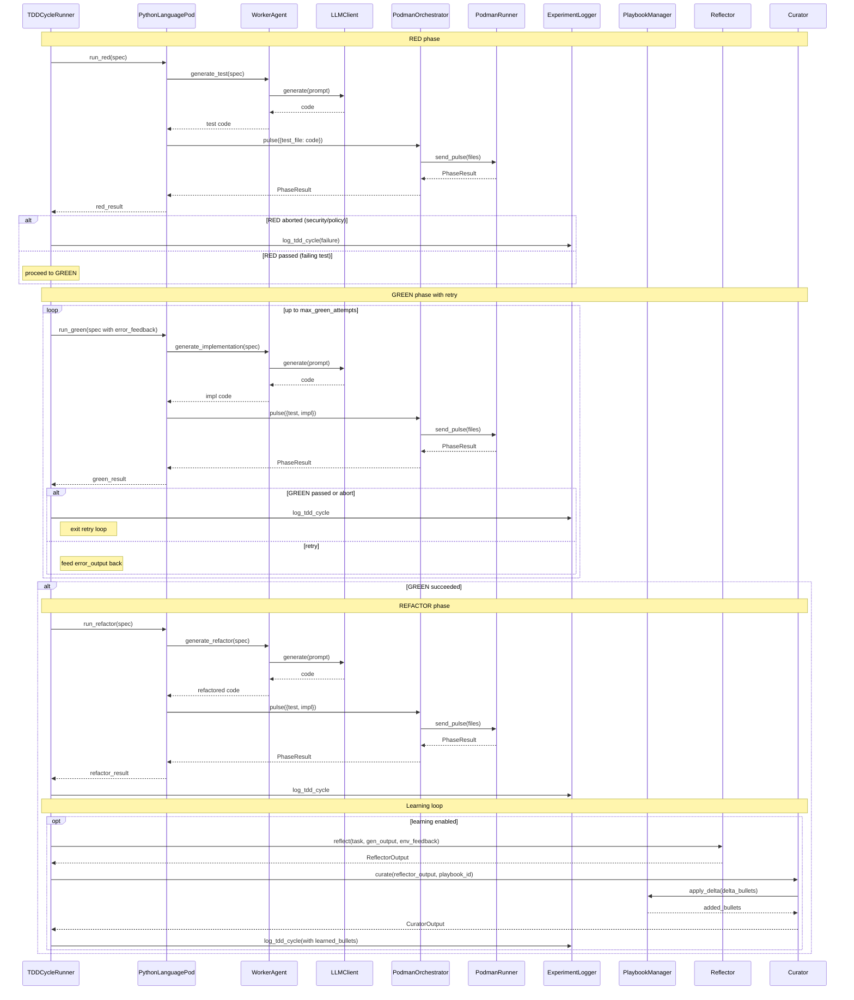

<!-- Generated by generate_live_docs.py on 2026-05-21 08:03 — do not edit by hand -->

# System Architecture

| Component | Module | Role |
|-----------|--------|------|
| TDDCycleRunner | src/agents/tdd_cycle_runner.py | Orchestrates RED→GREEN→REFACTOR with retry and learning loop |
| PythonLanguagePod | src/agents/python_language_pod.py | LanguagePod for Python – delegates to WorkerAgent and PodmanOrchestrator |
| WorkerAgent | src/agents/worker_agent.py | Builds prompts and calls LLM to generate test/implementation/refactor code |
| PodmanOrchestrator | src/agents/podman_orchestrator.py | Stateless sidecar execution – sends code to container, returns PhaseResult |
| PodmanRunner | src/agents/podman_runner.py | Rootless Podman container runner – start/stop pulse execution |
| LLMClient | src/utils/llm_client.py | Unified LLM client (OpenRouter, Ollama, etc.) |
| ExperimentLogger | src/storage/experiment_logger.py | Persists TDD cycles to PostgreSQL/SQLite (fallback) |
| PlaybookManager | src/playbook/manager.py | CRUD for playbook bullets with delta application and persistence |
| Generator | src/core/generator/module.py | Task execution using playbook-guided LLM generation |
| Reflector | src/core/reflector/module.py | Analyzes task outcomes and extracts learning insights |
| Curator | src/core/curator/module.py | Synthesises insights into playbook bullets and applies them |
| BulletRetriever | src/playbook/retrieval.py | Hybrid retrieval (keyword + embedding) for relevant bullets |
| ImportFilter | src/agents/import_filter.py | Checks generated code for forbidden imports and builtins |
| ContextMapBuilder | src/utils/context_map.py | Builds AST context map for code understanding |
| AutonomousTDDAgent | src/agents/autonomous_tdd_agent.py | Original TDD agent (wrapped by PythonLanguagePod) |
| PolyglotTDDRunner | src/agents/polyglot_tdd_runner.py | Runs TDD across multiple LanguagePods (languages) |
| EnsembleLearner | src/ensemble/learner.py | Multi-model ensemble learning with voting and deliberation |
| PerformanceAggregator | src/broker/performance_aggregator.py | Aggregates agent performance metrics from audit trail |
| AdaptiveBroker | src/broker/adaptive_broker.py | Routes tasks to best agent based on historical performance |
| BrokerAdvisor | src/broker/advisor.py | Recommends agents by capability fit |
| CapabilityRegistry | src/broker/capability_registry.py | Tracks anonymous agent capabilities for routing |
| ContractOrchestrator | src/contracts/contract_driven.py | Manages contract-driven development lifecycle |
| AuditStore | src/audit/store.py | Append-only audit event store with hash chain integrity |
| AuditClient | src/audit/client.py | Write-only audit client for agents |
| InstitutionalKnowledgeService | src/retrieval/service.py | Central guidance retrieval for TDD/implementation |
| TokenEfficiencyReporter | src/analytics/token_efficiency.py | Computes token efficiency scores from pod run data |
| SuccessRateCalculator | src/analytics/success_rate_calculator.py | Measures experiment success rates across system |
| PlaybookReliabilityAnalyzer | src/reliability/playbook_analyzer.py | Correlates bullet retrieval with first-pass GREEN success |
| TDDCycleAnalyzer | src/reliability/tdd_cycle_analyzer.py | Measures first-pass GREEN rate and trend over time |
| ModuleArchitect | src/contracts/module_architect.py | Generates module-level contracts for stateful systems |

