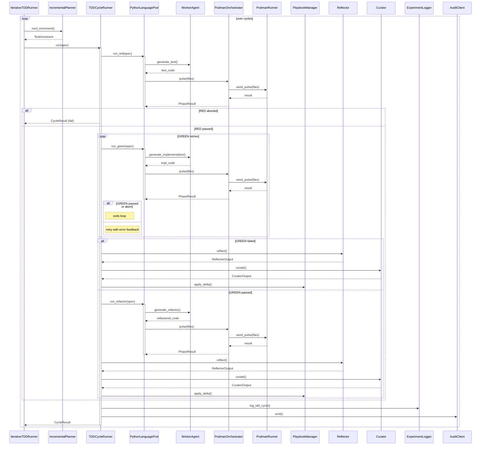

<!-- Generated by generate_live_docs.py on 2026-09-07 06:17 — do not edit by hand -->

# System Architecture

| Component | Module | Role |
|-----------|--------|------|
| IncrementalPlanner | src/agents/incremental_planner.py | Plans next test increment in TDD loop |
| IterativeTDDRunner | src/agents/iterative_tdd_runner.py | Orchestrates RED→GREEN→REFACTOR loop across features |
| TDDCycleRunner | src/agents/tdd_cycle_runner.py | Runs one complete TDD cycle with retries and learning |
| PodmanOrchestrator | src/agents/podman_orchestrator.py | Stateless sidecar execution layer for container |
| PodmanRunner | src/agents/podman_runner.py | Rootless Podman container runner |
| PythonLanguagePod | src/agents/python_language_pod.py | LanguagePod for Python TDD cycles |
| WorkerAgent | src/agents/worker_agent.py | LLM code generation for RED/GREEN/REFACTOR |
| PlaybookManager | src/playbook/manager.py | Manages playbook CRUD, dedup, persistence |
| ExperimentLogger | src/storage/experiment_logger.py | Logs TDD/ML experiments to DB with fallback |
| LLMClient | src/utils/llm_client.py | Unified LLM client for multiple providers |
| Reflector | src/core/reflector/module.py | Analyzes task outcomes and extracts insights |
| Curator | src/core/curator/module.py | Synthesizes insights into playbook bullets |
| Generator | src/core/generator/module.py | Executes tasks using playbook-guided LLM |
| ImportFilter | src/agents/import_filter.py | Blocks forbidden imports in generated code |
| BulletRetriever | src/playbook/retrieval.py | Hybrid retrieval engine for playbook bullets |
| BulletDeduplicator | src/playbook/deduplication.py | Semantic deduplication of bullets |
| PerformanceAggregator | src/broker/performance_aggregator.py | Extracts metrics from audit trail |
| AdaptiveBroker | src/broker/adaptive_broker.py | Routes tasks based on learned performance |
| EnsembleBuildRunner | src/agents/ensemble_build.py | Multi-candidate blind feature build |
| PolyglotTDDRunner | src/agents/polyglot_tdd_runner.py | Drives TDD across multiple language pods |
| GoLanguagePod | src/agents/go_language_pod.py | LanguagePod for Go TDD cycles |
| TypeScriptLanguagePod | src/agents/typescript_language_pod.py | LanguagePod for TypeScript TDD cycles |
| SimulationPod | src/agents/simulation_pod.py | LanguagePod for PyBullet simulation TDD |
| SimulationOracle | src/agents/simulation_oracle.py | Physics-simulation test oracle |
| TestReviewAgent | src/agents/test_review_agent.py | Validates test quality before implementation |
| RedundancyPreChecker | src/agents/redundancy_checker.py | Pre-checks proposed tests for redundancy |
| TDDFailureRecorder | src/agents/tdd_failure_recorder.py | Records failures and interventions for self-healing |
| TDDLessonInjector | src/agents/tdd_lesson_injector.py | Injects TDD lessons into agent prompts |
| ProjectArchitecture | src/agents/project_aware_tdd.py | Manages cached project architecture info |
| CodeReuseDetector | src/agents/project_aware_tdd.py | Detects code reuse opportunities |
| ContractArchitect | src/contracts/contract_architect.py | Generates contracts from requirements |
| ModuleArchitect | src/contracts/module_architect.py | Generates module-level contracts |
| ProjectArchitect | src/contracts/project_architect.py | Decomposes project spec into module DAG |
| DistillationRouter | src/playbook/distillation_router.py | Routes tasks to domain-specific distillation playbooks |

