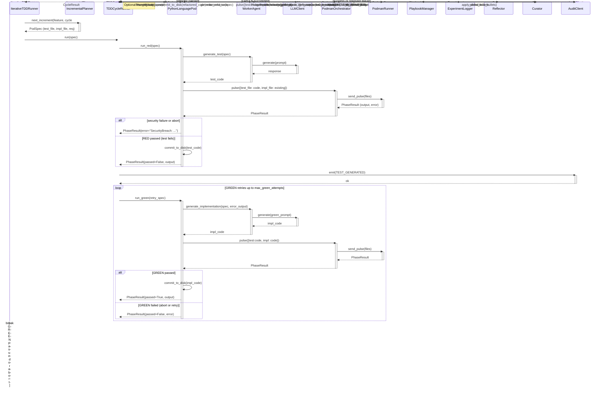

<!-- Generated by generate_live_docs.py on 2026-09-16 06:21 — do not edit by hand -->

# System Architecture

| Component | Module | Role |
|-----------|--------|------|
| IterativeTDDRunner | src.agents.iterative_tdd_runner | Top-level TDD loop: plans increments, runs cycles until complete |
| TDDCycleRunner | src.agents.tdd_cycle_runner | Orchestrates RED→GREEN→REFACTOR with retries and optional learning |
| IncrementalPlanner | src.agents.incremental_planner | Determines next test increment from feature spec and existing code |
| WorkerAgent | src.agents.worker_agent | Generates test/implementation/refactor code via LLM |
| PythonLanguagePod | src.agents.python_language_pod | Language pod: code generation + sandboxed execution for Python |
| GoLanguagePod | src.agents.go_language_pod | Language pod for Go TDD cycles |
| TypeScriptLanguagePod | src.agents.typescript_language_pod | Language pod for TypeScript TDD cycles |
| SimulationPod | src.agents.simulation_pod | Language pod for physics simulation TDD (PyBullet) |
| TypeScriptWorkerAgent | src.agents.typescript_worker_agent | Code generation for TypeScript TDD phases |
| PodmanOrchestrator | src.agents.podman_orchestrator | Container execution with canonical-hash security check |
| PodmanRunner | src.agents.podman_runner | Rootless Podman container lifecycle management |
| LLMClient | src.utils.llm_client | Unified LLM provider client (OpenRouter, Ollama, etc.) |
| PlaybookManager | src.playbook.manager | CRUD operations for playbook bullets with persistence |
| BulletRetriever | src.playbook.retrieval | Hybrid semantic+keyword retrieval of relevant bullets |
| Reflector | src.core.reflector.module | Analyzes task outcomes and extracts error patterns/insights |
| Curator | src.core.curator.module | Synthesizes reflector insights into playbook updates |
| Generator | src.core.generator.module | Executes tasks using playbook-guided LLM generation |
| ExperimentLogger | src.storage.experiment_logger | Persists experiments to PostgreSQL/SQLite |
| AuditClient | src.audit.client | Emits audit events to hash-chained store |
| AuditStore | src.audit.store | Append-only hash-chained audit event store with verification |
| AdaptiveBroker | src.broker.adaptive_broker | Routes tasks to best model based on historical performance |
| PerformanceAggregator | src.broker.performance_aggregator | Aggregates agent metrics from audit trail |
| ContextGraphRetriever | src.retrieval.cgr3_retriever | CGR³: context-graph retrieval with reasoning over bullet lineage |
| PolyglotTDDRunner | src.agents.polyglot_tdd_runner | Orchestrates TDD across multiple languages for a single feature |
| EnsembleBuildRunner | src.agents.ensemble_build | Multi-candidate blind build with consensus evaluation |
| ConsensusBuilder | src.ensemble.consensus | Clusters bullet proposals and builds consensus representatives |
| EnsembleLearner | src.ensemble.learner | Parallel multi-model learning with cross-voting and deliberation |
| CharacterizationTestGenerator | src.agents.characterization_test_generator | Writes empirically-verified characterization test suites |

