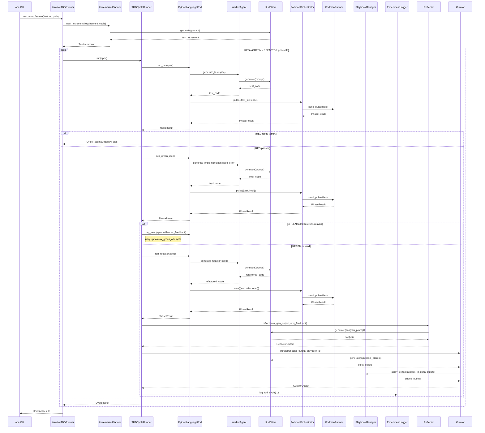

<!-- Generated by generate_live_docs.py on 2026-09-02 18:33 — do not edit by hand -->

# System Architecture

| Component | Module | Role |
|-----------|--------|------|
| `IterativeTDDRunner` | `src/agents/iterative_tdd_runner.py` | Orchestrates the RED→GREEN→REFACTOR loop across multiple cycles, driven by a planner or Gherkin feature file |
| `TDDCycleRunner` | `src/agents/tdd_cycle_runner.py` | Executes one complete TDD cycle (RED→GREEN→REFACTOR) with retries, learning loop, and audit trail |
| `PythonLanguagePod` | `src/agents/python_language_pod.py` | Language-specific pod for Python TDD; delegates code generation to WorkerAgent and execution to PodmanOrchestrator |
| `WorkerAgent` | `src/agents/worker_agent.py` | Generates code for each TDD phase (test, implementation, refactor) using LLM prompts and playbook context |
| `IncrementalPlanner` | `src/agents/incremental_planner.py` | Determines the next test increment by querying the LLM with current test and implementation context |
| `PodmanOrchestrator` | `src/agents/podman_orchestrator.py` | Stateless sidecar execution layer; pulses files to container and verifies hash-chain integrity |
| `PodmanRunner` | `src/agents/podman_runner.py` | Production ContainerRunner backed by rootless Podman; manages container lifecycle and file pulses |
| `PlaybookManager` | `src/playbook/manager.py` | Core playbook operations: creation, delta updates, semantic deduplication, token budget, persistence |
| `ExperimentLogger` | `src/storage/experiment_logger.py` | Unified logger for TDD and ML experiments; stores to PostgreSQL with SQLite fallback |
| `Reflector` | `src/core/reflector/module.py` | Analyzes task outcomes, extracts error patterns, root causes, and key insights |
| `Curator` | `src/core/curator/module.py` | Synthesizes reflector insights into actionable playbook bullets with section organization |
| `Generator` | `src/core/generator/module.py` | Executes tasks using playbook-guided LLM; retrieves relevant bullets and tracks usage |
| `BulletRetriever` | `src/playbook/retrieval.py` | Hybrid retrieval system for selecting relevant bullets by embedding similarity and keyword match |
| `BulletDeduplicator` | `src/playbook/deduplication.py` | Semantic deduplication of bullets using embedding cosine similarity |
| `BulletClusterer` | `src/playbook/clustering.py` | DBSCAN-based clustering for playbook bullets; selects representatives and finds knowledge gaps |
| `DistillationRouter` | `src/playbook/distillation_router.py` | Routes tasks to domain-specific distillation playbooks with provenance-aware filtering |
| `ContextGraphRetriever` | `src/retrieval/cgr3_retriever.py` | CGR³ pipeline: retrieve, rank, reason; scores bullets against request context |
| `ContextScorer` | `src/retrieval/context_scorer.py` | Scores bullets across temporal, team, tech-stack, project, and domain dimensions |
| `InstitutionalKnowledgeService` | `src/retrieval/service.py` | Central knowledge retrieval service for all code generation activities |
| `AdaptiveBroker` | `src/broker/adaptive_broker.py` | Routes tasks to best agent based on historical performance and routing mode |
| `PerformanceAggregator` | `src/broker/performance_aggregator.py` | Extracts and aggregates performance metrics from audit trail |
| `CapabilityRegistry` | `src/broker/capability_registry.py` | Anonymous agent capability tracking with proficiency ratings |
| `ModelAttributionTracker` | `src/benchmark/model_attribution.py` | Tracks OpenRouter model attribution in performance metrics |
| `ProductionDataAnalyzer` | `src/benchmark/production_analyzer.py` | Analyzes quality data from experiment logs; extracts model performance |
| `SuccessRateCalculator` | `src/analytics/success_rate_calculator.py` | Measures experiment success rates across types, versions, and time |
| `TokenEfficiencyReporter` | `src/analytics/token_efficiency.py` | Aggregates token usage data from LanguagePods and computes efficiency scores |
| `CostQualityAnalyzer` | `src/analytics/cost_quality_analyzer.py` | Analyzes cost-quality tradeoffs for model performance data |
| `EnsembleBuildRunner` | `src/agents/ensemble_build.py` | Drives multi-candidate blind build for one feature; generates, evaluates, and selects candidates |
| `ConsensusBuilder` | `src/ensemble/consensus.py` | Builds consensus from multiple model proposals; clusters similar bullets |
| `EnsembleLearner` | `src/ensemble/learner.py` | Orchestrates multiple models learning in parallel with cross-voting and deliberation |
| `VotingSystem` | `src/ensemble/voting.py` | Applies voting strategies (majority, supermajority, weighted, unanimous, escalating) to bullet approval |
| `PlaybookReliabilityAnalyzer` | `src/reliability/playbook_analyzer.py` | Correlates bullet retrieval with first-pass GREEN success |
| `TDDCycleAnalyzer` | `src/reliability/tdd_cycle_analyzer.py` | Measures first-pass GREEN rate and trend over time |
| `RegressionDetector` | `src/broker/regression_detector.py` | Tracks quality scores by model version and detects regressions |
| `BlindEvaluator` | `src/benchmark/blind_evaluation.py` | Scores outputs without knowing which agent produced them |
| `ProjectArchitect` | `src/contracts/project_architect.py` | Decomposes a project spec into a module DAG |
| `ModuleArchitect` | `src/contracts/module_architect.py` | Generates module-level contracts for stateful systems |
| `ModuleTDDBuilder` | `src/contracts/module_tdd_builder.py` | Builds module implementations using TDD methodology |
| `ContractOrchestrator` | `src/contracts/contract_driven.py` | Orchestrates contract-driven development; registers contracts and validates implementations |
| `ContractDecomposer` | `src/contracts/contract_decomposer.py` | Breaks user requirements into interface contracts |
| `ProjectBuilder` | `src/cli/project_builder.py` | Drives ModuleArchitect + ModuleTDDBuilder over a ProjectPlan in dependency order |
| `GherkinExtractionAgent` | `src/agents/gherkin_extraction_agent.py` | Reverse-engineers Gherkin scenarios from existing code and tests |
| `GherkinFeatureBridge` | `src/agents/gherkin_feature_bridge.py` | Parses a Gherkin .feature file into a FeatureSpec |
| `TestReviewAgent` | `src/agents/test_review_agent.py` | Validates test quality before implementation |
| `RedundancyPreChecker` | `src/agents/redundancy_checker.py` | Pre-checks proposed tests for redundancy before RED phase |
| `TDDFailureRecorder` | `src/agents/tdd_failure_recorder.py` | Records TDD failures and interventions for self-improvement |
| `TDDLessonInjector` | `src/agents/tdd_lesson_injector.py` | Injects TDD lessons into agent prompts based on development phase |
| `LessonExtractor` | `src/agents/tdd_lessons.py` | Extracts TDD lessons from resolved beads issues |
| `CodeAnalyzer` | `src/agents/gherkin_extraction_agent.py` | Analyzes Python code to extract structure and APIs |
| `TestAnalyzer` | `src/agents/gherkin_extraction_agent.py` | Analyzes test code to extract test scenarios |
| `ImportFilter` | `src/agents/import_filter.py` | Static analysis filter that rejects forbidden imports and builtin calls |
| `ImportValidator` | `src/utils/import_validator.py` | Validates and corrects import paths in generated code |
| `ContextMapBuilder` | `src/utils/context_map.py` | Builds a context map of AST signatures from source files |
| `LLMClient` | `src/utils/llm_client.py` | Unified LLM client supporting multiple providers (OpenRouter, OpenAI, Anthropic, etc.) |
| `ClaudeCliClient` | `src/utils/claude_cli_client.py` | Drop-in replacement for LLMClient using the local claude CLI |
| `EffGenClient` | `src/utils/effgen_client.py` | LLM client adapter for effGen local models |
| `EmbeddingService` | `src/utils/embedding.py` | Local embedding generation using sentence-transformers |
| `PlaybookEnforcer` | `src/utils/playbook_enforcer.py` | Enforces playbook rules like high-frequency feedback limits |
| `SessionLog` | `src/utils/session_log.py` | Tracks edits and tests in current session |
| `DriftDetector` | `src/utils/file_lock.py` | Detects inadvertent file drift between lock and release |
| `FileLockContext` | `src/utils/file_lock.py` | Context manager that locks target files and detects drift on exit |
| `AuditStore` | `src/audit/store.py` | Append-only audit event store with hash chain integrity |
| `LocalAuditClient` | `src/audit/local_client.py` | Audit client that writes directly to local SQLite database |
| `AuditClient` | `src/audit/client.py` | Write-only HTTP audit client for ACE agents |
| `AuditDashboard` | `src/audit/dashboard.py` | Dashboard for analyzing audit data; agent performance, cost, and task-type strengths |
| `HumanDecisionInterface` | `src/broker/human_decision.py` | Interface for human decision-making; provides context and records decisions |
| `BrokerAdvisor` | `src/broker/advisor.py` | Recommends agents by capability fit |
| `FeedbackCollector` | `src/broker/feedback.py` | Stores human ratings and derives blended/drift scores |
| `EffGenAdapter` | `src/broker/effgen_adapter.py` | Adapter for integrating effGen instances with Capability Broker |
| `MarkdownImporter` | `src/playbook/markdown_importer.py` | Imports knowledge from markdown files into playbook bullets |
| `PlaybookQA` | `src/playbook/qa.py` | Q&A system that answers coding questions using playbook knowledge |
| `PostgresPlaybookAdapter` | `src/playbook/postgres_adapter.py` | PostgreSQL-backed playbook manager maintaining compatibility with PlaybookManager |
| `PostgresBulletRetriever` | `src/playbook/postgres_retriever.py` | PostgreSQL-backed retrieval system using pgvector |
| `PlaybookRepository` | `src/storage/repository.py` | PostgreSQL repository with pgvector for semantic search |
| `GoLanguagePod` | `src/agents/go_language_pod.py` | LanguagePod implementation for Go TDD cycles |
| `GoRunner` | `src/agents/go_runner.py` | PodmanRunner pre-configured for the Go harness image |
| `GoStepGenerator` | `src/agents/go_step_generator.py` | Generates Go step definitions for Gherkin scenarios |
| `TypeScriptLanguagePod` | `src/agents/typescript_language_pod.py` | LanguagePod for TypeScript TDD cycles via vitest |
| `TypeScriptRunner` | `src/agents/typescript_runner.py` | PodmanRunner pre-configured for the TypeScript harness image |
| `TypeScriptWorkerAgent` | `src/agents/typescript_worker_agent.py` | Generates TypeScript code for each TDD phase |
| `PolyglotTDDRunner` | `src/agents/polyglot_tdd_runner.py` | Orchestrates RED→GREEN→REFACTOR across multiple LanguagePods |
| `PodFactory` | `src/agents/polyglot_tdd_runner.py` | Creates LanguagePod instances for a given language identifier |
| `ProjectArchitecture` | `src/agents/project_aware_tdd.py` | Manages cached project architecture information |
| `CodeReuseDetector` | `src/agents/project_aware_tdd.py` | Detects opportunities for code reuse in the project |
| `ProjectDetector` | `src/project/detector.py` | Detects and analyzes Python project structure |
| `ProjectConfig` | `src/project/config.py` | Manages ACE project configuration (.ace/config.yml) |
| `DecisionRecord` | `src/project/decision_record.py` | Generates Architectural Decision Records (ADR) for features |
| `ACEMLflowCallback` | `src/ml/mlflow_callback.py` | Callback to capture ACE knowledge during MLflow experiments |
| `PostgresACEMLflowCallback` | `src/ml/postgres_mlflow_callback.py` | PostgreSQL-backed MLflow callback for ACE knowledge capture |
| `MLflowKnowledgeQuery` | `src/ml/query_interface.py` | Unified interface to query MLflow runs with ACE knowledge context |
| `MLExperimentKnowledge` | `src/ml/experiment_knowledge.py` | Knowledge base for ML experiments; integrates with MLflow run tracking |
| `EvaluationRubric` | `src/benchmark/rubrics/base.py` | Abstract base for domain-specific scoring rubrics |
| `CodeGenerationRubric` | `src/benchmark/rubrics/code.py` | Evaluates Python code output quality |
| `TestWritingRubric` | `src/benchmark/rubrics/tests.py` | Evaluates test suite output quality |
| `DocumentationRubric` | `src/benchmark/rubrics/docs.py` | Evaluates Markdown documentation output |
| `AnalysisRubric` | `src/benchmark/rubrics/analysis.py` | Evaluates analytical/research output |
| `SemanticCodeAnalyzer` | `src/benchmark/semantic_analyzer.py` | Analyzes code for security-sensitive patterns (SQL, eval, exec, secrets) |
| `ContractArchitect` | `src/contracts/contract_architect.py` | Generates contracts from natural language requirements |
| `ContractValidator` | `src/contracts/contract_driven.py` | Validates implementations against contracts inside a sandbox |
| `BayesianEstimator` | `src/broker/bayesian.py` | Bayesian success-rate estimation using Beta-Binomial model |
| `ModelRouter` | `src/broker/model_router.py` | Live entry point for AdaptiveBroker routing; picks best model for task type |

