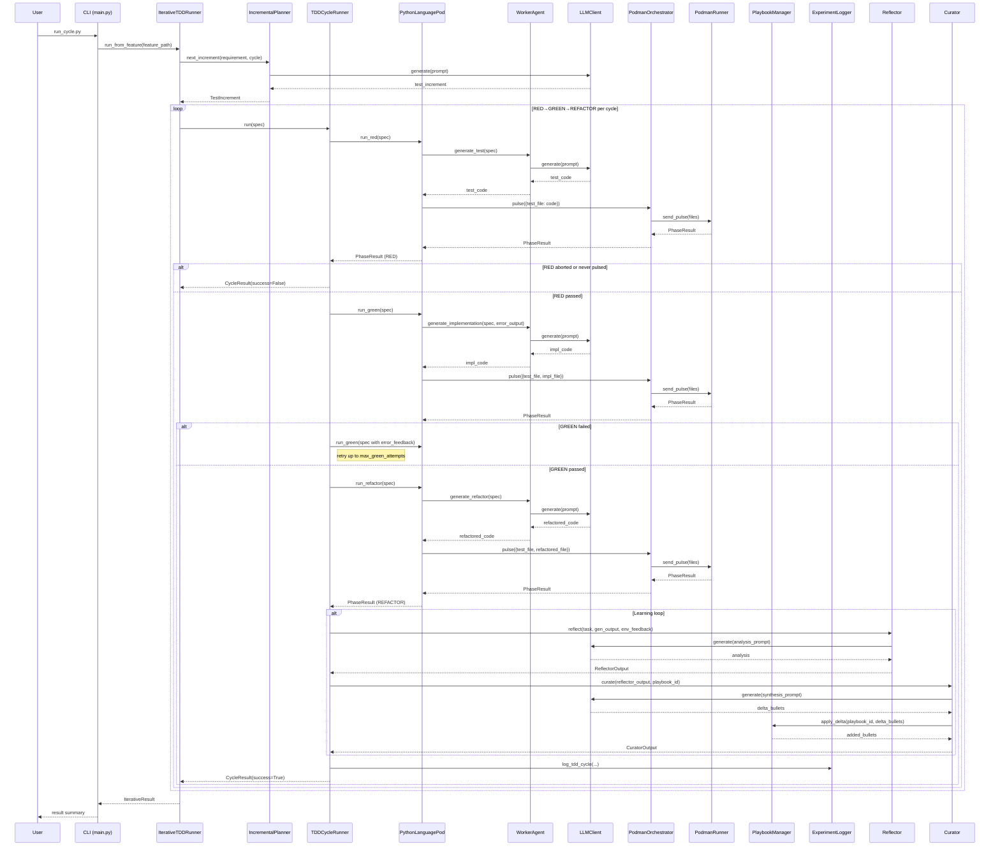

<!-- Generated by generate_live_docs.py on 2026-08-29 14:00 — do not edit by hand -->

# System Architecture

| Component | Module | Role |
|-----------|--------|------|
| IterativeTDDRunner | src/agents/iterative_tdd_runner.py | Orchestrates the Kent Beck-style RED→GREEN→REFACTOR loop across multiple cycles |
| TDDCycleRunner | src/agents/tdd_cycle_runner.py | Runs one complete TDD cycle: RED → GREEN (with retry) → REFACTOR |
| PythonLanguagePod | src/agents/python_language_pod.py | LanguagePod implementation for Python TDD cycles; delegates code generation to WorkerAgent and execution to PodmanOrchestrator |
| WorkerAgent | src/agents/worker_agent.py | Standalone LLM code-generation component; builds prompts and returns code strings for each TDD phase |
| IncrementalPlanner | src/agents/incremental_planner.py | Determines the next test increment by asking the LLM what test to write next |
| PodmanOrchestrator | src/agents/podman_orchestrator.py | Stateless sidecar execution layer for the Clean Room harness; manages container pulse and security checks |
| PodmanRunner | src/agents/podman_runner.py | Production ContainerRunner backed by rootless Podman |
| PlaybookManager | src/playbook/manager.py | Core playbook operations: creation, updates, merging, retrieval, and persistence |
| BulletRetriever | src/playbook/retrieval.py | Hybrid retrieval system for selecting relevant playbook bullets |
| BulletClusterer | src/playbook/clustering.py | DBSCAN-based clustering for playbook bullets |
| BulletDeduplicator | src/playbook/deduplication.py | Semantic deduplication of bullets using embedding similarity |
| DistillationRouter | src/playbook/distillation_router.py | Routes tasks to domain-specific distillation playbooks with provenance-aware filtering |
| Generator | src/core/generator/module.py | Executes tasks using playbook-guided LLM; retrieves relevant bullets and generates reasoning trajectory |
| Reflector | src/core/reflector/module.py | Analyzes task outcomes and extracts learning insights; identifies error patterns and root causes |
| Curator | src/core/curator/module.py | Synthesizes reflector insights into actionable playbook updates |
| ExperimentLogger | src/storage/experiment_logger.py | Unified logger for TDD and ML experiments; stores in PostgreSQL with SQLite fallback |
| LLMClient | src/utils/llm_client.py | Unified LLM client supporting multiple providers (OpenRouter, OpenAI, Anthropic, etc.) |
| ContextMapBuilder | src/utils/context_map.py | Builds AST-based context maps for code generation |
| ImportFilter | src/agents/import_filter.py | Checks generated code for forbidden imports and blocked builtins |
| RedundancyPreChecker | src/agents/redundancy_checker.py | Pre-checks proposed tests for redundancy before the RED phase |
| GherkinFeatureBridge | src/agents/gherkin_feature_bridge.py | Parses Gherkin .feature files into FeatureSpec objects |
| TestReviewAgent | src/agents/test_review_agent.py | Reviews test quality before implementation |
| TDDFailureRecorder | src/agents/tdd_failure_recorder.py | Records TDD failures and interventions for self-improvement |
| TDDLessonInjector | src/agents/tdd_lesson_injector.py | Injects TDD lessons into agent prompts based on development phase |
| AdaptiveBroker | src/broker/adaptive_broker.py | Routes tasks to best agent based on historical performance |
| PerformanceAggregator | src/broker/performance_aggregator.py | Extracts performance metrics from audit trail |
| RegressionDetector | src/broker/regression_detector.py | Tracks quality changes across model versions and detects regressions |
| AuditStore | src/audit/store.py | Append-only audit event store with hash chain integrity |
| LocalAuditClient | src/audit/local_client.py | Audit client that writes directly to local SQLite database |
| EnsembleLearner | src/ensemble/learner.py | Orchestrates multiple models learning in parallel with voting and deliberation |
| ConsensusBuilder | src/ensemble/consensus.py | Builds consensus from multiple model proposals |
| VotingSystem | src/ensemble/voting.py | Applies different voting strategies (majority, supermajority, weighted, etc.) |
| ContractOrchestrator | src/contracts/contract_driven.py | Orchestrates contract-driven development |
| ContractValidator | src/contracts/contract_driven.py | Validates implementations against contracts inside sandbox |
| ModuleTDDBuilder | src/contracts/module_tdd_builder.py | Builds module implementations using TDD methodology |
| InstitutionalKnowledgeService | src/retrieval/service.py | Central knowledge retrieval service for all code generation activities |
| ContextScorer | src/retrieval/context_scorer.py | Scores bullets against request context across multiple dimensions |
| ContextGraphRetriever | src/retrieval/cgr3_retriever.py | CGR³: Context Graph Retrieve-Rank-Reason pipeline |
| PlaybookReliabilityAnalyzer | src/reliability/playbook_analyzer.py | Correlates bullet retrieval with first-pass GREEN outcomes |
| TDDCycleAnalyzer | src/reliability/tdd_cycle_analyzer.py | Measures first-pass GREEN rate and trend over time |
| SuccessRateCalculator | src/analytics/success_rate_calculator.py | Measures experiment success rates across the system |
| TokenEfficiencyReporter | src/analytics/token_efficiency.py | Computes token efficiency scores from LanguagePod run data |
| CostQualityAnalyzer | src/analytics/cost_quality_analyzer.py | Analyzes cost-quality tradeoffs for model performance data |
| ModelAttributionTracker | src/benchmark/model_attribution.py | Tracks OpenRouter model attribution in performance metrics |
| ProductionDataAnalyzer | src/benchmark/production_analyzer.py | Analyzes quality data from experiment_logs |
| BlindEvaluator | src/benchmark/blind_evaluation.py | Scores outputs without knowing which agent produced them |
| PlaybookEnforcer | src/utils/playbook_enforcer.py | Enforces playbook rules like high-frequency feedback |
| ImportValidator | src/utils/import_validator.py | Validates and corrects import paths in generated code |
| DriftDetector | src/utils/file_lock.py | Detects inadvertent file drift during TDD cycles |
| ProjectDetector | src/project/detector.py | Detects and analyzes Python project structure |
| PostgresPlaybookAdapter | src/playbook/postgres_adapter.py | PostgreSQL-backed playbook manager |
| PostgresBulletRetriever | src/playbook/postgres_retriever.py | PostgreSQL-backed retrieval system using pgvector |
| PlaybookRepository | src/storage/repository.py | PostgreSQL repository for playbooks and bullets with pgvector integration |
| CapabilityRegistry | src/broker/capability_registry.py | Anonymous agent capability tracking |
| BrokerAdvisor | src/broker/advisor.py | Recommends agents by capability fit |
| HumanDecisionInterface | src/broker/human_decision.py | Interface for human decision-making in agent selection |
| FeedbackCollector | src/broker/feedback.py | Stores human ratings and derives blended/drift scores |
| EffGenAdapter | src/broker/effgen_adapter.py | Adapter for integrating effGen instances with Capability Broker |
| AuditDashboard | src/audit/dashboard.py | Dashboard for analyzing audit data and agent performance |
| AuditCheckpoint | src/audit/checkpoint.py | External anchoring for the audit hash chain |
| AuditClient | src/audit/client.py | Write-only audit client for ACE agents |
| GherkinExtractionAgent | src/agents/gherkin_extraction_agent.py | Reverse engineers Gherkin scenarios from existing code and tests |
| CodeAnalyzer | src/agents/gherkin_extraction_agent.py | Analyzes Python code to extract structure and APIs |
| TestAnalyzer | src/agents/gherkin_extraction_agent.py | Analyzes test code to extract test scenarios |
| GoLanguagePod | src/agents/go_language_pod.py | LanguagePod implementation for Go TDD cycles |
| GoRunner | src/agents/go_runner.py | PodmanRunner variant for the Go TDD harness |
| GoStepGenerator | src/agents/go_step_generator.py | Generates Go step definitions for Gherkin scenarios |
| TypeScriptLanguagePod | src/agents/typescript_language_pod.py | LanguagePod for TypeScript TDD cycles via vitest |
| TypeScriptRunner | src/agents/typescript_runner.py | PodmanRunner pre-configured for the TypeScript harness image |
| TypeScriptWorkerAgent | src/agents/typescript_worker_agent.py | Code generation for TypeScript TDD cycles |
| PolyglotTDDRunner | src/agents/polyglot_tdd_runner.py | Orchestrates RED→GREEN→REFACTOR across multiple LanguagePods |
| PodFactory | src/agents/polyglot_tdd_builder.py | Creates LanguagePod instances for a given language identifier |
| ProjectArchitecture | src/agents/project_aware_tdd.py | Manages cached project architecture information |
| CodeReuseDetector | src/agents/project_aware_tdd.py | Detects opportunities for code reuse in the project |
| LessonExtractor | src/agents/tdd_lessons.py | Extracts TDD lessons from resolved beads issues |
| ContractArchitect | src/contracts/contract_architect.py | Generates contracts from natural language requirements |
| ContractDecomposer | src/contracts/contract_decomposer.py | Breaks user specs into interface contracts |
| ModuleArchitect | src/contracts/module_architect.py | Generates module-level contracts for stateful systems |
| MarkdownImporter | src/playbook/markdown_importer.py | Imports knowledge from markdown files into playbook bullets |
| PlaybookQA | src/playbook/qa.py | Answers coding questions using playbook knowledge |
| MLflowKnowledgeQuery | src/ml/query_interface.py | Unified interface to query MLflow runs with ACE knowledge context |
| ACEMLflowCallback | src/ml/mlflow_callback.py | Callback to capture ACE knowledge during MLflow experiments |
| PostgresACEMLflowCallback | src/ml/postgres_mlflow_callback.py | PostgreSQL-backed MLflow callback for ACE knowledge capture |
| MLExperimentKnowledge | src/ml/experiment_knowledge.py | Knowledge base for ML experiments |
| EmbeddingService | src/utils/embedding.py | Local embedding generation using sentence-transformers |
| ClaudeCliClient | src/utils/claude_cli_client.py | LLM client backed by the local 'claude -p' CLI |
| EffGenClient | src/utils/effgen_client.py | LLM client adapter for effGen local models |
| SessionLog | src/utils/session_log.py | Tracks edits and tests in current session |
| ProjectConfig | src/project/config.py | Manages .ace/config.yml project configuration |
| DecisionRecord | src/project/decision_record.py | Generates Architectural Decision Records |
| TDDRunHandle | src/cli/factory.py | Owns the sandbox container lifecycle for one `ace tdd` invocation |
| ProjectConfig | src/cli/config.py | Loads .ace/config.yaml and auto-detects project layout |

