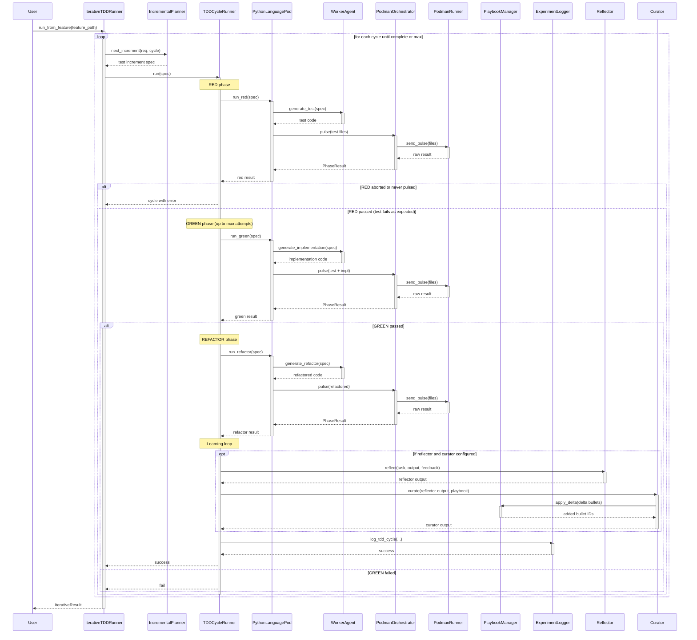

<!-- Generated by generate_live_docs.py on 2026-08-29 11:57 — do not edit by hand -->

# System Architecture

| Component | Module | Role |
|-----------|--------|------|
| `TDDCycleRunner` | `src.agents.tdd_cycle_runner` | Orchestrates a single RED→GREEN→REFACTOR cycle with retries and learning |
| `IterativeTDDRunner` | `src.agents.iterative_tdd_runner` | Kent Beck-style loop: plan → cycle → repeat until complete or max iterations |
| `IncrementalPlanner` | `src.agents.incremental_planner` | Asks the LLM for the next single test increment given current state |
| `PythonLanguagePod` | `src.agents.python_language_pod` | Python language implementation: code generation + container execution for each phase |
| `WorkerAgent` | `src.agents.worker_agent` | LLM code generation for RED/GREEN/REFACTOR phases; builds prompts with playbook context |
| `PlaybookManager` | `src.playbook.manager` | CRUD operations for playbook sections/bullets, deduplication, token budget enforcement |
| `ExperimentLogger` | `src.storage.experiment_logger` | Unified logger for TDD and ML experiments; persists to PostgreSQL or SQLite |
| `Reflector` | `src.core.reflector.module` | Analyzes task outcomes, identifies errors, root causes, and extracts reusable insights |
| `Curator` | `src.core.curator.module` | Synthesizes reflector insights into playbook delta bullets; writes to playbook |
| `Generator` | `src.core.generator.module` | Executes tasks using playbook-guided LLM; retrieves relevant bullets and builds prompts |
| `PodmanOrchestrator` | `src.agents.podman_orchestrator` | Stateless sidecar execution layer; verifies workspace hash, wraps container pulse |
| `PodmanRunner` | `src.agents.podman_runner` | Rootless Podman container lifecycle (start/stop/send_pulse) |
| `PolyglotTDDRunner` | `src.agents.polyglot_tdd_runner` | Drives TDD across multiple LanguagePods concurrently and compares token efficiency |
| `RedundancyPreChecker` | `src.agents.redundancy_checker` | AST-scan test files to detect redundant test proposals before writing |
| `TDDFailureRecorder` | `src.agents.tdd_failure_recorder` | Records failures and human interventions for self‑improvement |
| `GherkinExtractionAgent` | `src.agents.gherkin_extraction_agent` | Reverse‑engineers Gherkin scenarios from existing code and tests |
| `GherkinFeatureBridge` | `src.agents.gherkin_feature_bridge` | Parses `.feature` files into `FeatureSpec` used by the TDD loop |
| `ImportFilter` | `src.agents.import_filter` | Blocks forbidden imports and dangerous builtin calls in generated code |
| `TypeScriptLanguagePod` | `src.agents.typescript_language_pod` | TypeScript TDD via vitest in a Podman container |
| `GoLanguagePod` | `src.agents.go_language_pod` | Go TDD via `go test` in a Podman container |
| `CostQualityAnalyzer` | `src.analytics.cost_quality_analyzer` | Analyzes cost‑quality tradeoffs for model performance data |
| `SuccessRateCalculator` | `src.analytics.success_rate_calculator` | Measures experiment success rates across types and versions |
| `TokenEfficiencyReporter` | `src.analytics.token_efficiency` | Aggregates token usage from LanguagePods and scores efficiency |
| `AuditClient` | `src.audit.client` | Write‑only audit event emitter over HTTP |
| `LocalAuditClient` | `src.audit.local_client` | Write‑only audit client backed by local SQLite |
| `AuditStore` | `src.audit.store` | Append‑only hash‑chained audit event store |
| `PerformanceAggregator` | `src.broker.performance_aggregator` | Extracts agent performance metrics from audit trail for routing decisions |
| `AdaptiveBroker` | `src.broker.adaptive_broker` | Routes tasks to best‑performing agent based on historical success/cost/latency |
| `CapabilityRegistry` | `src.broker.capability_registry` | Anonymous tracking of agent capabilities and proficiency |
| `EnsembleLearner` | `src.ensemble.learner` | Runs multiple Generator→Reflector→Curator pipelines in parallel and votes on consensus bullets |
| `BulletRetriever` | `src.playbook.retrieval` | Hybrid (embedding+keyword) retrieval engine for playbook bullets |
| `ContextGraphRetriever` | `src.retrieval.cgr3_retriever` | CGR³ pipeline: scores bullets via context matching and reasons about applicability |
| `InstitutionalKnowledgeService` | `src.retrieval.service` | Central knowledge service providing guidance for TDD and implementation tasks |
| `LLMClient` | `src.utils.llm_client` | Unified LLM client supporting OpenRouter, Anthropic, OpenAI, Ollama, etc. |
| `EmbeddingService` | `src.utils.embedding` | Local sentence‑transformer embedding generation for bullet similarity |

