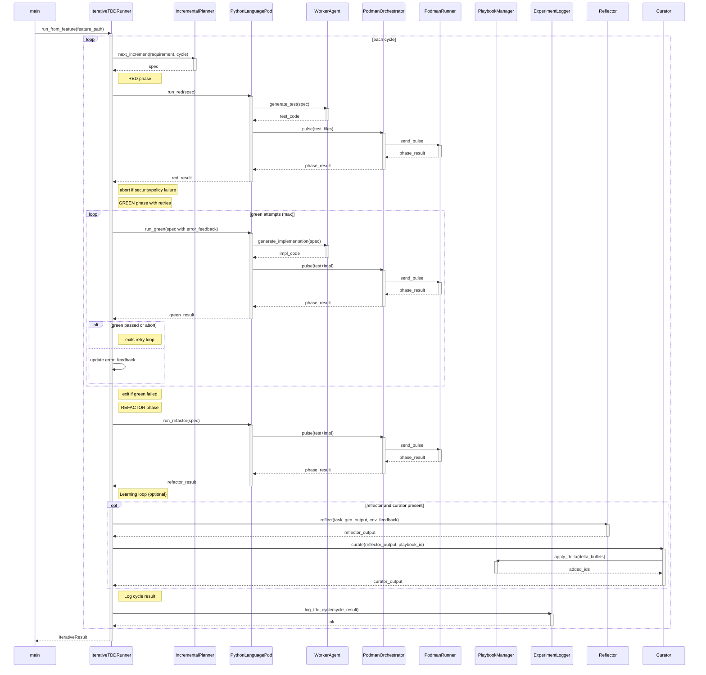

<!-- Generated by generate_live_docs.py on 2026-05-23 09:22 — do not edit by hand -->

# System Architecture

| Component | Module | Role |
|-----------|--------|------|
| IterativeTDDRunner | src.agents.iterative_tdd_runner | Orchestrates the RED→GREEN→REFACTOR loop across multiple increments |
| TDDCycleRunner | src.agents.tdd_cycle_runner | Runs one complete TDD cycle with GREEN retry and optional learning |
| IncrementalPlanner | src.agents.incremental_planner | Determines the next test increment to write |
| PythonLanguagePod | src.agents.python_language_pod | LanguagePod implementation for Python; delegates code generation and execution |
| PodmanOrchestrator | src.agents.podman_orchestrator | Stateless sidecar execution layer with security breach detection |
| PodmanRunner | src.agents.podman_runner | Production container runner using rootless Podman |
| WorkerAgent | src.agents.worker_agent | LLM-based code generation for RED, GREEN, REFACTOR phases |
| LLMClient | src.utils.llm_client | Unified interface for multiple LLM providers |
| PlaybookManager | src.playbook.manager | Core playbook CRUD, delta updates, and persistence |
| ExperimentLogger | src.storage.experiment_logger | Unified logger for TDD and ML experiments with PostgreSQL/SQLite |
| Reflector | src.core.reflector.module | Analyzes task execution and extracts learning insights |
| Curator | src.core.curator.module | Synthesizes insights into actionable playbook updates |
| Generator | src.core.generator.module | Executes tasks using playbook-guided LLM generation |
| ImportFilter | src.agents.import_filter | Validates imports and blocks forbidden calls |
| RedundancyPreChecker | src.agents.redundancy_checker | Detects redundant tests before writing them |
| TestReviewAgent | src.agents.test_review_agent | Validates test quality before implementation |
| GherkinFeatureBridge | src.agents.gherkin_feature_bridge | Parses Gherkin .feature files into FeatureSpec |
| PolyglotTDDRunner | src.agents.polyglot_tdd_runner | Drives RED→GREEN→REFACTOR across multiple LanguagePods |
| AutonomousTDDAgent | src.agents.autonomous_tdd_agent | Builds features autonomously using TDD with ensemble learning |
| BulletRetriever | src.playbook.retrieval | Hybrid retrieval engine for playbook bullets |
| InstitutionalKnowledgeService | src.retrieval.service | Central knowledge service for code generation guidance |
| ContextGraphRetriever | src.retrieval.cgr3_retriever | CGR³ retrieve-rank-reason pipeline |
| EnsembleLearner | src.ensemble.learner | Orchestrates parallel model reflection and consensus voting |
| VotingSystem | src.ensemble.voting | Applies voting strategies to ensemble proposals |
| AdaptiveBroker | src.broker.adaptive_broker | Routes tasks to best agent based on historical performance |
| PerformanceAggregator | src.broker.performance_aggregator | Aggregates performance metrics from audit trail |
| AuditStore | src.audit.store | Append-only audit event store with hash chain integrity |
| AuditClient | src.audit.client | Write-only audit event client for agents |
| ContractArchitect | src.contracts.contract_architect | Generates interface contracts from natural language requirements |
| ModuleArchitect | src.contracts.module_architect | Generates module-level contracts for stateful systems |
| ProjectConfig | src.cli.config | Loads ACE configuration and auto-detects project layout |
| Settings | src.config.settings | Application settings loaded from environment |

