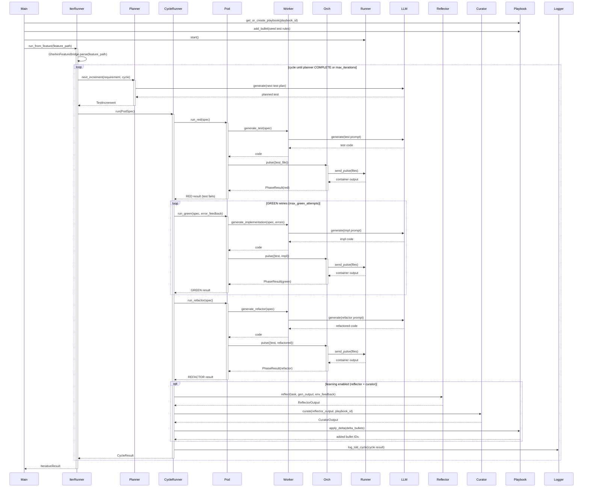

<!-- Generated by generate_live_docs.py on 2026-09-20 06:40 — do not edit by hand -->

# System Architecture

| Component | Module | Role |
|-----------|--------|------|
| IterativeTDDRunner | src/agents/iterative_tdd_runner.py | Orchestrates the full RED→GREEN→REFACTOR loop per feature until the planner says COMPLETE |
| TDDCycleRunner | src/agents/tdd_cycle_runner.py | Runs one TDD cycle: RED (retried on parse noise), GREEN (retried with error feedback), REFACTOR; aborts on security failures; drives Reflector/Curator learning |
| IncrementalPlanner | src/agents/incremental_planner.py | Asks the LLM for the next single test increment and tracks tests/implementations already written |
| PythonLanguagePod | src/agents/python_language_pod.py | Python TDD pod: delegates codegen to WorkerAgent, executes via PodmanOrchestrator, commits files atomically |
| WorkerAgent | src/agents/worker_agent.py | Builds prompts and calls the LLM to generate test/implementation/refactor/patch code for each phase |
| PodmanOrchestrator | src/agents/podman_orchestrator.py | Stateless sidecar execution layer: sends workspace pulses and verifies execution integrity via canonical hashing |
| PodmanRunner | src/agents/podman_runner.py | Rootless Podman container runner: start/stop/is_alive/send_pulse |
| PlaybookManager | src/playbook/manager.py | Persists playbooks, applies delta bullets with content-safety screening, semantic dedup, and token-budget checks |
| ExperimentLogger | src/storage/experiment_logger.py | Persists TDD cycles and experiments to PostgreSQL with SQLite fallback |
| Reflector | src/core/reflector/module.py | Analyzes task outcomes and extracts error patterns, root causes, and code invariants |
| Curator | src/core/curator/module.py | Synthesizes reflector insights into playbook delta bullets and applies them |
| Generator | src/core/generator/module.py | Executes tasks using playbook-guided LLM generation with bullet retrieval and feedback tracking |
| LLMClient | src/utils/llm_client.py | Unified LLM client abstraction over OpenRouter/DeepSeek/Ollama/Anthropic/etc. |
| ImportFilter | src/agents/import_filter.py | Static inspection that rejects forbidden imports/builtins before sandbox execution |
| GherkinFeatureBridge | src/agents/gherkin_feature_bridge.py | Parses Gherkin .feature files into FeatureSpec plans for Gherkin-driven runs |
| CharacterizationTestGenerator | src/agents/characterization_test_generator.py | Drafts, verifies, and repairs empirical pytest characterization suites |
| EnsembleBuildRunner | src/agents/ensemble_build.py | Drives multi-candidate blind feature builds with consensus evaluation and winner selection |
| PolyglotTDDRunner | src/agents/polyglot_tdd_runner.py | Drives RED→GREEN→REFACTOR across multiple LanguagePods for one feature |
| PodFactory | src/agents/polyglot_tdd_runner.py | Creates LanguagePod instances for a given language identifier |
| TypeScriptLanguagePod | src/agents/typescript_language_pod.py | TypeScript/vitest TDD pod delegating to WorkerAgent and PodmanOrchestrator |
| GoLanguagePod | src/agents/go_language_pod.py | Go TDD pod with gofmt/gosec integration and container-based execution |
| SimulationOracle | src/agents/simulation_oracle.py | Runs controller code against physics scenarios in a subprocess/container and checks metric bounds |
| SimulationPod | src/agents/simulation_pod.py | Simulation TDD pod bridging LLM generation to SimulationOracle execution |
| AuditClient | src/audit/client.py | Write-only HTTP audit event emitter for the hash-chained audit trail |
| AuditStore | src/audit/store.py | Append-only audit event store with SHA-256 hash-chain integrity verification |
| PerformanceAggregator | src/broker/performance_aggregator.py | Aggregates per-agent performance metrics from the audit trail |
| AdaptiveBroker | src/broker/adaptive_broker.py | Routes tasks to the best-performing agent based on historical metrics |
| BulletRetriever | src/playbook/retrieval.py | Hybrid semantic/keyword retrieval of playbook bullets for prompt context |
| TokenEfficiencyReporter | src/analytics/token_efficiency.py | Computes token efficiency scores and cross-language comparisons |
| SuccessRateCalculator | src/analytics/success_rate_calculator.py | Measures success rates by experiment type, playbook version, and time window |
| ModuleArchitect | src/contracts/module_architect.py | Generates module-level contracts for stateful systems |
| ModuleTDDBuilder | src/contracts/module_tdd_builder.py | Builds modules function-by-function using TDD with repair and escalation paths |
| ProjectBuilder | src/cli/project_builder.py | Orchestrates ModuleArchitect + ModuleTDDBuilder over a ProjectPlan in dependency order |

