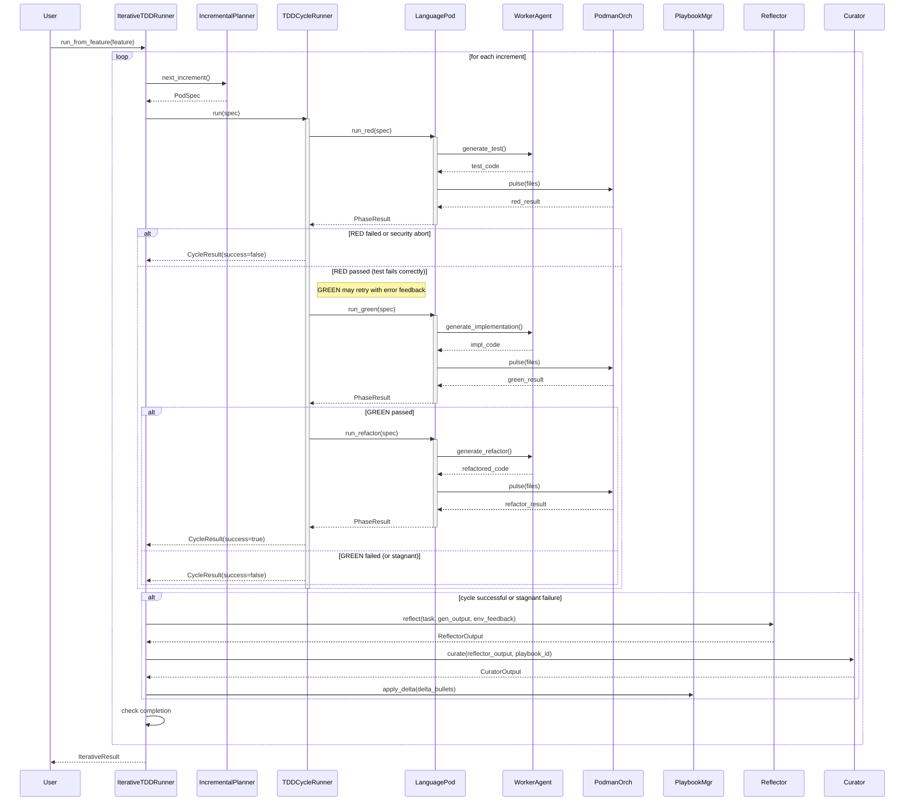

<!-- Generated by generate_live_docs.py on 2026-09-20 18:58 — do not edit by hand -->

# System Architecture

| Component | Module | Role |
|-----------|--------|------|
| IterativeTDDRunner | src/agents/iterative_tdd_runner.py | Orchestrates iterative TDD loop: plan→RED→GREEN→REFACTOR→repeat |
| TDDCycleRunner | src/agents/tdd_cycle_runner.py | Runs one TDD cycle (RED→GREEN→REFACTOR) with retries and learning |
| PythonLanguagePod | src/agents/python_language_pod.py | Python TDD execution: code gen via WorkerAgent, test via PodmanOrchestrator |
| GoLanguagePod | src/agents/go_language_pod.py | Go TDD execution via LLM and Podman |
| TypeScriptLanguagePod | src/agents/typescript_language_pod.py | TypeScript TDD execution via LLM and Podman |
| SimulationPod | src/agents/simulation_pod.py | Physics simulation TDD pod with PyBullet oracle |
| WorkerAgent | src/agents/worker_agent.py | LLM code generation for TDD phases (RED, GREEN, REFACTOR) |
| IncrementalPlanner | src/agents/incremental_planner.py | Determines the next test increment to write |
| CharacterizationTestGenerator | src/agents/characterization_test_generator.py | Generates empirically-verified characterization tests |
| GherkinExtractionAgent | src/agents/gherkin_extraction_agent.py | Reverse-engineers Gherkin scenarios from existing code and tests |
| TestReviewAgent | src/agents/test_review_agent.py | Validates test quality before implementation generation |
| EnsembleBuildRunner | src/agents/ensemble_build.py | Multi-candidate blind build for one feature |
| PodmanOrchestrator | src/agents/podman_orchestrator.py | Stateless sidecar execution layer with security hashing |
| PodmanRunner | src/agents/podman_runner.py | Rootless Podman container management |
| PlaybookManager | src/playbook/manager.py | Core playbook CRUD, delta updates, deduplication |
| Generator | src/core/generator/module.py | Executes tasks using playbook-guided LLM |
| Reflector | src/core/reflector/module.py | Analyzes execution outcome and extracts learning insights |
| Curator | src/core/curator/module.py | Synthesizes insights into actionable playbook updates |
| BulletRetriever | src/playbook/retrieval.py | Hybrid retrieval for relevant playbook bullets |
| ContextScorer | src/retrieval/context_scorer.py | Scores bullets against request context (temporal, team, tech) |
| InstitutionalKnowledgeService | src/retrieval/service.py | Central knowledge retrieval service for all code generation |
| DistillationRouter | src/playbook/distillation_router.py | Routes tasks to domain-specific distillation playbooks |
| AdaptiveBroker | src/broker/adaptive_broker.py | Routes tasks to best agent based on learned performance |
| PerformanceAggregator | src/broker/performance_aggregator.py | Extracts performance metrics from audit trail |
| BrokerAdvisor | src/broker/advisor.py | Recommends agents by capability fit |
| HumanDecisionInterface | src/broker/human_decision.py | Interface for human decision-making on agent assignments |
| FeedbackCollector | src/broker/feedback.py | Stores human ratings and detects automated–human drift |
| ProductionDataAnalyzer | src/benchmark/production_analyzer.py | Analyzes production quality data from experiment logs |
| SuccessRateCalculator | src/analytics/success_rate_calculator.py | Measures experiment success rates across the system |
| TokenEfficiencyReporter | src/analytics/token_efficiency.py | Aggregates token usage for cross-language efficiency scoring |
| CostQualityAnalyzer | src/analytics/cost_quality_analyzer.py | Analyzes cost–quality tradeoffs for model performance |
| ModelAttributionTracker | src/benchmark/model_attribution.py | Tracks per-model performance with OpenRouter attribution |
| ContractArchitect | src/contracts/contract_architect.py | Generates interface contracts from natural language requirements |
| ModuleArchitect | src/contracts/module_architect.py | Generates module-level contracts for stateful systems |
| ModuleTDDBuilder | src/contracts/module_tdd_builder.py | Builds module implementations using TDD methodology |

