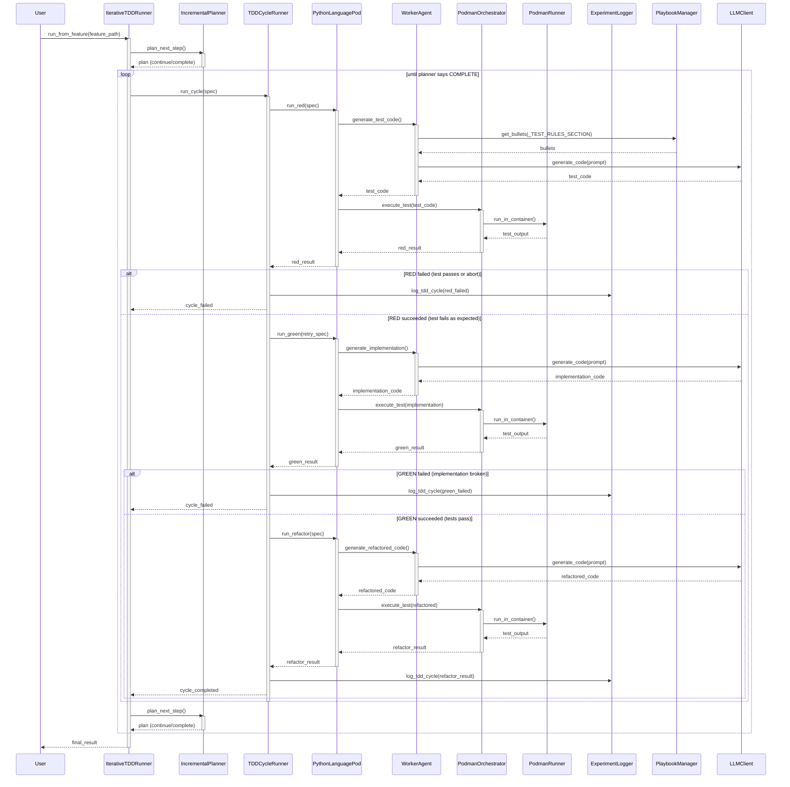

<!-- Generated by generate_live_docs.py on 2026-09-14 06:23 — do not edit by hand -->

# System Architecture

| Component | Module | Role |
|-----------|--------|------|
| IterativeTDDRunner | src/agents/iterative_tdd_runner.py | Orchestrates the Kent Beck-style RED→GREEN→REFACTOR loop, parsing Gherkin features and driving iterations until the planner signals COMPLETE. |
| IncrementalPlanner | src/agents/incremental_planner.py | Plans the next TDD step based on current state, deciding whether to continue or mark the cycle complete. |
| TDDCycleRunner | src/agents/tdd_cycle_runner.py | Executes one full RED→GREEN→REFACTOR cycle for a single feature, handling retries and persisting results via ExperimentLogger. |
| PythonLanguagePod | src/agents/python_language_pod.py | Implements the language-specific pod for Python, using WorkerAgent for code generation and PodmanOrchestrator for isolated execution. |
| WorkerAgent | src/agents/worker_agent.py | Generates Python code via LLM, applying test rules and playbook bullets to produce RED-phase tests and GREEN-phase implementations. |
| PodmanOrchestrator | src/agents/podman_orchestrator.py | Manages Podman container lifecycle, executing tests and code in isolated environments, detecting security breaches. |
| PodmanRunner | src/agents/podman_runner.py | Starts and manages the Podman container instance used for test execution. |
| PlaybookManager | src/playbook/manager.py | Loads, saves, and manages playbook data, providing bullets and sections for TDD guidance. |
| ExperimentLogger | src/storage/experiment_logger.py | Persists TDD cycle results and metrics to the database via SQLAlchemy models. |
| LLMClient | src/utils/llm_client.py | Provides the LLM interface for all model calls, routing to configured providers. |
| Reflector | src/core/reflector/module.py | Reflects on completed cycles, extracting lessons and updating the playbook with new knowledge. |
| Curator | src/core/curator/module.py | Curates playbook bullets, managing fenced code blocks and section organization. |
| PolyglotTDDRunner | src/agents/polyglot_tdd_runner.py | Drives RED→GREEN→REFACTOR loops for multiple languages, coordinating pods and reporting results. |
| TestReviewAgent | src/agents/test_review_agent.py | Reviews test quality before implementation, using LLM for deep analysis when enabled. |
| TypeScriptLanguagePod | src/agents/typescript_language_pod.py | Implements the language-specific pod for TypeScript, ensuring test imports and running tests in Podman. |
| TypeScriptRunner | src/agents/typescript_runner.py | Executes TypeScript tests inside a sandboxed Podman container. |
| TypeScriptWorkerAgent | src/agents/typescript_worker_agent.py | Generates TypeScript code via LLM with playbook guidance. |
| MermaidRunner | src/agents/mermaid_runner.py | Sends mermaid diagram text as pulses for validation. |
| SimulationPod | src/agents/simulation_pod.py | Simulates pod behavior for testing without real containers. |
| SimulationPodmanRunner | src/agents/simulation_podman_runner.py | Simulates Podman runner behavior for testing. |
| SimulationRunner | src/agents/simulation_runner.py | Runs simulations of the TDD loop for validation and calibration. |
| EscalatingVoting | src/core/generator/module.py | Implements escalating thresholds for model selection, starting strict and loosening over time. |
| ContextMap | src/utils/context_map.py | Extracts codebase context from Python files, mapping modules to relative paths. |
| EffgenClient | src/utils/effgen_client.py | Adapter to use effGen local models with the LLMClient interface. |
| MermaidValidation | src/utils/mermaid_validation.py | Extracts and validates mermaid blocks, checking syntax and topological ordering. |
| ImportValidator | src/utils/import_validator.py | Validates import statements in generated code. |
| FileLock | src/utils/file_lock.py | Provides file locking for concurrent access to shared resources. |
| IdGenerator | src/utils/id_generator.py | Generates unique identifiers for experiments and entities. |
| CodeExtraction | src/utils/code_extraction.py | Extracts code from LLM responses, handling fenced code blocks. |

