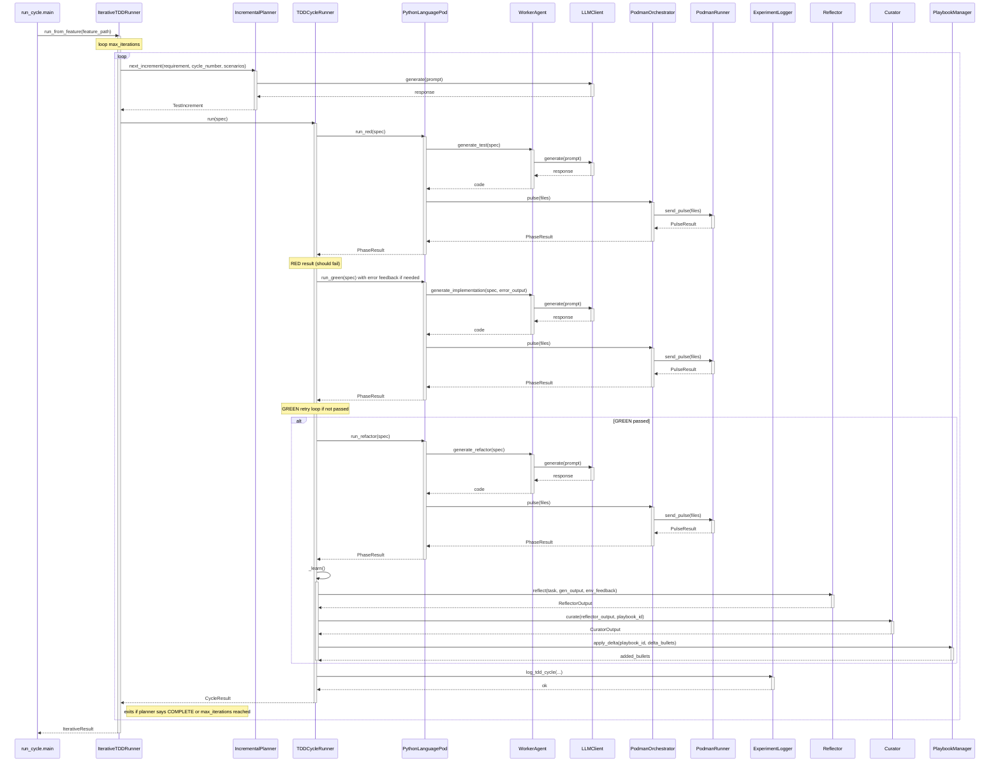

<!-- Generated by generate_live_docs.py on 2026-09-01 22:26 — do not edit by hand -->

# System Architecture

| Component | Module | Role |
|-----------|--------|------|
| IterativeTDDRunner | src/agents/iterative_tdd_runner.py | Orchestrates the iterative RED→GREEN→REFACTOR loop across multiple test increments |
| TDDCycleRunner | src/agents/tdd_cycle_runner.py | Executes a single TDD cycle (RED→GREEN→REFACTOR) with retry logic for GREEN failures |
| IncrementalPlanner | src/agents/incremental_planner.py | Plans the next test increment by querying LLM against current codebase state |
| PythonLanguagePod | src/agents/python_language_pod.py | LanguagePod implementation for Python, delegates code generation to WorkerAgent and execution to PodmanOrchestrator |
| WorkerAgent | src/agents/worker_agent.py | Generates code for each TDD phase (RED, GREEN, REFACTOR) via LLM with playbook context |
| PodmanOrchestrator | src/agents/podman_orchestrator.py | Stateless sidecar execution layer ensuring workspace integrity via canonical hashing |
| PodmanRunner | src/agents/podman_runner.py | Rootless Podman container runner for isolated test execution |
| PlaybookManager | src/playbook/manager.py | Manages playbook CRUD, delta application, deduplication, and token budget enforcement |
| ExperimentLogger | src/storage/experiment_logger.py | Logs TDD cycles and experiments to PostgreSQL with SQLite fallback |
| LLMClient | src/utils/llm_client.py | Unified interface for multiple LLM providers (OpenRouter, OpenAI, Anthropic, etc.) |
| Reflector | src/core/reflector/module.py | Analyzes task outcomes, extracts error patterns, root causes, and key insights |
| Curator | src/core/curator/module.py | Synthesizes reflector insights into playbook bullets with section organization |
| Generator | src/core/generator/module.py | Executes tasks using playbook-guided LLM generation with bullet retrieval |
| BulletRetriever | src/playbook/retrieval.py | Hybrid retrieval engine for selecting relevant bullets using semantic + keyword scoring |
| ContextMapBuilder | src/utils/context_map.py | Builds AST context map from source files for code generation context |
| ContextMap | src/utils/context_map.py | Provides AST signatures relevant to failing test IDs for implementation context |
| PerformanceAggregator | src/broker/performance_aggregator.py | Aggregates agent performance metrics from audit trail including Bayesian estimates |
| AdaptiveBroker | src/broker/adaptive_broker.py | Routes tasks to best agent based on historical performance and cost-quality trade-offs |
| CapabilityRegistry | src/broker/capability_registry.py | Tracks anonymous agent capabilities and proficiency ratings |
| EnsembleBuildRunner | src/agents/ensemble_build.py | Drives multi-candidate blind feature build across models with consensus evaluation |
| PolyglotTDDRunner | src/agents/polyglot_tdd_runner.py | Orchestrates RED→GREEN→REFACTOR across multiple language pods for the same feature |
| PodFactory | src/agents/polyglot_tdd_runner.py | Creates LanguagePod instances for a given language identifier |
| TDDLessonInjector | src/agents/tdd_lesson_injector.py | Injects TDD lessons and anti-patterns into agent prompts per development phase |
| TDDFailureRecorder | src/agents/tdd_failure_recorder.py | Records TDD failures and interventions for self-healing and playbook updates |
| RedundancyPreChecker | src/agents/redundancy_checker.py | Pre-checks proposed tests for redundancy before RED phase using keyword matching |
| TestReviewAgent | src/agents/test_review_agent.py | Reviews test quality before implementation, detecting structural issues and edge cases |
| InstitutionalKnowledgeService | src/retrieval/service.py | Central knowledge retrieval service for all code generation activities |
| ContextGraphRetriever | src/retrieval/cgr3_retriever.py | CGR³ pipeline: context-aware retrieval, ranking, and reasoning with verdict |
| ContextScorer | src/retrieval/context_scorer.py | Scores bullets against request context across temporal, team, tech stack, project, domain dimensions |
| AuditStore | src/audit/store.py | Append-only audit event store with hash chain integrity verification |
| LocalAuditClient | src/audit/local_client.py | Writes audit events directly to local SQLite database for development/testing |
| ContractArchitect | src/contracts/contract_architect.py | Generates interface contracts from natural language requirements |
| ContractOrchestrator | src/contracts/contract_driven.py | Orchestrates contract-driven development: registration, validation, and status tracking |
| ModuleArchitect | src/contracts/module_architect.py | Generates module-level contracts for stateful systems with shared state and integration tests |
| ProjectArchitect | src/contracts/project_architect.py | Decomposes project specification into a module dependency DAG |

