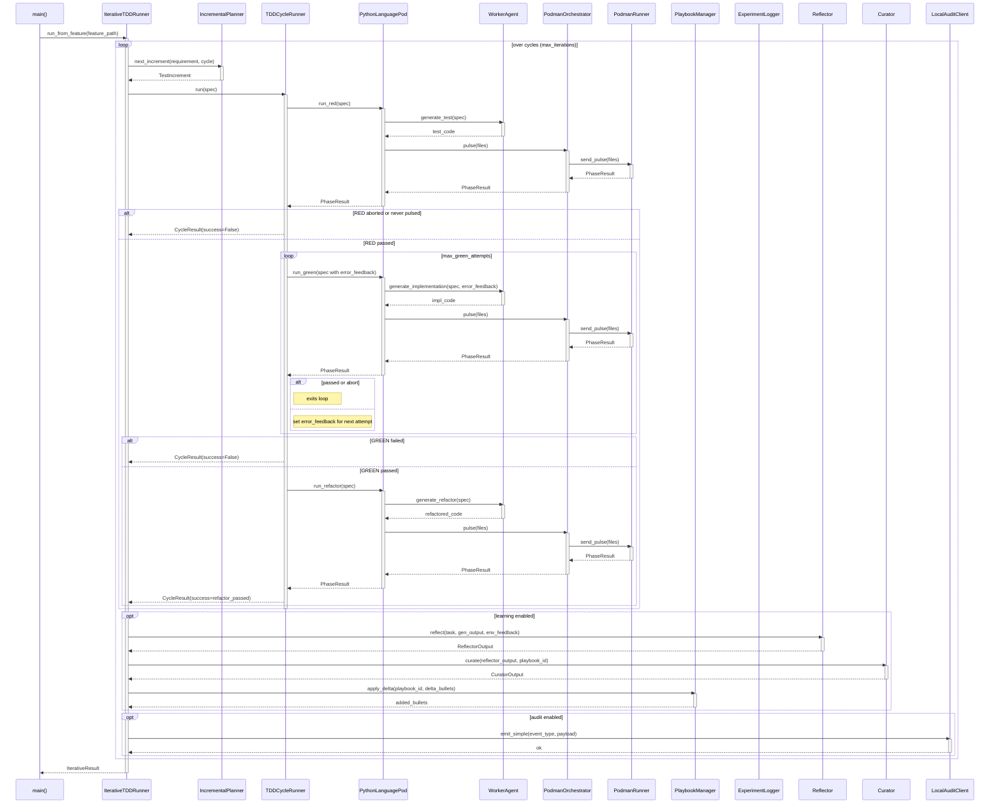

<!-- Generated by generate_live_docs.py on 2026-09-13 09:18 — do not edit by hand -->

# System Architecture

| Component | Module | Role |
|-----------|--------|------|
| IterativeTDDRunner | src/agents/iterative_tdd_runner.py | Orchestrates the iterative TDD loop (plan → RED → GREEN → REFACTOR → learn) |
| TDDCycleRunner | src/agents/tdd_cycle_runner.py | Runs one complete TDD cycle with GREEN retries and optional learning/audit |
| IncrementalPlanner | src/agents/incremental_planner.py | Determines the next test increment using LLM and existing context |
| PythonLanguagePod | src/agents/python_language_pod.py | LanguagePod for Python TDD cycles; delegates code generation and container execution |
| WorkerAgent | src/agents/worker_agent.py | Generates code for each TDD phase via LLM prompts |
| PodmanOrchestrator | src/agents/podman_orchestrator.py | Stateless sidecar execution layer; verifies workspace integrity |
| PodmanRunner | src/agents/podman_runner.py | ContainerRunner implementation using rootless Podman |
| PlaybookManager | src/playbook/manager.py | Manages playbook CRUD, delta updates, deduplication, and persistence |
| ExperimentLogger | src/storage/experiment_logger.py | Unified logger for TDD and ML experiments with PostgreSQL/SQLite fallback |
| LLMClient | src/utils/llm_client.py | Unified LLM client supporting multiple providers (OpenRouter, OpenAI, etc.) |
| Reflector | src/core/reflector/module.py | Analyzes task outcomes and extracts learning insights |
| Curator | src/core/curator/module.py | Synthesizes insights into playbook delta bullets |
| Generator | src/core/generator/module.py | Executes tasks using playbook-guided LLM generation |
| BulletRetriever | src/playbook/retrieval.py | Hybrid retrieval system for selecting relevant playbook bullets |
| ContextScorer | src/retrieval/context_scorer.py | Scores bullets against request context across temporal, team, tech-stack dimensions |
| InstitutionalKnowledgeService | src/retrieval/service.py | Central knowledge retrieval service for all code generation activities |
| PerformanceAggregator | src/broker/performance_aggregator.py | Extracts performance metrics from audit trail |
| AdaptiveBroker | src/broker/adaptive_broker.py | Routes tasks to best agent based on historical performance |
| AuditStore | src/audit/store.py | Append-only audit store with hash chain integrity |
| LocalAuditClient | src/audit/local_client.py | Audit client that writes directly to local SQLite database |
| RedundancyPreChecker | src/agents/redundancy_checker.py | Pre-checks proposed tests for redundancy before RED phase |
| GherkinFeatureBridge | src/agents/gherkin_feature_bridge.py | Parses Gherkin .feature files into FeatureSpec |
| ImportFilter | src/agents/import_filter.py | Checks generated code for forbidden imports and builtins |
| PolyglotTDDRunner | src/agents/polyglot_tdd_runner.py | Orchestrates TDD across multiple LanguagePods for different languages |
| PodFactory | src/agents/polyglot_tdd_runner.py | Creates LanguagePod instances for a given language identifier |
| SimulationPod | src/agents/simulation_pod.py | LanguagePod for PyBullet-backed physics simulation TDD cycles |
| SimulationOracle | src/agents/simulation_oracle.py | Physics-simulation test oracle running inside a container |
| EnsembleBuildRunner | src/agents/ensemble_build.py | Drives multi-candidate blind build for one feature |
| ConsensusBuilder | src/ensemble/consensus.py | Builds consensus from multiple model proposals |
| EnsembleLearner | src/ensemble/learner.py | Orchestrates multiple models learning in parallel with voting |
| VotingSystem | src/ensemble/voting.py | Main voting system with configurable strategies (majority, supermajority, weighted) |
| BulletClusterer | src/playbook/clustering.py | DBSCAN-based clustering for playbook bullets |
| BulletDeduplicator | src/playbook/deduplication.py | Handles semantic deduplication of bullets using embedding similarity |
| DistillationRouter | src/playbook/distillation_router.py | Routes tasks to domain-specific distillation playbooks |
| PlaybookQA | src/playbook/qa.py | Q&A system that answers coding questions using playbook knowledge |

