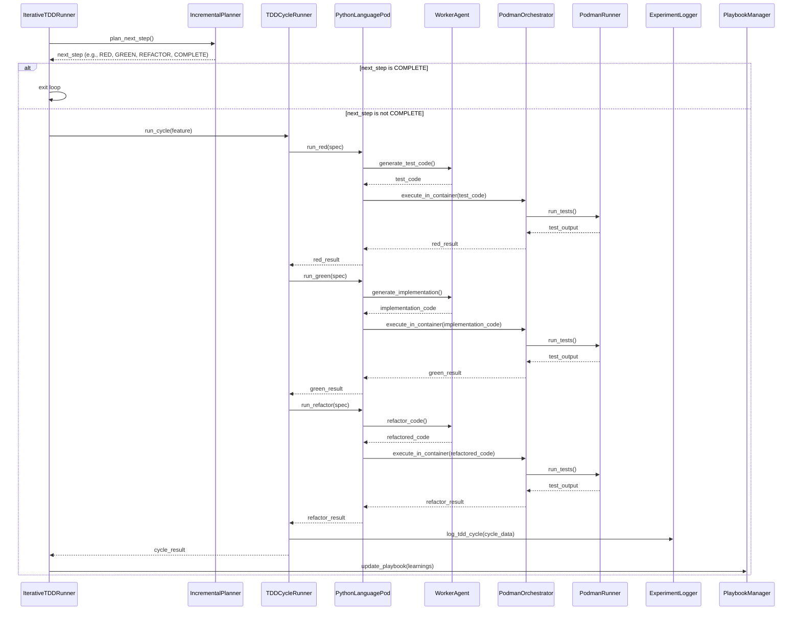

<!-- Generated by generate_live_docs.py on 2026-09-21 08:18 — do not edit by hand -->

# System Architecture

| Component | Module | Role |
|-----------|--------|------|
| IterativeTDDRunner | src/agents/iterative_tdd_runner.py | Orchestrates the Kent Beck-style RED→GREEN→REFACTOR loop, iterating until the planner declares COMPLETE. |
| IncrementalPlanner | src/agents/incremental_planner.py | Plans the next TDD step based on current progress and feature requirements. |
| TDDCycleRunner | src/agents/tdd_cycle_runner.py | Executes a single RED→GREEN→REFACTOR cycle for one feature, including retries. |
| PythonLanguagePod | src/agents/python_language_pod.py | Implements language-specific TDD phases (RED/GREEN/REFACTOR) for Python using WorkerAgent and PodmanOrchestrator. |
| WorkerAgent | src/agents/worker_agent.py | Generates and edits code via LLM, following SEARCH/REPLACE blocks and test rules. |
| PodmanOrchestrator | src/agents/podman_orchestrator.py | Manages isolated container execution for running tests and code. |
| PodmanRunner | src/agents/podman_runner.py | Handles container lifecycle and command execution inside Podman. |
| PlaybookManager | src/playbook/manager.py | Loads, persists, and manages playbook knowledge base (bullets, sections). |
| ExperimentLogger | src/storage/experiment_logger.py | Persists TDD cycle results and experiment metadata to the database. |
| LLMClient | src/utils/llm_client.py | Provides unified interface to LLM providers (e.g., OpenRouter, effGen). |
| PolyglotTDDRunner | src/agents/polyglot_tdd_runner.py | Drives RED→GREEN→REFACTOR loops across multiple languages from a Gherkin feature. |
| TestReviewAgent | src/agents/test_review_agent.py | Validates test quality before implementation, optionally using LLM deep review. |
| TypeScriptLanguagePod | src/agents/typescript_language_pod.py | Implements TDD phases for TypeScript, ensuring test imports. |
| TypeScriptRunner | src/agents/typescript_runner.py | Runs TypeScript tests inside a sandboxed Podman container. |
| TypeScriptWorkerAgent | src/agents/typescript_worker_agent.py | Generates TypeScript code via LLM with language-specific rules. |
| ModuleTDDOrchestrator | src/core/generator/module.py | Orchestrates module-level TDD, including sandboxed candidate runners and assembly. |
| ModuleTDDRunner | src/core/generator/module.py | Runs TDD for a single module, handling repairs and escalations. |
| Reflector | src/core/reflector/module.py | Analyzes failures and extracts context from codebase. |
| Curator | src/core/curator/module.py | Curates and updates playbook bullets based on reflector analysis. |
| AdaptiveBroker | src/core/generator/module.py | Routes runs to candidate models based on configuration. |
| MermaidRunner | src/agents/mermaid_runner.py | Sends mermaid diagram text as a pulse for validation. |
| SimulationPod | src/agents/simulation_pod.py | Simulates pod behavior for testing without real containers. |
| SimulationPodmanRunner | src/agents/simulation_podman_runner.py | Simulates Podman runner for sandboxed testing. |
| SimulationRunner | src/agents/simulation_runner.py | Runs simulation-based TDD cycles for calibration. |
| CodeExtractor | src/utils/code_extraction.py | Extracts code blocks from LLM responses. |
| ContextMap | src/utils/context_map.py | Maps module paths to file paths and builds context. |
| EffGenClient | src/utils/effgen_client.py | Adapter for effGen local models implementing LLMClient interface. |
| FileLock | src/utils/file_lock.py | Provides file-based locking for concurrent access. |
| ImportValidator | src/utils/import_validator.py | Validates import statements in generated code. |
| MermaidValidator | src/utils/mermaid_validation.py | Extracts and validates mermaid diagram blocks. |

