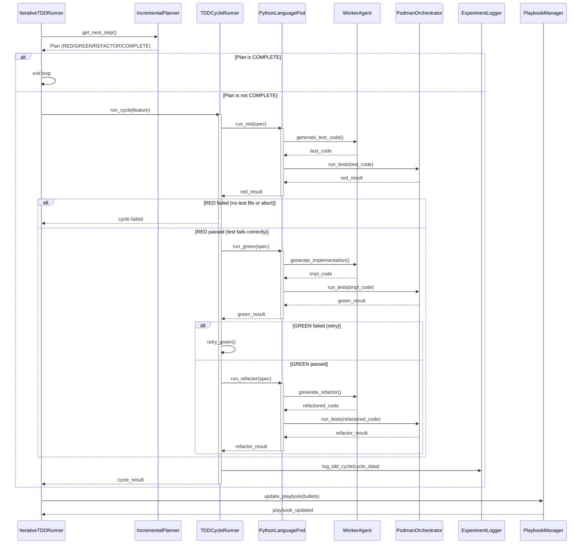

<!-- Generated by generate_live_docs.py on 2026-09-22 11:43 — do not edit by hand -->

# System Architecture

| Component | Module | Role |
|-----------|--------|------|
| IterativeTDDRunner | src/agents/iterative_tdd_runner.py | Orchestrates the Kent Beck-style RED→GREEN→REFACTOR loop, iterating until the planner declares COMPLETE. |
| IncrementalPlanner | src/agents/incremental_planner.py | Plans the next TDD step based on current state and feature requirements. |
| TDDCycleRunner | src/agents/tdd_cycle_runner.py | Executes a single RED→GREEN→REFACTOR cycle for one feature, handling retries and logging. |
| PythonLanguagePod | src/agents/python_language_pod.py | Language-specific pod that uses WorkerAgent for code generation and PodmanOrchestrator for execution. |
| WorkerAgent | src/agents/worker_agent.py | Generates Python code (implementation, tests, refactors) via LLM with strict formatting rules. |
| PodmanOrchestrator | src/agents/podman_orchestrator.py | Manages sandboxed container lifecycle and execution for tests and code. |
| PodmanRunner | src/agents/podman_runner.py | Runs commands inside a Podman container, handling test execution and result collection. |
| PlaybookManager | src/playbook/manager.py | Loads, persists, and manages playbook sections and bullets (knowledge base). |
| ExperimentLogger | src/storage/experiment_logger.py | Persists TDD cycle results and experiment metrics to the database. |
| LLMClient | src/utils/llm_client.py | Unified client for LLM API calls (OpenRouter, effGen, etc.). |
| PolyglotTDDRunner | src/agents/polyglot_tdd_runner.py | Drives RED→GREEN→REFACTOR loops across multiple languages for a feature. |
| Reflector | src/core/reflector/module.py | Analyzes test failures and code context to generate improvement insights. |
| Curator | src/core/curator/module.py | Curates and deduplicates knowledge bullets from reflector output and codebase. |
| Generator | src/core/generator/module.py | Generates sandboxed candidate runners and orchestrates module-level TDD. |
| TestReviewAgent | src/agents/test_review_agent.py | Validates test quality before implementation, optionally using LLM deep review. |
| TypeScriptLanguagePod | src/agents/typescript_language_pod.py | TypeScript-specific pod for TDD cycles with namespace import handling. |
| TypeScriptRunner | src/agents/typescript_runner.py | Runs TypeScript tests inside a sandboxed container. |
| TypeScriptWorkerAgent | src/agents/typescript_worker_agent.py | Generates TypeScript code via LLM with language-specific rules. |
| SimulationPod | src/agents/simulation_pod.py | Simulated pod for testing and calibration without real containers. |
| SimulationPodmanRunner | src/agents/simulation_podman_runner.py | Simulated container runner for dry-run or calibration scenarios. |
| SimulationRunner | src/agents/simulation_runner.py | Orchestrates simulated TDD cycles for calibration and cold-start testing. |
| MermaidRunner | src/agents/mermaid_runner.py | Sends mermaid diagram text as a pulse for visualization. |
| EffGenClient | src/utils/effgen_client.py | Adapter to use effGen local models with the LLMClient interface. |
| ImportValidator | src/utils/import_validator.py | Validates Python import statements for correctness and security. |
| ContextMap | src/utils/context_map.py | Maps dotted module paths to file paths and extracts import context. |

