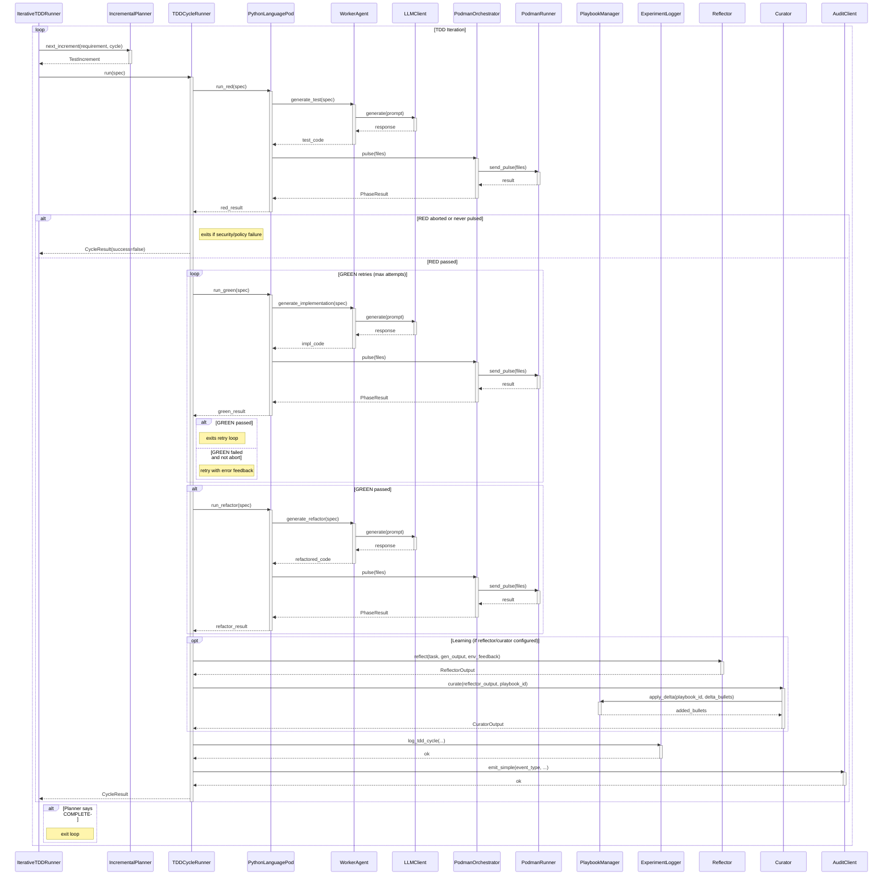

<!-- Generated by generate_live_docs.py on 2026-09-14 18:49 — do not edit by hand -->

# System Architecture

| Component | Module | Role |
|-----------|--------|------|
| IterativeTDDRunner | src/agents/iterative_tdd_runner.py | Orchestrates the iterative TDD loop: plan → RED → GREEN → REFACTOR → repeat until planner signals COMPLETE |
| TDDCycleRunner | src/agents/tdd_cycle_runner.py | Runs one complete TDD cycle (RED → GREEN with retries → REFACTOR) and triggers learning loop |
| PythonLanguagePod | src/agents/python_language_pod.py | LanguagePod implementation for Python TDD cycles; delegates code generation to WorkerAgent and execution to PodmanOrchestrator |
| WorkerAgent | src/agents/worker_agent.py | Generates code for each TDD phase (test, implementation, refactor) using LLM and playbook context |
| IncrementalPlanner | src/agents/incremental_planner.py | Determines the next test increment to write by querying the LLM about what remains unimplemented |
| PodmanOrchestrator | src/agents/podman_orchestrator.py | Stateless sidecar execution layer that sends files to the container and verifies hash integrity |
| PodmanRunner | src/agents/podman_runner.py | Production ContainerRunner backed by rootless Podman; manages container lifecycle and file pulses |
| PlaybookManager | src/playbook/manager.py | Manages playbook CRUD, delta updates, semantic deduplication, token budgets, and persistence |
| ExperimentLogger | src/storage/experiment_logger.py | Unified logger for TDD and ML experiments; stores to PostgreSQL with SQLite fallback |
| LLMClient | src/utils/llm_client.py | Unified LLM client supporting multiple providers (OpenRouter, OpenAI, Anthropic, etc.) |
| Reflector | src/core/reflector/module.py | Analyzes task outcomes and extracts error patterns, root causes, and key insights |
| Curator | src/core/curator/module.py | Synthesizes reflector insights into actionable playbook bullets and applies them |
| Generator | src/core/generator/module.py | Executes tasks using playbook-guided LLM generation with bullet retrieval |
| EnsembleBuildRunner | src/agents/ensemble_build.py | Drives multi-candidate blind build for one feature across multiple models |
| PolyglotTDDRunner | src/agents/polyglot_tdd_runner.py | Orchestrates RED→GREEN→REFACTOR across multiple LanguagePods for different languages |
| CharacterizationTestGenerator | src/agents/characterization_test_generator.py | Drafts, verifies, and repairs pytest characterization suites for existing code |
| GherkinExtractionAgent | src/agents/gherkin_extraction_agent.py | Reverse engineers Gherkin scenarios from existing code and tests |
| GherkinFeatureBridge | src/agents/gherkin_feature_bridge.py | Parses .feature files into FeatureSpec for Gherkin-driven TDD |
| TestReviewAgent | src/agents/test_review_agent.py | Validates test quality before implementation using structural checks and optional LLM analysis |
| RedundancyPreChecker | src/agents/redundancy_checker.py | Pre-checks proposed tests for redundancy against existing tests before RED phase |
| TDDFailureRecorder | src/agents/tdd_failure_recorder.py | Records TDD failures and interventions for self-improvement and playbook updates |
| TDDLessonInjector | src/agents/tdd_lesson_injector.py | Injects TDD lessons into agent prompts based on development phase |
| ProjectArchitect | src/contracts/project_architect.py | Decomposes a project specification into a module dependency DAG |
| ModuleArchitect | src/contracts/module_architect.py | Generates module-level contracts with shared state and integration tests |
| ModuleTDDBuilder | src/contracts/module_tdd_builder.py | Builds module implementations using TDD methodology per function |
| ContractOrchestrator | src/contracts/contract_driven.py | Orchestrates contract-driven development: registration, implementation, validation |
| ContractValidator | src/contracts/contract_driven.py | Validates implementations against contracts by running test cases in sandbox |
| AdaptiveBroker | src/broker/adaptive_broker.py | Routes tasks to the best agent based on historical performance and cost-quality tradeoffs |
| PerformanceAggregator | src/broker/performance_aggregator.py | Aggregates performance metrics from the audit trail for agent evaluation |
| BrokerAdvisor | src/broker/advisor.py | Recommends agents by capability fit using the capability registry |
| CapabilityRegistry | src/broker/capability_registry.py | Tracks anonymous agent capabilities and proficiency ratings |
| EffGenAdapter | src/broker/effgen_adapter.py | Adapter for integrating effGen small language models with the Capability Broker |
| HumanDecisionInterface | src/broker/human_decision.py | Interface for human decision-making in agent selection with full context |
| ModelAttributionTracker | src/benchmark/model_attribution.py | Tracks OpenRouter model attribution in performance metrics for cost analysis |
| ProductionDataAnalyzer | src/benchmark/production_analyzer.py | Analyzes quality data from experiment_logs to generate production reports |

