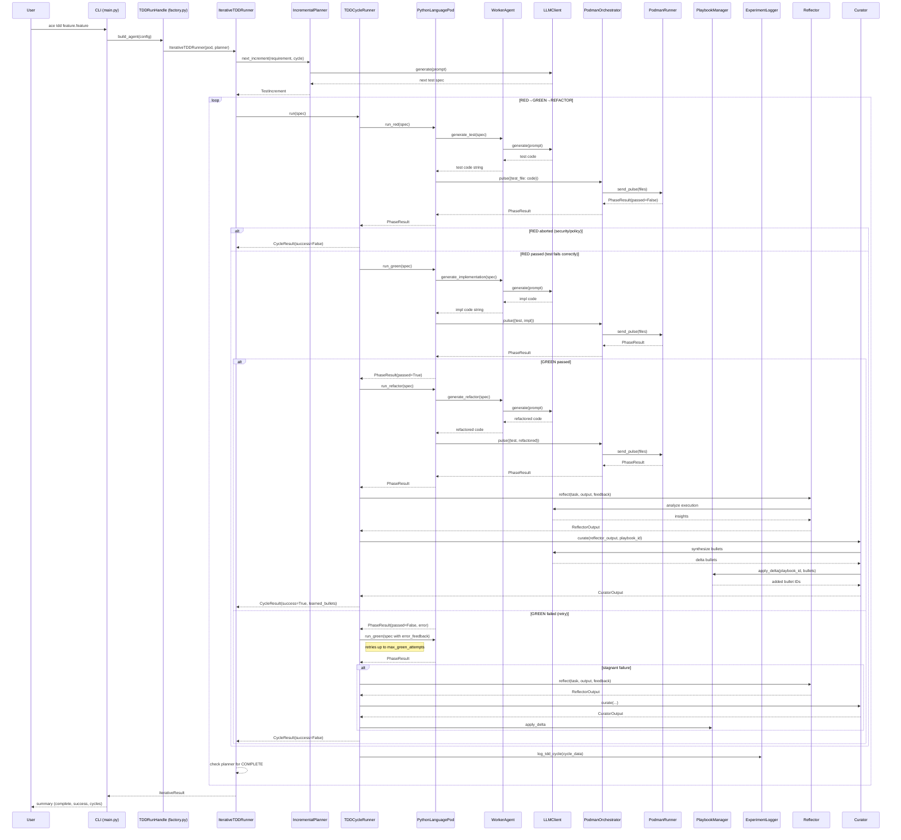

<!-- Generated by generate_live_docs.py on 2026-09-13 07:27 — do not edit by hand -->

# System Architecture

| Component | Module | Role |
|-----------|--------|------|
| IterativeTDDRunner | src/agents/iterative_tdd_runner.py | Orchestrates the RED→GREEN→REFACTOR loop across multiple cycles |
| TDDCycleRunner | src/agents/tdd_cycle_runner.py | Runs one complete TDD cycle with GREEN retries and learning loop |
| IncrementalPlanner | src/agents/incremental_planner.py | Determines the next test increment via LLM |
| PythonLanguagePod | src/agents/python_language_pod.py | LanguagePod for Python: code generation + container execution |
| WorkerAgent | src/agents/worker_agent.py | Generates code for RED/GREEN/REFACTOR phases |
| PodmanOrchestrator | src/agents/podman_orchestrator.py | Stateless sidecar execution with security breach detection |
| PodmanRunner | src/agents/podman_runner.py | Rootless Podman container lifecycle and pulse execution |
| PlaybookManager | src/playbook/manager.py | CRUD operations for playbook bullets with dedup and safety |
| ExperimentLogger | src/storage/experiment_logger.py | Persists TDD cycles and ML experiments to DB |
| LLMClient | src/utils/llm_client.py | Unified LLM provider interface (OpenRouter, OpenAI, etc.) |
| Reflector | src/core/reflector/module.py | Analyzes task outcomes and extracts learning insights |
| Curator | src/core/curator/module.py | Synthesizes insights into playbook delta bullets |
| Generator | src/core/generator/module.py | Executes tasks using playbook-guided LLM generation |
| BulletRetriever | src/playbook/retrieval.py | Hybrid retrieval engine for relevant playbook bullets |
| BulletDeduplicator | src/playbook/deduplication.py | Semantic deduplication via embedding similarity |
| ContextScorer | src/retrieval/context_scorer.py | Scores bullets against request context (temporal, team, tech) |
| ContextGraphRetriever | src/retrieval/cgr3_retriever.py | CGR³ pipeline: retrieve, rank, reason |
| InstitutionalKnowledgeService | src/retrieval/service.py | Central knowledge retrieval for code generation |
| PerformanceAggregator | src/broker/performance_aggregator.py | Extracts agent metrics from audit trail |
| AdaptiveBroker | src/broker/adaptive_broker.py | Routes tasks to best agent based on learned performance |
| ModelAttributionTracker | src/benchmark/model_attribution.py | Tracks OpenRouter model attribution in performance metrics |
| ProductionDataAnalyzer | src/benchmark/production_analyzer.py | Analyzes quality data from experiment logs |
| SuccessRateCalculator | src/analytics/success_rate_calculator.py | Measures experiment success rates across the system |
| TokenEfficiencyReporter | src/analytics/token_efficiency.py | Computes token efficiency scores from LanguagePod data |
| EnsembleBuildRunner | src/agents/ensemble_build.py | Drives multi-candidate blind build for one feature |
| ConsensusBuilder | src/ensemble/consensus.py | Builds consensus from multiple model proposals |
| EnsembleLearner | src/ensemble/learner.py | Orchestrates multiple models learning in parallel |
| VotingSystem | src/ensemble/voting.py | Applies voting strategies to ensemble bullets |
| DistillationRouter | src/playbook/distillation_router.py | Routes tasks to domain-specific distillation playbooks |
| ProjectArchitect | src/contracts/project_architect.py | Decomposes project spec into module DAG |
| ModuleArchitect | src/contracts/module_architect.py | Generates module-level contracts for stateful systems |
| ModuleTDDBuilder | src/contracts/module_tdd_builder.py | Builds module implementations using TDD |
| ProjectBuilder | src/cli/project_builder.py | Builds every module of a ProjectPlan in dependency order |
| ContractOrchestrator | src/contracts/contract_driven.py | Orchestrates contract-driven development |
| SimulationOracle | src/agents/simulation_oracle.py | Physics-simulation test oracle for SimulationPod |
| SimulationPod | src/agents/simulation_pod.py | LanguagePod for PyBullet-backed TDD cycles |
| CharacterizationTestGenerator | src/agents/characterization_test_generator.py | Drafts and repairs pytest characterization suites |
| GherkinExtractionAgent | src/agents/gherkin_extraction_agent.py | Reverse-engineers Gherkin from existing code and tests |
| GherkinFeatureBridge | src/agents/gherkin_feature_bridge.py | Parses .feature files into FeatureSpec |
| RedundancyPreChecker | src/agents/redundancy_checker.py | Detects redundant tests before writing them |
| TestReviewAgent | src/agents/test_review_agent.py | Validates test quality before implementation |
| TDDFailureRecorder | src/agents/tdd_failure_recorder.py | Records failures and interventions for self-improvement |
| TDDLessonInjector | src/agents/tdd_lesson_injector.py | Injects TDD lessons into agent prompts |
| PlaybookReliabilityAnalyzer | src/reliability/playbook_analyzer.py | Correlates bullet retrieval with first-pass GREEN success |
| TDDCycleAnalyzer | src/reliability/tdd_cycle_analyzer.py | Measures first-pass GREEN rate and trend over time |
| RegressionDetector | src/broker/regression_detector.py | Tracks quality changes across model versions |
| CostQualityAnalyzer | src/analytics/cost_quality_analyzer.py | Analyzes cost-quality tradeoffs for model performance |
| BlindEvaluator | src/benchmark/blind_evaluation.py | Scores outputs without knowing which agent produced them |
| AuditStore | src/audit/store.py | Append-only audit event store with hash chain integrity |
| LocalAuditClient | src/audit/local_client.py | Write-only audit client for local SQLite |
| AuditDashboard | src/audit/dashboard.py | Analyzes audit data for human insights |
| FeedbackCollector | src/broker/feedback.py | Stores human ratings and derives blended/drift scores |
| HumanDecisionInterface | src/broker/human_decision.py | Interface for human decision-making on agent selection |
| BrokerAdvisor | src/broker/advisor.py | Recommends agents by capability fit |
| CapabilityRegistry | src/broker/capability_registry.py | Anonymous agent capability tracking |
| EffGenAdapter | src/broker/effgen_adapter.py | Connects small language models to ACE |
| BulletClusterer | src/playbook/clustering.py | DBSCAN clustering for playbook bullets |
| MarkdownImporter | src/playbook/markdown_importer.py | Batch imports knowledge from markdown files |
| PlaybookQA | src/playbook/qa.py | Answers coding questions using playbook knowledge |
| PostgresPlaybookAdapter | src/playbook/postgres_adapter.py | PostgreSQL-backed playbook manager |
| PostgresBulletRetriever | src/playbook/postgres_retriever.py | PostgreSQL-backed retrieval using pgvector |
| PlaybookRepository | src/storage/repository.py | PostgreSQL repository with pgvector for semantic search |
| EmbeddingService | src/utils/embedding.py | Local embedding generation using sentence-transformers |
| ContextMapBuilder | src/utils/context_map.py | Builds AST context maps from source files |
| ImportFilter | src/agents/import_filter.py | Blocks forbidden imports and builtin calls in generated code |
| ImportValidator | src/utils/import_validator.py | Validates and corrects import paths in generated code |
| ClaudeCliClient | src/utils/claude_cli_client.py | LLM client backed by local claude CLI |
| EffGenClient | src/utils/effgen_client.py | LLM client adapter for effGen local models |
| DriftDetector | src/utils/file_lock.py | Detects inadvertent file drift during TDD cycles |
| PlaybookEnforcer | src/utils/playbook_enforcer.py | Enforces high-frequency feedback rules |
| SessionLog | src/utils/session_log.py | Tracks edits and tests in current session |
| ProjectDetector | src/project/detector.py | Detects and analyzes Python project structure |
| DecisionRecord | src/project/decision_record.py | Generates Architectural Decision Records |
| ACEMLflowCallback | src/ml/mlflow_callback.py | Captures ACE knowledge during MLflow experiments |
| PostgresACEMLflowCallback | src/ml/postgres_mlflow_callback.py | PostgreSQL-backed MLflow callback for ACE knowledge |
| MLflowKnowledgeQuery | src/ml/query_interface.py | Unified interface to query MLflow runs with ACE knowledge |
| MLExperimentKnowledge | src/ml/experiment_knowledge.py | Knowledge base for ML experiments |
| ContractDecomposer | src/contracts/contract_decomposer.py | Breaks user specs into interface contracts |
| ContractValidator | src/contracts/contract_driven.py | Validates implementations against contracts |
| GoLanguagePod | src/agents/go_language_pod.py | LanguagePod for Go TDD cycles |
| GoRunner | src/agents/go_runner.py | PodmanRunner variant for Go harness |
| TypeScriptLanguagePod | src/agents/typescript_language_pod.py | LanguagePod for TypeScript TDD cycles |
| TypeScriptRunner | src/agents/typescript_runner.py | PodmanRunner variant for TypeScript harness |
| TypeScriptWorkerAgent | src/agents/typescript_worker_agent.py | Code generation for TypeScript TDD cycles |
| PolyglotTDDRunner | src/agents/polyglot_tdd_runner.py | Orchestrates TDD across multiple LanguagePods |
| PodFactory | src/agents/polyglot_tdd_runner.py | Creates LanguagePod instances for a given language |
| SimulationPodmanRunner | src/agents/simulation_podman_runner.py | PodmanRunner variant for simulation physics harness |
| SimulationScenario | src/agents/simulation_scenario.py | Pluggable physical-world contract for SimulationOracle |
| PegInHoleScenario | src/agents/simulation_scenarios/peg_in_hole.py | Peg-in-hole insertion task scenario |
| TactilePegInHoleScenario | src/agents/simulation_scenarios/peg_in_hole_tactile.py | Contact-rich peg-in-hole with tactile feedback |
| TrajectoryFollowingScenario | src/agents/simulation_scenarios/trajectory_following.py | Moving-target tracking task scenario |
| CodeReuseDetector | src/agents/project_aware_tdd.py | Detects code reuse opportunities in the project |
| ProjectArchitecture | src/agents/project_aware_tdd.py | Manages cached project architecture information |
| GoStepGenerator | src/agents/go_step_generator.py | Generates Go step definitions for Gherkin scenarios |
| LessonExtractor | src/agents/tdd_lessons.py | Extracts TDD lessons from resolved beads issues |
| MetricBound | src/agents/simulation_invariants.py | Extracts physical acceptance criteria from Gherkin |
| AttemptRecord | src/agents/simulation_replay.py | Replays archived SimulationPod attempts |
| SimulationTelemetry | src/agents/simulation_runner.py | Outcome of one simulation scenario run |
| EnsembleCandidate | src/agents/ensemble_build.py | One model's attempt at a feature build |
| ConsensusReport | src/agents/ensemble_build.py | Convergence analysis of candidate solutions |
| FeatureSpec | src/agents/gherkin_feature_bridge.py | Parsed representation of a Gherkin .feature file |
| ScenarioSpec | src/agents/gherkin_feature_bridge.py | One Gherkin scenario with step lines |
| TestIncrement | src/agents/incremental_planner.py | One planned test step in the TDD loop |
| IterativeResult | src/agents/iterative_tdd_runner.py | Outcome of a full iterative TDD session |
| CycleResult | src/agents/tdd_cycle_runner.py | Outcome of a complete TDD cycle |
| PhaseResult | src/agents/language_pod.py | Outcome of a single phase (RED/GREEN/REFACTOR) |
| PodSpec | src/agents/language_pod.py | Everything a pod needs to execute one phase |
| TokenUsage | src/analytics/token_efficiency.py | Token consumption for one complete TDD cycle |
| PulseResult | src/agents/podman_orchestrator.py | Raw response from container runner with bandit analysis |
| SecurityBreachError | src/agents/podman_orchestrator.py | Raised when container ran different code than sent |
| ForbiddenImportError | src/agents/import_filter.py | Raised when code contains forbidden imports |
| ContentRejectedError | src/playbook/content_safety.py | Raised when bullet content fails safety screen |
| LLMQuotaExhaustedError | src/utils/llm_client.py | Raised when provider reports exhausted API quota |
| DependencyError | src/utils/topo.py | Raised when dependency graph cannot be ordered |
| ProjectPlanError | src/contracts/project_architect.py | Raised when generated plan is malformed |
| DecompositionError | src/contracts/contract_decomposer.py | Raised when contract decomposition fails |
| InadvertentDriftError | src/utils/file_lock.py | Raised when file drift is detected |
| ImportValidationError | src/utils/import_validator.py | Raised when import validation fails |
| CharacterizationError | src/agents/characterization_test_generator.py | Raised when suite can't reach usable baseline |
| SimulationEnvironmentError | src/agents/simulation_oracle.py | Raised when simulation subprocess cannot run |
| CheckpointFailure | src/audit/checkpoint.py | Raised when checkpoint verification fails |
| RoutingVerdict | src/playbook/distillation_router.py | Verdict for distillation routing decision |
| DomainMatch | src/playbook/distillation_router.py | Result of domain classification |
| RoutingResult | src/playbook/distillation_router.py | Result of distillation routing |
| ModelRoutingDecision | src/broker/model_router.py | Outcome of routing one task among candidate models |
| RoutingResult | src/broker/adaptive_broker.py | Result of adaptive routing decision |
| Recommendation | src/broker/advisor.py | A recommended agent for a task |
| DecisionContext | src/broker/human_decision.py | Full context for human decision-making |
| HumanDecision | src/broker/human_decision.py | A human's assignment decision |
| DecisionResult | src/broker/human_decision.py | Result of recording a decision |
| AgentPerformance | src/audit/dashboard.py | Performance metrics for an agent |
| AgentIdentity | src/audit/dashboard.py | Identity information for an agent |
| AgentPerformanceMetrics | src/broker/performance_aggregator.py | Performance metrics for an agent (anonymized) |
| ModelProfile | src/broker/performance_aggregator.py | Strength/weakness profile from per-model metrics |
| LatencyQualityReport | src/broker/performance_aggregator.py | Latency-quality correlation summary |
| BayesianEstimate | src/broker/bayesian.py | Posterior summary of Beta-Binomial success-rate model |
| QualityBaseline | src/broker/regression_detector.py | Quality summary for one (model_id, version) pair |
| RegressionAlert | src/broker/regression_detector.py | Fired when a quality regression is detected |
| ModelPerformance | src/benchmark/production_analyzer.py | Performance metrics for a single model |
| ProductionReport | src/benchmark/production_analyzer.py | Comprehensive production quality report |
| TaskCompletion | src/benchmark/model_attribution.py | Record of a completed task with model attribution |
| ModelMetrics | src/benchmark/model_attribution.py | Aggregated performance metrics for a model |
| ModelFamilyMetrics | src/benchmark/model_attribution.py | Aggregated metrics for a model family |
| DailyMetrics | src/benchmark/model_attribution.py | Performance metrics for a single day |
| Submission | src/benchmark/blind_evaluation.py | A submission to be evaluated |
| EvaluationResult | src/benchmark/blind_evaluation.py | Result of blind evaluation |
| MultiRunResult | src/benchmark/blind_evaluation.py | Aggregated result across N evaluations |
| RubricResult | src/benchmark/rubrics/base.py | Aggregated result from running a rubric |
| DimensionScore | src/benchmark/rubrics/base.py | Score awarded on a single dimension |
| ScoringDimension | src/benchmark/rubrics/base.py | One measurable axis within a rubric |
| EvaluationRubric | src/benchmark/rubrics/base.py | Abstract base for domain-specific scoring rubrics |
| CodeGenerationRubric | src/benchmark/rubrics/code.py | Evaluates Python code output |
| TestWritingRubric | src/benchmark/rubrics/tests.py | Evaluates test suite output |
| DocumentationRubric | src/benchmark/rubrics/docs.py | Evaluates Markdown documentation output |
| AnalysisRubric | src/benchmark/rubrics/analysis.py | Evaluates analytical/research output |
| SemanticCodeAnalyzer | src/benchmark/semantic_analyzer.py | Analyzes code for security issues |
| SQLAnalyzer | src/benchmark/semantic_analyzer.py | Detects SQL injection in code |
| EvalAnalyzer | src/benchmark/semantic_analyzer.py | Detects eval() calls in code |
| ExecAnalyzer | src/benchmark/semantic_analyzer.py | Detects exec() calls in code |
| SecretAnalyzer | src/benchmark/semantic_analyzer.py | Detects hardcoded secrets in code |
| HumanFeedback | src/broker/feedback.py | A single human quality rating |
| FeedbackCollector | src/broker/feedback.py | Stores human ratings and derives blended scores |
| TaskRequirements | src/broker/advisor.py | Requirements for a task |
| AgentCapabilities | src/broker/capability_registry.py | Agent capabilities with proficiency ratings |
| CapabilityRegistry | src/broker/capability_registry.py | Registry for anonymous agent capabilities |
| EffGenAgentConfig | src/broker/effgen_adapter.py | Configuration for an effGen agent |
| TaskRequest | src/broker/effgen_adapter.py | Task request in MCP format |
| TaskResponse | src/broker/effgen_adapter.py | Response from effGen task execution |
| HealthStatus | src/broker/effgen_adapter.py | Health status of an effGen agent |
| BrokerConfig | src/broker/adaptive_broker.py | Configuration for AdaptiveBroker |
| ModelRoutingDecision | src/broker/model_router.py | Outcome of routing one task among candidate models |
| CalibrationResult | src/broker/calibration.py | Result of cold-start model calibration |
| AuditEvent | src/audit/schemas.py | An immutable audit event with hash chain |
| AuditEventCreate | src/audit/schemas.py | Schema for creating an audit event |
| AuditQuery | src/audit/schemas.py | Query parameters for searching audit events |
| AuditResult | src/audit/schemas.py | Result of an audit query |
| AuditEventModel | src/audit/store.py | SQLAlchemy model for audit events |
| AuditCheckpoint | src/audit/checkpoint.py | Snapshot of the current chain tip |
| CheckpointVerificationResult | src/audit/checkpoint.py | Result of checkpoint verification |
| AuditClient | src/audit/client.py | Write-only audit client for ACE agents |
| NoOpAuditClient | src/audit/client.py | No-op audit client for testing |
| LocalAuditClient | src/audit/local_client.py | Audit client for local SQLite |
| AuditDashboard | src/audit/dashboard.py | Dashboard for analyzing audit data |
| AgentPerformance | src/audit/dashboard.py | Performance metrics for an agent |
| AgentIdentity | src/audit/dashboard.py | Identity information for an agent |
| Playbook | src/storage/schemas.py | Complete playbook schema |
| Bullet | src/storage/schemas.py | Complete bullet schema with metadata |
| BulletCreate | src/storage/schemas.py | Schema for creating a new bullet |
| DeltaBullet | src/storage/schemas.py | A new bullet to add to playbook |
| BulletFeedback | src/storage/schemas.py | Feedback on bullet usefulness |
| TaskInput | src/storage/schemas.py | Task input from user |
| EnvironmentFeedback | src/storage/schemas.py | Feedback from task execution environment |
| GeneratorOutput | src/storage/schemas.py | Output from Generator module |
| ReflectorOutput | src/storage/schemas.py | Output from Reflector module |
| CuratorOutput | src/storage/schemas.py | Output from Curator module |
| ExperimentLog | src/storage/schemas.py | Complete experiment log |
| ExperimentLogCreate | src/storage/schemas.py | Schema for creating experiment log |
| Checkpoint | src/storage/schemas.py | Complete checkpoint schema |
| CheckpointCreate | src/storage/schemas.py | Schema for creating a checkpoint |
| RollbackRequest | src/storage/schemas.py | Request to rollback to a checkpoint |
| RollbackResult | src/storage/schemas.py | Result of a rollback operation |
| PerformanceMetrics | src/storage/schemas.py | Real-time performance metrics |
| RegressionAlert | src/storage/schemas.py | Alert for performance regression |
| PlaybookModel | src/storage/models.py | SQLAlchemy model for playbooks |
| BulletModel | src/storage/models.py | SQLAlchemy model for bullets |
| BulletLineageModel | src/storage/models.py | Tracks relationships between bullets |
| ExperimentLogModel | src/storage/models.py | SQLAlchemy model for experiment logs |
| CheckpointModel | src/storage/models.py | SQLAlchemy model for checkpoints |
| PerformanceMetricModel | src/storage/models.py | SQLAlchemy model for performance metrics |
| RegressionAlertModel | src/storage/models.py | SQLAlchemy model for regression alerts |
| RollbackHistoryModel | src/storage/models.py | SQLAlchemy model for rollback history |
| PlaybookRepository | src/storage/repository.py | PostgreSQL repository with pgvector |
| ExperimentLogger | src/storage/experiment_logger.py | Unified logger for TDD and ML experiments |
| _SQLiteRepo | src/storage/experiment_logger.py | Minimal SQLite-backed repo for fallback |
| Settings | src/config/settings.py | Application settings from .env |
| ProjectConfig | src/cli/config.py | Loads .ace/config.yaml and auto-detects project layout |
| TDDRunHandle | src/cli/factory.py | Owns sandbox container lifecycle for one TDD invocation |
| ProjectConfig | src/project/config.py | ACE configuration for a project |
| ProjectInfo | src/project/detector.py | Information about a detected Python project |
| ProjectDetector | src/project/detector.py | Detects and analyzes Python project structure |
| DecisionRecord | src/project/decision_record.py | Architectural Decision Record for a feature |
| ACEMLflowCallback | src/ml/mlflow_callback.py | Callback to capture ACE knowledge during MLflow |
| PostgresACEMLflowCallback | src/ml/postgres_mlflow_callback.py | PostgreSQL-backed MLflow callback |
| MLflowKnowledgeQuery | src/ml/query_interface.py | Unified interface to query MLflow runs |
| EnrichedRun | src/ml/query_interface.py | MLflow run enriched with ACE knowledge |
| MLExperimentKnowledge | src/ml/experiment_knowledge.py | Knowledge base for ML experiments |
| ExperimentDecision | src/ml/experiment_knowledge.py | Captures a decision made during ML experimentation |
| ExperimentPattern | src/ml/experiment_knowledge.py | Cross-experiment pattern learned from multiple runs |
| ContractSpec | src/contracts/contract_schema.py | Contract specification loaded from YAML |
| TestCaseSpec | src/contracts/contract_schema.py | Test case specification from YAML |
| FixtureSpec | src/contracts/contract_schema.py | Fixture specification for test setup/teardown |
| InterfaceContract | src/contracts/contract_driven.py | Defines what needs to be implemented |
| Implementation | src/contracts/contract_driven.py | Result of implementing a contract |
| ContractStatus | src/contracts/contract_driven.py | Status of a contract implementation |
| TestCase | src/contracts/contract_driven.py | A test case for validating implementation |
| Fixtures | src/contracts/contract_driven.py | Test fixtures for setup/teardown |
| ContractOrchestrator | src/contracts/contract_driven.py | Orchestrates contract-driven development |
| ContractValidator | src/contracts/contract_driven.py | Validates implementations against contracts |
| DecomposerConfig | src/contracts/contract_decomposer.py | Configuration for contract decomposition |
| ContractDecomposer | src/contracts/contract_decomposer.py | Decomposes user requirements into interface contracts |
| ArchitectResult | src/contracts/contract_architect.py | Result of contract generation |
| ContractArchitect | src/contracts/contract_architect.py | Generates contracts from natural language requirements |
| ModuleContract | src/contracts/module_architect.py | Contract for an entire module with shared state |
| ModuleArchitectResult | src/contracts/module_architect.py | Result of module contract generation |
| FunctionSpec | src/contracts/module_architect.py | Specification for a function within a module |
| IntegrationTest | src/contracts/module_architect.py | Integration test that exercises multiple functions |
| ModuleDependencies | src/contracts/module_architect.py | Dependencies between modules |
| CodebaseContext | src/contracts/module_architect.py | Context about the existing codebase |
| ExistingFunction | src/contracts/module_architect.py | An existing function in the codebase |
| SchemaTable | src/contracts/module_architect.py | Database table schema |
| ModuleArchitect | src/contracts/module_architect.py | Generates module-level contracts for stateful systems |
| FunctionBuildResult | src/contracts/module_tdd_builder.py | Result of building one function via TDD |
| ModuleBuildResult | src/contracts/module_tdd_builder.py | Result of building complete module via TDD |
| ModuleTDDBuilder | src/contracts/module_tdd_builder.py | Builds module implementations using TDD |
| ModuleSpec | src/contracts/project_architect.py | One module in a project plan |
| ProjectPlan | src/contracts/project_architect.py | Complete project plan with module DAG |
| ProjectPlanResult | src/contracts/project_architect.py | Result of project planning |
| ProjectArchitect | src/contracts/project_architect.py | Decomposes project spec into module DAG |
| ModuleStatus | src/cli/project_builder.py | Status of a module build |
| ModuleOutcome | src/cli/project_builder.py | Outcome of building a module |
| ProjectBuildResult | src/cli/project_builder.py | Result of building the entire project |
| ProjectBuilder | src/cli/project_builder.py | Drives ModuleArchitect + ModuleTDDBuilder over a ProjectPlan |
| ACEConfig | src/project/config.py | ACE configuration for a project |
| ProjectConfig | src/project/config.py | Manages project configuration |
| ProjectInfo | src/project/detector.py | Information about a detected Python project |
| ProjectDetector | src/project/detector.py | Detects and analyzes Python project structure |
| DecisionRecord | src/project/decision_record.py | Architectural Decision Record for a feature |
| ACEMLflowCallback | src/ml/mlflow_callback.py | Callback to capture ACE knowledge during MLflow |
| PostgresACEMLflowCallback | src/ml/postgres_mlflow_callback.py | PostgreSQL-backed MLflow callback |
| MLflowKnowledgeQuery | src/ml/query_interface.py | Unified interface to query MLflow runs |
| EnrichedRun | src/ml/query_interface.py | MLflow run enriched with ACE knowledge |
| MLExperimentKnowledge | src/ml/experiment_knowledge.py | Knowledge base for ML experiments |
| ExperimentDecision | src/ml/experiment_knowledge.py | Captures a decision made during ML experimentation |
| ExperimentPattern | src/ml/experiment_knowledge.py | Cross-experiment pattern learned from multiple runs |
| ContractSpec | src/contracts/contract_schema.py | Contract specification loaded from YAML |
| TestCaseSpec | src/contracts/contract_schema.py | Test case specification from YAML |
| FixtureSpec | src/contracts/contract_schema.py | Fixture specification for test setup/teardown |
| InterfaceContract | src/contracts/contract_driven.py | Defines what needs to be implemented |
| Implementation | src/contracts/contract_driven.py | Result of implementing a contract |
| ContractStatus | src/contracts/contract_driven.py | Status of a contract implementation |
| TestCase | src/contracts/contract_driven.py | A test case for validating implementation |
| Fixtures | src/contracts/contract_driven.py | Test fixtures for setup/teardown |
| ContractOrchestrator | src/contracts/contract_driven.py | Orchestrates contract-driven development |
| ContractValidator | src/contracts/contract_driven.py | Validates implementations against contracts |
| DecomposerConfig | src/contracts/contract_decomposer.py | Configuration for contract decomposition |
| ContractDecomposer | src/contracts/contract_decomposer.py | Decomposes user requirements into interface contracts |
| ArchitectResult | src/contracts/contract_architect.py | Result of contract generation |
| ContractArchitect | src/contracts/contract_architect.py | Generates contracts from natural language requirements |
| ModuleContract | src/contracts/module_architect.py | Contract for an entire module with shared state |
| ModuleArchitectResult | src/contracts/module_architect.py | Result of module contract generation |
| FunctionSpec | src/contracts/module_architect.py | Specification for a function within a module |
| IntegrationTest | src/contracts/module_architect.py | Integration test that exercises multiple functions |
| ModuleDependencies | src/contracts/module_architect.py | Dependencies between modules |
| CodebaseContext | src/contracts/module_architect.py | Context about the existing codebase |
| ExistingFunction | src/contracts/module_architect.py | An existing function in the codebase |
| SchemaTable | src/contracts/module_architect.py | Database table schema |
| ModuleArchitect | src/contracts/module_architect.py | Generates module-level contracts for stateful systems |
| FunctionBuildResult | src/contracts/module_tdd_builder.py | Result of building one function via TDD |
| ModuleBuildResult | src/contracts/module_tdd_builder.py | Result of building complete module via TDD |
| ModuleTDDBuilder | src/contracts/module_tdd_builder.py | Builds module implementations using TDD |
| ModuleSpec | src/contracts/project_architect.py | One module in a project plan |
| ProjectPlan | src/contracts/project_architect.py | Complete project plan with module DAG |
| ProjectPlanResult | src/contracts/project_architect.py | Result of project planning |
| ProjectArchitect | src/contracts/project_architect.py | Decomposes project spec into module DAG |
| ModuleStatus | src/cli/project_builder.py | Status of a module build |
| ModuleOutcome | src/cli/project_builder.py | Outcome of building a module |
| ProjectBuildResult | src/cli/project_builder.py | Result of building the entire project |
| ProjectBuilder | src/cli/project_builder.py | Drives ModuleArchitect + ModuleTDDBuilder over a ProjectPlan |

