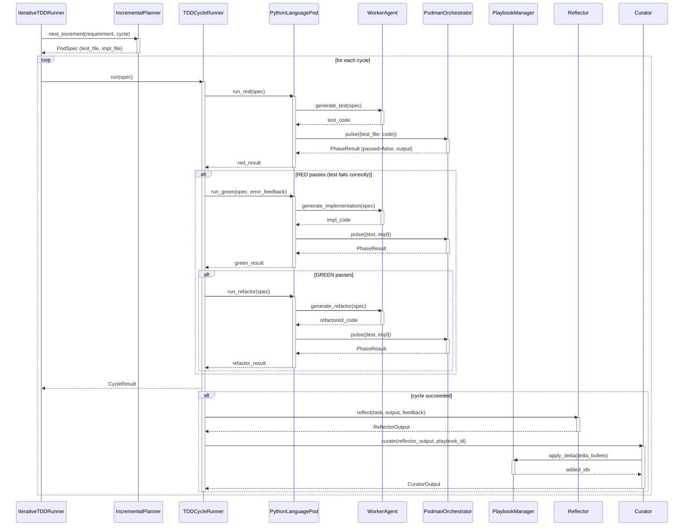

<!-- Generated by generate_live_docs.py on 2026-09-21 06:53 — do not edit by hand -->

# System Architecture

| Component | Module | Role |
|-----------|--------|------|
| IncrementalPlanner | src/agents/incremental_planner.py | Determines next test increment in the TDD loop |
| IterativeTDDRunner | src/agents/iterative_tdd_runner.py | Orchestrates Kent Beck–style RED→GREEN→REFACTOR loop |
| TDDCycleRunner | src/agents/tdd_cycle_runner.py | Runs one TDD cycle with GREEN retries and learning loop |
| PodmanOrchestrator | src/agents/podman_orchestrator.py | Stateless sidecar for container execution and security breach detection |
| PodmanRunner | src/agents/podman_runner.py | Manages rootless Podman container lifecycle |
| PythonLanguagePod | src/agents/python_language_pod.py | Python language‑specific TDD pod (code gen + container pulse) |
| WorkerAgent | src/agents/worker_agent.py | Generates test, implementation, and refactor code via LLM prompts |
| PlaybookManager | src/playbook/manager.py | Manages playbook CRUD, dedup, token budget, and persistence |
| ExperimentLogger | src/storage/experiment_logger.py | Logs TDD/ML experiments to PostgreSQL with SQLite fallback |
| LLMClient | src/utils/llm_client.py | Unified LLM client for multiple providers (OpenRouter, Ollama, etc.) |
| Reflector | src/core/reflector/module.py | Analyzes task outcomes and extracts error patterns and root causes |
| Curator | src/core/curator/module.py | Synthesizes reflector insights into playbook delta bullets |
| Generator | src/core/generator/module.py | Executes tasks using playbook context and bullet retrieval |
| PlaybookReliabilityAnalyzer | src/reliability/playbook_analyzer.py | Correlates bullet retrieval with first‑pass GREEN success |
| TDDCycleAnalyzer | src/reliability/tdd_cycle_analyzer.py | Measures first‑pass GREEN rate and trend over time |
| CostQualityAnalyzer | src/analytics/cost_quality_analyzer.py | Analyzes cost‑quality tradeoffs and Pareto frontiers |
| SuccessRateCalculator | src/analytics/success_rate_calculator.py | Computes overall and per‑type experiment success rates |
| TokenEfficiencyReporter | src/analytics/token_efficiency.py | Computes token efficiency scores and cross‑language comparisons |
| BlindEvaluator | src/benchmark/blind_evaluation.py | Scores submissions without revealing agent identity |
| ModelAttributionTracker | src/benchmark/model_attribution.py | Tracks OpenRouter model attribution in performance metrics |
| ProductionDataAnalyzer | src/benchmark/production_analyzer.py | Analyzes quality data from experiment logs |
| AdaptiveBroker | src/broker/adaptive_broker.py | Routes tasks to best agent based on historical performance |
| BrokerAdvisor | src/broker/advisor.py | Recommends agents by capability fit and success rates |
| PerformanceAggregator | src/broker/performance_aggregator.py | Aggregates agent metrics from audit trail with caching |
| RegressionDetector | src/broker/regression_detector.py | Detects quality regressions across model versions |
| DistillationRouter | src/playbook/distillation_router.py | Routes tasks to domain‑specific distillation playbooks |
| ContextScorer | src/retrieval/context_scorer.py | Scores bullets against request context across multiple dimensions |
| ContextGraphRetriever | src/retrieval/cgr3_retriever.py | Execute CGR³ retrieve‑rank‑reason pipeline |
| InstitutionalKnowledgeService | src/retrieval/service.py | Central knowledge retrieval for code generation activities |
| ModuleArchitect | src/contracts/module_architect.py | Generates module‑level contracts for stateful systems |
| ModuleTDDBuilder | src/contracts/module_tdd_builder.py | Builds module implementations using TDD methodology |
| ProjectArchitect | src/contracts/project_architect.py | Decomposes project spec into module DAG |
| ProjectBuilder | src/cli/project_builder.py | Drives build of project modules in dependency order |
| EnsembleLearner | src/ensemble/learner.py | Orchestrates multi‑model parallel learning with deliberation |
| VotingSystem | src/ensemble/voting.py | Implements voting strategies (majority, supermajority, weighted) |

