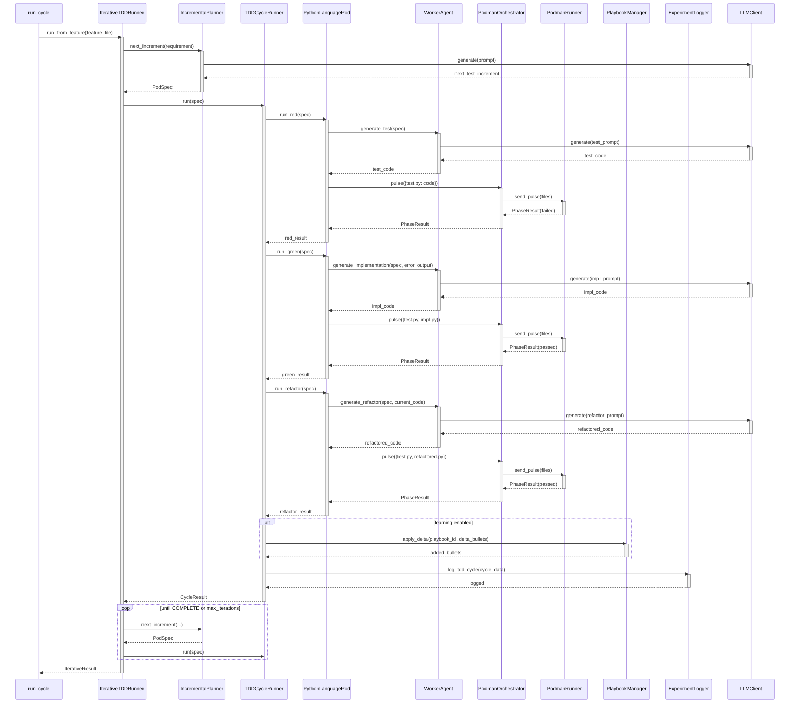

<!-- Generated by generate_live_docs.py on 2026-08-29 12:28 — do not edit by hand -->

# System Architecture

| Component | Module | Role |
|-----------|--------|------|
| IterativeTDDRunner | src.agents.iterative_tdd_runner | Orchestrates the RED→GREEN→REFACTOR loop across multiple iterations, driven by a planner or Gherkin scenarios |
| TDDCycleRunner | src.agents.tdd_cycle_runner | Runs a single TDD cycle (RED→GREEN→REFACTOR) with GREEN retries, abort logic, and an optional learning loop |
| PythonLanguagePod | src.agents.python_language_pod | LanguagePod implementation for Python: handles code generation via WorkerAgent and execution via PodmanOrchestrator |
| WorkerAgent | src.agents.worker_agent | Generates code for each TDD phase (test, implementation, refactor) using LLM prompts and playbook context |
| IncrementalPlanner | src.agents.incremental_planner | Determines the next test increment by querying the LLM about what test to write next |
| PodmanOrchestrator | src.agents.podman_orchestrator | Stateless sidecar execution layer that sends code pulses to a container and returns test results |
| PodmanRunner | src.agents.podman_runner | Rootless Podman container runner that manages container lifecycle and runs tests |
| ContainerRunner | src.agents.podman_orchestrator | Abstract runner interface for sending code pulses and checking container status |
| PlaybookManager | src.playbook.manager | Core playbook CRUD, delta application, bullet feedback, redundancy checks, and token budget management |
| Curator | src.core.curator.module | Synthesizes reflector insights into delta bullets and applies them to playbooks |
| Reflector | src.core.reflector.module | Analyzes task outcomes, extracts error patterns, root causes, and tags bullets |
| Generator | src.core.generator.module | Executes tasks using playbook-guided LLM generation with bullet retrieval and feedback |
| BulletRetriever | src.playbook.retrieval | Hybrid retrieval engine (semantic + keyword) for selecting relevant playbook bullets |
| ContextMapBuilder | src.utils.context_map | Builds an AST context map from source files for providing implementation context |
| ExperimentLogger | src.storage.experiment_logger | Unified logger for TDD and ML experiments, persisting to PostgreSQL or SQLite |
| PolyglotTDDRunner | src.agents.polyglot_tdd_runner | Drives TDD loops across multiple LanguagePods for polyglot feature development |
| AutonomousTDDAgent | src.agents.autonomous_tdd_agent | Autonomous agent that builds complete features via TDD with ensemble learning and test review |
| RedundancyPreChecker | src.agents.redundancy_checker | Pre-checks proposed tests for redundancy before the RED phase starts |
| TestReviewAgent | src.agents.test_review_agent | Validates test file quality before implementation, checking structure, naming, assertions, and edge cases |
| TDDFailureRecorder | src.agents.tdd_failure_recorder | Records TDD failures with context for self-healing and creates playbook troubleshooting bullets |
| TDDLessonInjector | src.agents.tdd_lesson_injector | Injects TDD lessons (from past failures) into LLM prompts based on the current development phase |
| PerformanceAggregator | src.broker.performance_aggregator | Aggregates agent performance metrics from the audit trail for broker routing decisions |
| AdaptiveBroker | src.broker.adaptive_broker | Routes tasks to the best agent based on learned historical performance and cost constraints |
| CapabilityRegistry | src.broker.capability_registry | Tracks anonymous agent capability registrations and finds agents by proficiency |
| BrokerAdvisor | src.broker.advisor | Recommends agents for a task by matching capability fit and historical success rates |
| ContractArchitect | src.contracts.contract_architect | Generates interface contracts from natural language requirements using LLM |
| ContractDecomposer | src.contracts.contract_decomposer | Decomposes user requirements into structured interface contracts |
| ModuleArchitect | src.contracts.module_architect | Generates module-level contracts for stateful systems with shared state and integration tests |
| ModuleTDDBuilder | src.contracts.module_tdd_builder | Builds module implementations using TDD methodology from module contracts |
| EnsembleLearner | src.ensemble.learner | Orchestrates parallel model learning, cross-voting, deliberation, and consensus building |
| InstitutionalKnowledgeService | src.retrieval.service | Central knowledge service that provides guidance for code generation and TDD cycles |
| DistillationRouter | src.playbook.distillation_router | Routes tasks to domain-specific distillation playbooks with provenance-aware filtering |
| ContractOrchestrator | src.contracts.contract_driven | Orchestrates contract-driven development: registration, validation, and tracking |
| PostgresPlaybookAdapter | src.playbook.postgres_adapter | PostgreSQL-backed playbook manager maintaining compatibility with the in-memory PlaybookManager interface |
| PostgresBulletRetriever | src.playbook.postgres_retriever | PostgreSQL-backed bullet retrieval using pgvector for semantic search |
| SuccessRateCalculator | src.analytics.success_rate_calculator | Measures experiment success rates across types, playbook versions, and time periods |
| TDDCycleAnalyzer | src.reliability.tdd_cycle_analyzer | Measures first-pass GREEN rate and trends over time for reliability monitoring |
| PlaybookReliabilityAnalyzer | src.reliability.playbook_analyzer | Correlates bullet retrieval with first-pass GREEN success to identify which bullets improve reliability |
| AuditClient | src.audit.client | Write-only audit client for emitting immutable audit events from agents |
| AuditStore | src.audit.store | Append-only audit event store with SHA-256 hash chain and chain verification |
| AuditDashboard | src.audit.dashboard | Analyzes audit data to produce agent performance metrics and cost analysis reports |
| BlindEvaluator | src.benchmark.blind_evaluation | Scores code outputs without knowing which agent produced them, using rubrics or heuristics |
| ProductionDataAnalyzer | src.benchmark.production_analyzer | Analyzes production experiment logs to extract model performance metrics and generate reports |
| ModelAttributionTracker | src.benchmark.model_attribution | Tracks OpenRouter model attribution in performance metrics with task-type and daily breakdowns |
| RegressionDetector | src.broker.regression_detector | Tracks quality scores per model version and detects regressions using statistical change-point detection |

