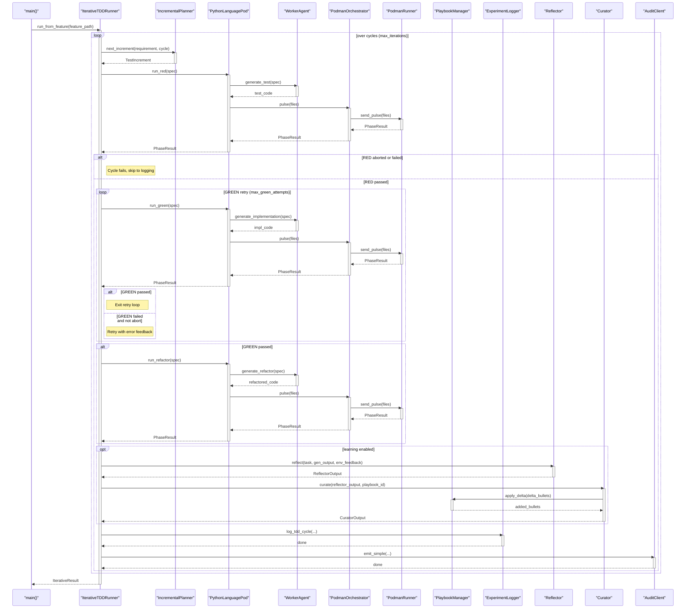

<!-- Generated by generate_live_docs.py on 2026-09-06 11:17 — do not edit by hand -->

# System Architecture

| Component | Module | Role |
|-----------|--------|------|
| IterativeTDDRunner | src/agents/iterative_tdd_runner.py | Orchestrates the RED→GREEN→REFACTOR loop across multiple cycles |
| TDDCycleRunner | src/agents/tdd_cycle_runner.py | Runs one complete TDD cycle with GREEN retries and learning |
| PythonLanguagePod | src/agents/python_language_pod.py | LanguagePod for Python: delegates code generation and container execution |
| WorkerAgent | src/agents/worker_agent.py | Generates code for each TDD phase using LLM prompts |
| LanguagePod | src/agents/language_pod.py | Protocol for language-specific TDD execution pods |
| PlaybookManager | src/playbook/manager.py | Manages playbook creation, bullet addition, and persistence |
| ExperimentLogger | src/storage/experiment_logger.py | Logs TDD cycles and ML experiments to database |
| Reflector | src/core/reflector/module.py | Analyzes task outcomes and extracts learning insights |
| Curator | src/core/curator/module.py | Synthesizes insights into playbook delta bullets |
| Generator | src/core/generator/module.py | Executes tasks using playbook-guided LLM generation |
| IncrementalPlanner | src/agents/incremental_planner.py | Determines the next test increment in the TDD loop |
| PodmanOrchestrator | src/agents/podman_orchestrator.py | Stateless sidecar execution layer for containerised harness |
| PodmanRunner | src/agents/podman_runner.py | Production ContainerRunner backed by rootless Podman |
| PolyglotTDDRunner | src/agents/polyglot_tdd_runner.py | Drives TDD across multiple language pods |
| PodFactory | src/agents/polyglot_tdd_runner.py | Creates LanguagePod instances for a given language |
| GherkinFeatureBridge | src/agents/gherkin_feature_bridge.py | Parses Gherkin .feature files into FeatureSpec |
| ImportFilter | src/agents/import_filter.py | Checks code for forbidden imports and builtins |
| RedundancyPreChecker | src/agents/redundancy_checker.py | Pre-checks proposed tests for redundancy before RED phase |
| SimulationOracle | src/agents/simulation_oracle.py | Runs physics simulation controllers against scenarios |
| SimulationPod | src/agents/simulation_pod.py | LanguagePod for PyBullet-backed TDD cycles |
| SimulationScenario | src/agents/simulation_scenario.py | Pluggable physical-world contract for simulation oracle |
| TDDFailureRecorder | src/agents/tdd_failure_recorder.py | Records TDD failures and interventions for self-improvement |
| TDDLessonInjector | src/agents/tdd_lesson_injector.py | Injects TDD lessons into agent prompts based on phase |
| TestReviewAgent | src/agents/test_review_agent.py | Validates test quality before implementation |
| TypeScriptLanguagePod | src/agents/typescript_language_pod.py | LanguagePod for TypeScript TDD cycles via vitest |
| TypeScriptWorkerAgent | src/agents/typescript_worker_agent.py | Generates TypeScript code for each TDD phase |
| CostQualityAnalyzer | src/analytics/cost_quality_analyzer.py | Analyzes cost-quality tradeoffs for model performance |
| SuccessRateCalculator | src/analytics/success_rate_calculator.py | Measures experiment success rates across the system |
| TokenEfficiencyReporter | src/analytics/token_efficiency.py | Computes token efficiency scores from LanguagePod run data |
| AuditStore | src/audit/store.py | Append-only audit event store with hash chain integrity |
| AuditClient | src/audit/client.py | Write-only audit client for ACE agents |
| LocalAuditClient | src/audit/local_client.py | Local SQLite-backed audit client for development |
| AdaptiveBroker | src/broker/adaptive_broker.py | Routes tasks to best agent based on historical performance |
| PerformanceAggregator | src/broker/performance_aggregator.py | Aggregates performance metrics from audit trail |
| BulletRetriever | src/playbook/retrieval.py | Hybrid retrieval system for selecting relevant playbook bullets |

