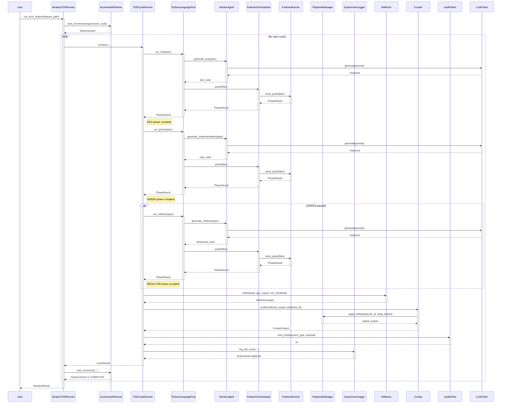

<!-- Generated by generate_live_docs.py on 2026-09-19 11:44 — do not edit by hand -->

# System Architecture

| Component | Module | Role |
|-----------|--------|------|
| IterativeTDDRunner | src/agents/iterative_tdd_runner.py | Orchestrates the RED→GREEN→REFACTOR loop across multiple cycles |
| TDDCycleRunner | src/agents/tdd_cycle_runner.py | Runs one complete TDD cycle with retries and learning |
| PythonLanguagePod | src/agents/python_language_pod.py | Language-specific pod for Python TDD execution |
| WorkerAgent | src/agents/worker_agent.py | Generates code for each TDD phase |
| PodmanOrchestrator | src/agents/podman_orchestrator.py | Stateless sidecar execution layer for sandbox |
| PodmanRunner | src/agents/podman_runner.py | Container runner backed by rootless Podman |
| IncrementalPlanner | src/agents/incremental_planner.py | Determines next test increment |
| PlaybookManager | src/playbook/manager.py | Manages playbook creation, updates, retrieval |
| ExperimentLogger | src/storage/experiment_logger.py | Logs TDD cycles and experiments to DB |
| Reflector | src/core/reflector/module.py | Analyzes task outcomes and extracts insights |
| Curator | src/core/curator/module.py | Synthesizes insights into playbook updates |
| Generator | src/core/generator/module.py | Executes tasks using playbook-guided LLM |
| BulletRetriever | src/playbook/retrieval.py | Retrieves relevant bullets for a query |
| LLMClient | src/utils/llm_client.py | Unified LLM client for multiple providers |
| AuditClient | src/audit/client.py | Write-only audit client for agents |
| LocalAuditClient | src/audit/local_client.py | Local SQLite audit client for dev/testing |
| AuditStore | src/audit/store.py | Append-only audit store with hash chain |
| PerformanceAggregator | src/broker/performance_aggregator.py | Aggregates metrics from audit trail |
| AdaptiveBroker | src/broker/adaptive_broker.py | Routes tasks based on learned performance |
| ModelAttributionTracker | src/benchmark/model_attribution.py | Tracks model attribution in metrics |
| SuccessRateCalculator | src/analytics/success_rate_calculator.py | Measures experiment success rates |
| TokenEfficiencyReporter | src/analytics/token_efficiency.py | Computes token efficiency scores |
| CostQualityAnalyzer | src/analytics/cost_quality_analyzer.py | Analyzes cost-quality tradeoffs |
| BlindEvaluator | src/benchmark/blind_evaluation.py | Scores outputs without agent attribution |
| ContractArchitect | src/contracts/contract_architect.py | Generates contracts from requirements |
| ModuleArchitect | src/contracts/module_architect.py | Generates module-level contracts |
| ProjectArchitect | src/contracts/project_architect.py | Decomposes project spec into module DAG |
| ModuleTDDBuilder | src/contracts/module_tdd_builder.py | Builds module implementations using TDD |
| ProjectBuilder | src/cli/project_builder.py | Builds every module of a ProjectPlan |
| EnsembleBuildRunner | src/agents/ensemble_build.py | Drives multi-candidate blind build |
| EnsembleLearner | src/ensemble/learner.py | Orchestrates multiple models learning in parallel |
| ConsensusBuilder | src/ensemble/consensus.py | Builds consensus from multiple proposals |
| VotingSystem | src/ensemble/voting.py | Applies voting strategies to bullets |

