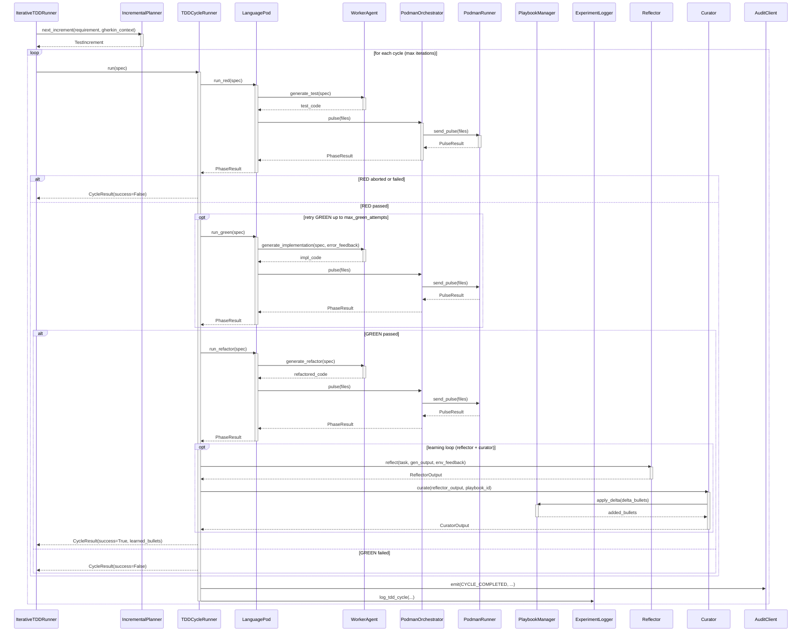

<!-- Generated by generate_live_docs.py on 2026-09-01 22:36 — do not edit by hand -->

# System Architecture

| Component | Module | Role |
|-----------|--------|------|
| `IterativeTDDRunner` | `src.agents.iterative_tdd_runner` | Orchestrates the outer RED→GREEN→REFACTOR loop across multiple increments |
| `IncrementalPlanner` | `src.agents.incremental_planner` | Decides the next test increment to write based on current state and Gherkin scenarios |
| `TDDCycleRunner` | `src.agents.tdd_cycle_runner` | Runs one complete RED→GREEN→REFACTOR cycle with retries and optional learning |
| `PythonLanguagePod` | `src.agents.python_language_pod` | Language-specific pod that delegates code generation to WorkerAgent and execution to PodmanOrchestrator |
| `WorkerAgent` | `src.agents.worker_agent` | Generates code for each TDD phase (test, implementation, refactor) using LLM prompts |
| `PodmanOrchestrator` | `src.agents.podman_orchestrator` | Stateless sidecar execution layer that verifies code integrity via hash checks |
| `PodmanRunner` | `src.agents.podman_runner` | Production container runner using rootless Podman to execute code in isolation |
| `ContainerRunner` | `src.agents.podman_orchestrator` | Abstract interface for container-based execution runners |
| `ImportFilter` | `src.agents.import_filter` | Blocks forbidden imports and dynamic import calls in generated code |
| `RedundancyPreChecker` | `src.agents.redundancy_checker` | Pre-checks proposed tests against existing tests to avoid redundant work |
| `TestReviewAgent` | `src.agents.test_review_agent` | Validates test quality before allowing implementation phase |
| `GherkinFeatureBridge` | `src.agents.gherkin_feature_bridge` | Parses Gherkin .feature files into FeatureSpec objects for the planner |
| `GherkinExtractionAgent` | `src.agents.gherkin_extraction_agent` | Reverse-engineers Gherkin scenarios from existing code and tests |
| `PolyglotTDDRunner` | `src.agents.polyglot_tdd_runner` | Drives TDD across multiple languages in parallel, comparing results |
| `PodFactory` | `src.agents.polyglot_tdd_runner` | Creates LanguagePod instances for a given language identifier |
| `EnsembleBuildRunner` | `src.agents.ensemble_build` | Runs multi-candidate blind builds for consensus-based feature development |
| `Reflector` | `src.core.reflector.module` | Analyzes task outcomes and extracts learning insights (error patterns, root causes) |
| `Curator` | `src.core.curator.module` | Synthesizes reflector insights into actionable playbook delta bullets |
| `Generator` | `src.core.generator.module` | Executes tasks using playbook-guided LLM generation with context retrieval |
| `PlaybookManager` | `src.playbook.manager` | Core playbook CRUD with delta merging, semantic deduplication, and token budget management |
| `BulletRetriever` | `src.playbook.retrieval` | Hybrid retrieval engine for selecting relevant bullets by semantic similarity and context |
| `PlaybookQA` | `src.playbook.qa` | Answers coding questions using playbook knowledge and LLM reasoning |
| `ExperimentLogger` | `src.storage.experiment_logger` | Logs TDD cycles and ML experiments to PostgreSQL with SQLite fallback |
| `PlaybookRepository` | `src.storage.repository` | PostgreSQL repository with pgvector support for semantic search |
| `AuditClient` | `src.audit.client` | Write-only audit client for emitting hash-chained events to the audit store |
| `LocalAuditClient` | `src.audit.local_client` | Local SQLite-based audit client for development/testing |
| `AuditStore` | `src.audit.store` | Append-only audit event store with hash chain integrity verification |
| `AdaptiveBroker` | `src.broker.adaptive_broker` | Routes tasks to the best agent based on historical performance data |
| `PerformanceAggregator` | `src.broker.performance_aggregator` | Aggregates performance metrics from audit trail for agent evaluation |
| `LLMClient` | `src.utils.llm_client` | Unified LLM client supporting multiple providers (OpenAI, Anthropic, OpenRouter, etc.) |
| `EmbeddingService` | `src.utils.embedding` | Local embedding generation using sentence-transformers for semantic search |

