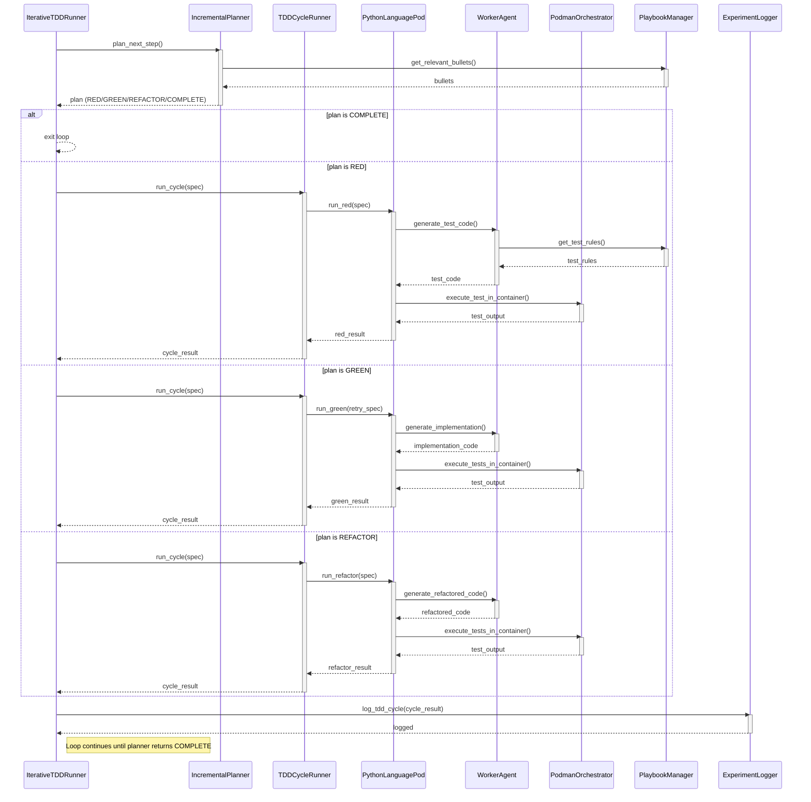

<!-- Generated by generate_live_docs.py on 2026-09-14 19:30 — do not edit by hand -->

# System Architecture

| Component | Module | Role |
|-----------|--------|------|
| IterativeTDDRunner | src/agents/iterative_tdd_runner.py | Orchestrates the Kent Beck-style RED→GREEN→REFACTOR loop, iterating until the planner declares COMPLETE |
| IncrementalPlanner | src/agents/incremental_planner.py | Plans the next TDD step based on current state and playbook knowledge |
| TDDCycleRunner | src/agents/tdd_cycle_runner.py | Runs one complete RED→GREEN→REFACTOR cycle for a single feature |
| PythonLanguagePod | src/agents/python_language_pod.py | Language-specific pod that uses WorkerAgent for code generation and PodmanOrchestrator for execution |
| WorkerAgent | src/agents/worker_agent.py | Standalone LLM code-generation component that produces test and implementation code |
| PodmanOrchestrator | src/agents/podman_orchestrator.py | Manages Podman container lifecycle and enforces security boundaries |
| PodmanRunner | src/agents/podman_runner.py | Executes code inside a sandboxed Podman container |
| PolyglotTDDRunner | src/agents/polyglot_tdd_runner.py | Drives RED→GREEN→REFACTOR loops for multiple languages from a Gherkin feature file |
| PlaybookManager | src/playbook/manager.py | Loads, persists, and queries playbook knowledge bullets |
| ExperimentLogger | src/storage/experiment_logger.py | Persists TDD cycle results and experiment metadata to the database |
| LLMClient | src/utils/llm_client.py | Unified client for LLM inference across providers |
| Reflector | src/core/reflector/module.py | Reflects on failed tests and extracts learning from markdown content |
| Curator | src/core/curator/module.py | Curates and deduplicates knowledge bullets from reflection output |
| Generator | src/core/generator/module.py | Generates implementation code from playbook bullets and task input |
| TestReviewAgent | src/agents/test_review_agent.py | Validates test quality before implementation proceeds |
| GoLanguagePod | src/agents/go_language_pod.py | Go-specific pod for RED→GREEN→REFACTOR cycles |
| GoRunner | src/agents/go_runner.py | Generates Go step definitions and test runners from Gherkin features |
| TypeScriptLanguagePod | src/agents/typescript_language_pod.py | TypeScript-specific pod with import handling for test files |
| TypeScriptRunner | src/agents/typescript_runner.py | Runs TypeScript tests inside a sandboxed Podman container |
| TypeScriptWorkerAgent | src/agents/typescript_worker_agent.py | TypeScript-specific LLM code-generation agent |
| SimulationPod | src/agents/simulation_pod.py | Simulated pod for testing TDD orchestration without real containers |
| SimulationPodmanRunner | src/agents/simulation_podman_runner.py | Simulated Podman runner for testing without container runtime |
| SimulationRunner | src/agents/simulation_runner.py | Simulated TDD runner for calibration and testing |
| MermaidRunner | src/agents/mermaid_runner.py | Sends mermaid diagram text as a pulse for diagram generation |
| EffGenClient | src/utils/effgen_client.py | Adapter to use effGen local models with the LLMClient interface |
| ContextMap | src/utils/context_map.py | Builds module-to-file mappings and renders mermaid flowcharts |
| CodeExtraction | src/utils/code_extraction.py | Extracts fenced code blocks from LLM responses |
| ImportValidator | src/utils/import_validator.py | Validates import statements in generated code |
| FileLock | src/utils/file_lock.py | Provides file-based locking for concurrent access |
| IDGenerator | src/utils/id_generator.py | Generates unique identifiers for entities |
| MermaidValidation | src/utils/mermaid_validation.py | Extracts and validates mermaid diagram blocks from markdown |

