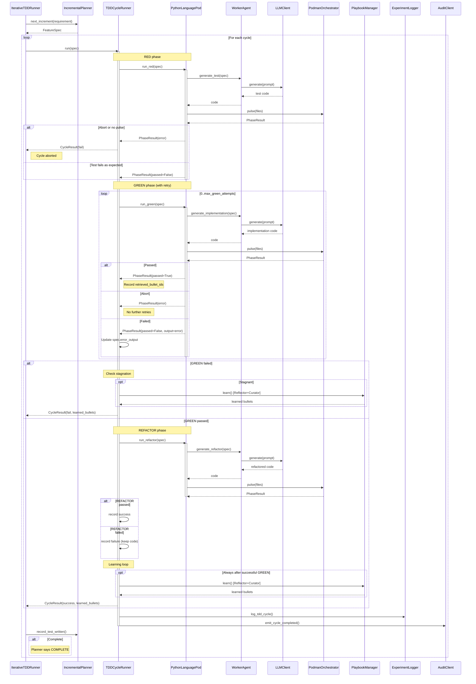

<!-- Generated by generate_live_docs.py on 2026-09-22 08:58 — do not edit by hand -->

# System Architecture

| Component | Module | Role |
|-----------|--------|------|
| IterativeTDDRunner | src/agents/iterative_tdd_runner.py | Orchestrates the RED→GREEN→REFACTOR loop across multiple features |
| IncrementalPlanner | src/agents/incremental_planner.py | Determines the next test increment given current state |
| TDDCycleRunner | src/agents/tdd_cycle_runner.py | Runs one TDD cycle with GREEN retries and optional learning |
| PythonLanguagePod | src/agents/python_language_pod.py | LanguagePod implementation for Python TDD cycles |
| WorkerAgent | src/agents/worker_agent.py | Generates code for each TDD phase using LLM |
| PodmanOrchestrator | src/agents/podman_orchestrator.py | Stateless sidecar execution layer for code validation |
| PodmanRunner | src/agents/podman_runner.py | ContainerRunner backed by rootless Podman |
| PlaybookManager | src/playbook/manager.py | Core playbook operations: creation, updates, merging, retrieval |
| ExperimentLogger | src/storage/experiment_logger.py | Unified logger for TDD and ML experiments (PostgreSQL/SQLite) |
| LLMClient | src/utils/llm_client.py | Unified LLM client supporting multiple providers |
| Reflector | src/core/reflector/module.py | Analyzes task execution and extracts learning insights |
| Curator | src/core/curator/module.py | Synthesizes reflector insights into playbook updates |
| Generator | src/core/generator/module.py | Executes tasks using playbook-guided LLM generation |
| AuditClient | src/audit/client.py | Write-only audit client for emitting events |
| LocalAuditClient | src/audit/local_client.py | Direct SQLite audit client for development/testing |
| PodFactory | src/agents/polyglot_tdd_runner.py | Creates LanguagePod instances for given language |
| PolyglotTDDRunner | src/agents/polyglot_tdd_runner.py | Drives TDD loop across multiple language pods |
| EnsembleBuildRunner | src/agents/ensemble_build.py | Drives multi-candidate blind build for one feature |
| CharacterizationTestGenerator | src/agents/characterization_test_generator.py | Drafts, verifies, repairs pytest characterization suite |
| GherkinFeatureBridge | src/agents/gherkin_feature_bridge.py | Parses .feature file into FeatureSpec |
| ProjectArchitect | src/contracts/project_architect.py | Decomposes project spec into module DAG |
| ModuleArchitect | src/contracts/module_architect.py | Generates module-level contracts |
| ModuleTDDBuilder | src/contracts/module_tdd_builder.py | Builds module implementations via TDD |
| ProjectBuilder | src/cli/project_builder.py | Drives ModuleArchitect + ModuleTDDBuilder over project plan |
| PerformanceAggregator | src/broker/performance_aggregator.py | Extracts metrics from audit trail |
| AdaptiveBroker | src/broker/adaptive_broker.py | Routes tasks based on learned performance |
| BulletRetriever | src/playbook/retrieval.py | Hybrid retrieval engine for selecting relevant bullets |
| ContextScorer | src/retrieval/context_scorer.py | Scores bullets against request context across dimensions |
| InstitutionalKnowledgeService | src/retrieval/service.py | Central knowledge retrieval service for code generation |
| PlaybookReliabilityAnalyzer | src/reliability/playbook_analyzer.py | Correlates bullet retrieval with first-pass GREEN outcomes |

