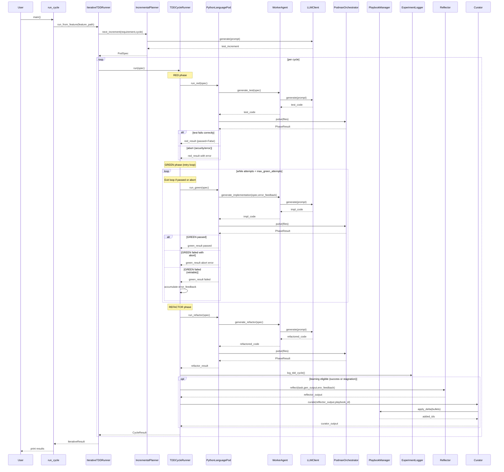

<!-- Generated by generate_live_docs.py on 2026-09-19 06:33 — do not edit by hand -->

# System Architecture

| Component | Module | Role |
|-----------|--------|------|
| IterativeTDDRunner | src.agents.iterative_tdd_runner | Orchestrates RED→GREEN→REFACTOR loop across multiple features |
| TDDCycleRunner | src.agents.tdd_cycle_runner | Runs one complete TDD cycle with RED, GREEN retries, REFACTOR, and learning |
| IncrementalPlanner | src.agents.incremental_planner | Determines next test increment via LLM query |
| WorkerAgent | src.agents.worker_agent | Generates code for each TDD phase (test, implementation, refactor) |
| PythonLanguagePod | src.agents.python_language_pod | LanguagePod for Python, manages code generation and execution |
| PodmanOrchestrator | src.agents.podman_orchestrator | Stateless sidecar execution layer for sandboxed container runs |
| PodmanRunner | src.agents.podman_runner | Manages Podman container lifecycle and sends code pulses |
| PlaybookManager | src.playbook.manager | Manages playbook creation, bullets, delta updates, persistence |
| ExperimentLogger | src.storage.experiment_logger | Logs TDD cycles and ML experiments to database with fallback |
| LLMClient | src.utils.llm_client | Unified LLM client supporting multiple providers |
| Reflector | src.core.reflector.module | Analyzes task outcomes and extracts learning insights |
| Curator | src.core.curator.module | Synthesizes insights into playbook delta bullets |
| Generator | src.core.generator.module | Executes tasks using playbook-guided LLM generation |
| BulletRetriever | src.playbook.retrieval | Retrieves relevant playbook bullets via hybrid search |
| AdaptiveBroker | src.broker.adaptive_broker | Routes tasks to best agent based on learned performance |
| PerformanceAggregator | src.broker.performance_aggregator | Aggregates performance metrics from audit trail |
| AuditStore | src.audit.store | Append-only audit event store with hash chain integrity |
| LocalAuditClient | src.audit.local_client | Write audit events to local SQLite for testing |
| CapabilityRegistry | src.broker.capability_registry | Tracks anonymous agent capabilities for routing |
| CostQualityAnalyzer | src.analytics.cost_quality_analyzer | Analyzes cost-quality tradeoffs for model selection |
| SuccessRateCalculator | src.analytics.success_rate_calculator | Measures experiment success rates across system |
| TokenEfficiencyReporter | src.analytics.token_efficiency | Computes token efficiency scores from LanguagePod run data |
| ContextMapBuilder | src.utils.context_map | Builds AST context maps for code generation |
| ImportFilter | src.agents.import_filter | Checks code for forbidden imports and builtins |
| RedundancyPreChecker | src.agents.redundancy_checker | Detects redundant tests before writing them |
| GherkinFeatureBridge | src.agents.gherkin_feature_bridge | Parses Gherkin feature files into FeatureSpec |
| PolyglotTDDRunner | src.agents.polyglot_tdd_runner | Drives TDD across multiple languages using PodFactory |
| PodFactory | src.agents.polyglot_tdd_runner | Creates LanguagePod instances per language identifier |
| SimulationOracle | src.agents.simulation_oracle | Runs physics simulation controller scripts in container |
| SimulationPod | src.agents.simulation_pod | LanguagePod for PyBullet-backed TDD cycles |

