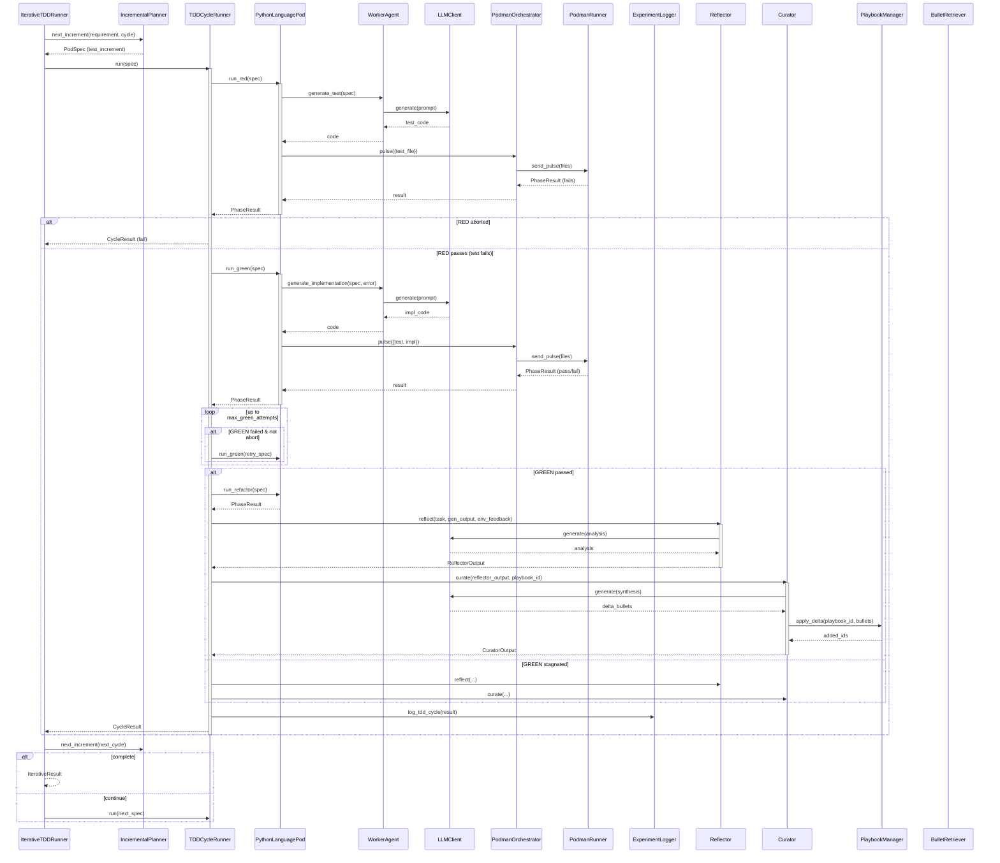

<!-- Generated by generate_live_docs.py on 2026-09-13 11:31 — do not edit by hand -->

# System Architecture

| Component | Module | Role |
|-----------|--------|------|
| IncrementalPlanner | src/agents/incremental_planner | Determines next test increment to write |
| IterativeTDDRunner | src/agents/iterative_tdd_runner | Orchestrates the full RED→GREEN→REFACTOR loop across multiple cycles |
| TDDCycleRunner | src/agents/tdd_cycle_runner | Executes one complete TDD cycle with GREEN retries and learning |
| PythonLanguagePod | src/agents/python_language_pod | Implements LanguagePod for Python TDD cycles |
| WorkerAgent | src/agents/worker_agent | Generates code for each TDD phase from prompts and playbook context |
| PodmanRunner | src/agents/podman_runner | Manages rootless Podman container lifecycle |
| PodmanOrchestrator | src/agents/podman_orchestrator | Stateless sidecar execution with security hash verification |
| PlaybookManager | src/playbook/manager | CRUD operations, delta application, semantic deduplication, persistence |
| ExperimentLogger | src/storage/experiment_logger | Logs TDD cycles and experiments to DB with fallback |
| LLMClient | src/utils/llm_client | Unified LLM interface supporting multiple providers |
| Reflector | src/core/reflector/module | Analyzes task outcomes and extracts learning insights |
| Curator | src/core/curator/module | Synthesizes insights into playbook bullets with redundancy check |
| Generator | src/core/generator/module | Executes tasks using playbook-guided LLM with bullet retrieval |
| BulletRetriever | src/playbook/retrieval | Hybrid retrieval of relevant playbook bullets |
| ContextGraphRetriever | src/retrieval/cgr3_retriever | CGR³ pipeline: context-aware retrieval and reasoning |
| ContextScorer | src/retrieval/context_scorer | Scores bullets against temporal, team, tech, and domain context |
| InstitutionalKnowledgeService | src/retrieval/service | Central knowledge retrieval for code generation |
| AdaptiveBroker | src/broker/adaptive_broker | Routes tasks to best agent based on performance history |
| PerformanceAggregator | src/broker/performance_aggregator | Aggregates metrics from audit trail for routing |
| ModelAttributionTracker | src/benchmark/model_attribution | Tracks model performance with OpenRouter attribution |
| SuccessRateCalculator | src/analytics/success_rate_calculator | Measures experiment success rates over time |
| CostQualityAnalyzer | src/analytics/cost_quality_analyzer | Analyzes cost-quality tradeoffs for model performance |
| ModuleArchitect | src/contracts/module_architect | Generates module-level contracts for stateful systems |
| ModuleTDDBuilder | src/contracts/module_tdd_builder | Builds module implementations using TDD |
| ProjectArchitect | src/contracts/project_architect | Decomposes project spec into module DAG |
| ProjectBuilder | src/cli/project_builder | Builds all modules from a ProjectPlan in dependency order |
| EnsembleBuildRunner | src/agents/ensemble_build | Drives multi-candidate blind build for one feature |
| RedundancyPreChecker | src/agents/redundancy_checker | Pre-checks proposed tests for redundancy before RED phase |
| TestReviewAgent | src/agents/test_review_agent | Validates test quality before implementation |
| GherkinFeatureBridge | src/agents/gherkin_feature_bridge | Parses .feature files into FeatureSpec |
| ContractValidator | src/contracts/contract_driven | Validates implementations against contracts in sandbox |

