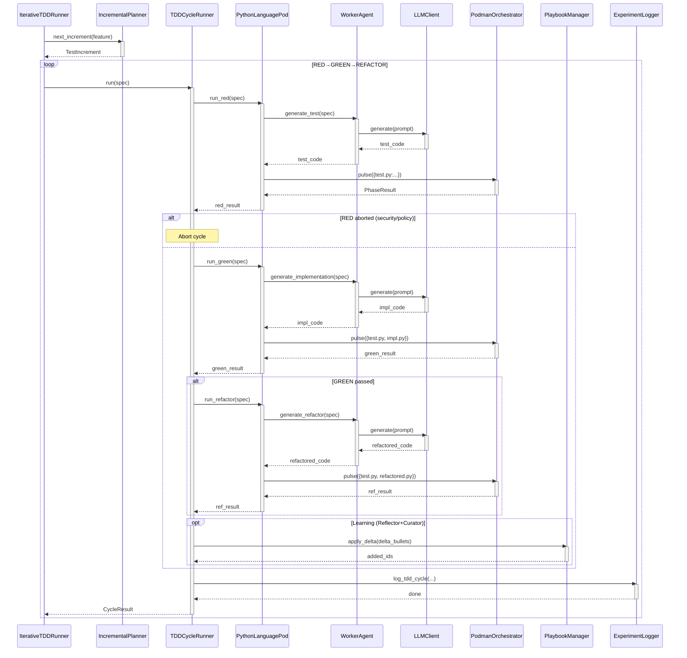

<!-- Generated by generate_live_docs.py on 2026-09-26 14:12 — do not edit by hand -->

# System Architecture

| Component | Module | Role |
|-----------|--------|------|
| IterativeTDDRunner | src/agents/iterative_tdd_runner.py | Orchestrates the RED→GREEN→REFACTOR loop across cycles, driving IncrementalPlanner and TDDCycleRunner |
| IncrementalPlanner | src/agents/incremental_planner.py | Determines the next test increment by consulting the LLM with current context |
| TDDCycleRunner | src/agents/tdd_cycle_runner.py | Runs one complete TDD cycle with GREEN retries, learning, and audit |
| PythonLanguagePod | src/agents/python_language_pod.py | Implements LanguagePod for Python: code generation via WorkerAgent, execution via PodmanOrchestrator |
| WorkerAgent | src/agents/worker_agent.py | Prompts the LLM for RED, GREEN, REFACTOR code and manages playbook retrieval |
| PodmanOrchestrator | src/agents/podman_orchestrator.py | Stateless sidecar that verifies code integrity and delegates execution to the container runner |
| PodmanRunner | src/agents/podman_runner.py | Manages rootless Podman container lifecycle and executes test/impl pulses |
| PlaybookManager | src/playbook/manager.py | CRUD for playbook bullets with deduplication, token budgets, persistence |
| ExperimentLogger | src/storage/experiment_logger.py | Persists TDD cycle outcomes to PostgreSQL (with SQLite fallback) |
| Reflector | src/core/reflector/module.py | Analyzes task execution outcomes and extracts root causes and insights |
| Curator | src/core/curator/module.py | Synthesises Reflector insights into delta bullets and applies them to the playbook |
| Generator | src/core/generator/module.py | Executes tasks using playbook-guided LLM generation with bullet retrieval |
| BulletRetriever | src/playbook/retrieval.py | Hybrid retrieval engine ranking bullets by embedding similarity and keyword match |
| PostgresBulletRetriever | src/playbook/postgres_retriever.py | pgvector-backed retrieval for production-scale bullet search |
| DistillationRouter | src/playbook/distillation_router.py | Routes queries to domain-specific distillation playbooks with provenance filtering |
| DomainRegistry | src/playbook/distillation_router.py | Manages domain centroids and playbook signatures for routing |
| BulletClusterer | src/playbook/clustering.py | DBSCAN-based clustering of bullets for knowledge distillation |
| BulletDeduplicator | src/playbook/deduplication.py | Semantic deduplication via embedding similarity |
| PlaybookReliabilityAnalyzer | src/reliability/playbook_analyzer.py | Correlates bullet retrieval with first-pass GREEN success rates |
| TDDCycleAnalyzer | src/reliability/tdd_cycle_analyzer.py | Measures first-pass rate trends over time from experiment logs |
| PerformanceAggregator | src/broker/performance_aggregator.py | Extracts agent performance metrics from audit trail for broker routing |
| AdaptiveBroker | src/broker/adaptive_broker.py | Routes tasks to the best agent based on historical performance and cost |
| BrokerAdvisor | src/broker/advisor.py | Recommends agents by capability fit using capability registry |
| ModelAttributionTracker | src/benchmark/model_attribution.py | Tracks per-model success rates and quality using OpenRouter attribution |
| ProductionDataAnalyzer | src/benchmark/production_analyzer.py | Analyzes experiment_logs for model performance and backfills quality scores |
| SuccessRateCalculator | src/analytics/success_rate_calculator.py | Computes overall success rates across experiment types and versions |
| TokenEfficiencyReporter | src/analytics/token_efficiency.py | Aggregates token usage across LanguagePods and computes efficiency scores |
| CostQualityAnalyzer | src/analytics/cost_quality_analyzer.py | Analyzes cost-quality tradeoffs and Pareto frontiers |
| RegressionDetector | src/broker/regression_detector.py | Detects quality regressions between model versions using CUSUM |
| CapabilityRegistry | src/broker/capability_registry.py | Tracks anonymous agent capabilities and proficiency ratings |
| EffGenAdapter | src/broker/effgen_adapter.py | Adapter for integrating small local models via MCP protocol |

