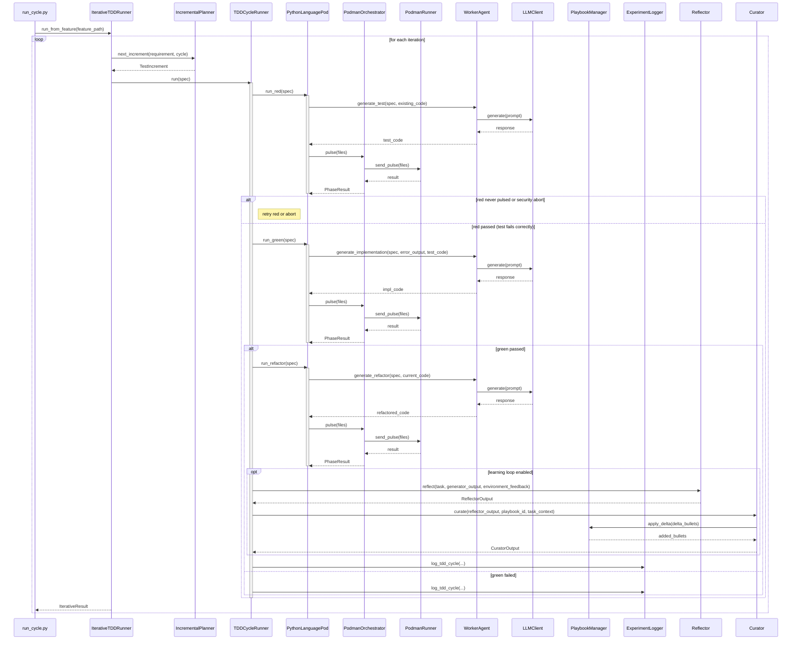

<!-- Generated by generate_live_docs.py on 2026-09-01 20:33 — do not edit by hand -->

# System Architecture

| Component | Module | Role |
|-----------|--------|------|
| LLMClient | src/utils/llm_client.py | Unified LLM provider interface |
| WorkerAgent | src/agents/worker_agent.py | Code generation for TDD phases |
| PythonLanguagePod | src/agents/python_language_pod.py | Python TDD execution (RED/GREEN/REFACTOR) |
| GoLanguagePod | src/agents/go_language_pod.py | Go TDD execution |
| TypeScriptLanguagePod | src/agents/typescript_language_pod.py | TypeScript TDD execution |
| TDDCycleRunner | src/agents/tdd_cycle_runner.py | Orchestrates RED→GREEN→REFACTOR with retries |
| IterativeTDDRunner | src/agents/iterative_tdd_runner.py | Iterative TDD loop planner → cycle |
| IncrementalPlanner | src/agents/incremental_planner.py | Determines next test increment |
| PodmanOrchestrator | src/agents/podman_orchestrator.py | Stateless container execution layer |
| PodmanRunner | src/agents/podman_runner.py | Rootless Podman container lifecycle |
| GoRunner | src/agents/go_runner.py | Go harness container runner |
| TypeScriptRunner | src/agents/typescript_runner.py | TypeScript harness container runner |
| PlaybookManager | src/playbook/manager.py | Playbook CRUD, delta updates, deduplication |
| BulletRetriever | src/playbook/retrieval.py | Hybrid bullet retrieval (semantic + keyword) |
| Generator | src/core/generator/module.py | Task execution with playbook context |
| Reflector | src/core/reflector/module.py | Error analysis and insight extraction |
| Curator | src/core/curator/module.py | Synthesizes insights into playbook bullets |
| ExperimentLogger | src/storage/experiment_logger.py | Logs TDD cycles and experiments |
| PerformanceAggregator | src/broker/performance_aggregator.py | Aggregates agent metrics from audit |
| AdaptiveBroker | src/broker/adaptive_broker.py | Routes tasks to best agent by performance |
| CapabilityRegistry | src/broker/capability_registry.py | Tracks anonymous agent capabilities |
| BrokerAdvisor | src/broker/advisor.py | Recommends agents by capability fit |
| EnsembleBuildRunner | src/agents/ensemble_build.py | Multi-candidate blind feature builds |
| ConsensusBuilder | src/ensemble/consensus.py | Clusters similar proposals, builds consensus |
| EnsembleLearner | src/ensemble/learner.py | Parallel model execution and voting |
| VotingSystem | src/ensemble/voting.py | Voting strategies (majority, weighted, etc.) |
| ContextGraphRetriever | src/retrieval/cgr3_retriever.py | CGR³ context-aware retrieval pipeline |
| ContextScorer | src/retrieval/context_scorer.py | Scores bullets against request context |
| InstitutionalKnowledgeService | src/retrieval/service.py | Central knowledge retrieval for code generation |
| DistillationRouter | src/playbook/distillation_router.py | Domain-aware routing for prompt-level distillation |
| SuccessRateCalculator | src/analytics/success_rate_calculator.py | Measures experiment success rates |
| TokenEfficiencyReporter | src/analytics/token_efficiency.py | Computes token efficiency across languages |
| ContractArchitect | src/contracts/contract_architect.py | Generates contracts from requirements |
| ContractOrchestrator | src/contracts/contract_driven.py | Orchestrates contract-driven development |
| ModuleArchitect | src/contracts/module_architect.py | Generates module-level contracts |

