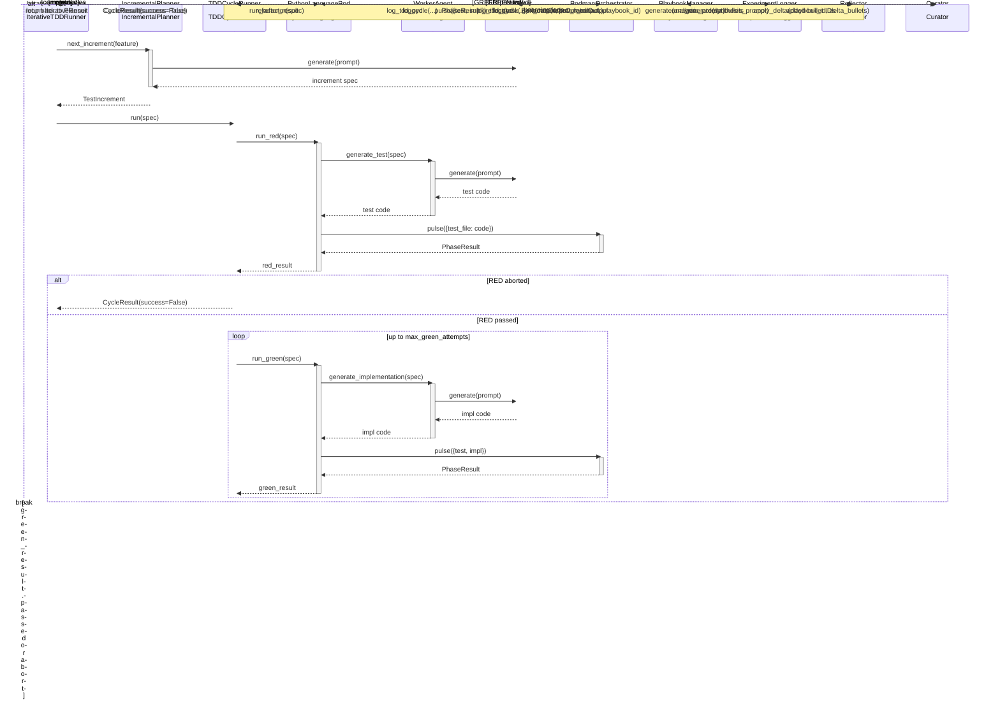

<!-- Generated by generate_live_docs.py on 2026-05-22 21:22 — do not edit by hand -->

# System Architecture

| Component | Module | Role |
|-----------|--------|------|
| IterativeTDDRunner | src/agents/iterative_tdd_runner.py | Orchestrates the iterative RED→GREEN→REFACTOR loop across multiple cycles |
| TDDCycleRunner | src/agents/tdd_cycle_runner.py | Runs one complete TDD cycle with GREEN retries and learning loop |
| PythonLanguagePod | src/agents/python_language_pod.py | Language-specific pod for Python TDD cycles, delegates to WorkerAgent and PodmanOrchestrator |
| WorkerAgent | src/agents/worker_agent.py | Generates code for each TDD phase using LLM and playbook context |
| IncrementalPlanner | src/agents/incremental_planner.py | Determines the next test increment to write |
| PodmanOrchestrator | src/agents/podman_orchestrator.py | Stateless sidecar execution layer for isolated container runs |
| PodmanRunner | src/agents/podman_runner.py | Production ContainerRunner backed by rootless Podman |
| PlaybookManager | src/playbook/manager.py | Manages playbook CRUD, delta updates, and persistence |
| ExperimentLogger | src/storage/experiment_logger.py | Unified logger for TDD and ML experiments with PostgreSQL/SQLite fallback |
| LLMClient | src/utils/llm_client.py | Unified LLM client supporting multiple providers |
| Reflector | src/core/reflector/module.py | Analyzes task outcomes and extracts learning insights |
| Curator | src/core/curator/module.py | Synthesizes insights into playbook updates |
| Generator | src/core/generator/module.py | Executes tasks using playbook-guided LLM generation |
| BulletRetriever | src/playbook/retrieval.py | Hybrid retrieval system for selecting relevant bullets |
| ImportFilter | src/agents/import_filter.py | Validates code against forbidden imports and builtins |
| GherkinFeatureBridge | src/agents/gherkin_feature_bridge.py | Parses Gherkin .feature files into FeatureSpec |
| ContextMapBuilder | src/utils/context_map.py | Builds AST context maps for code generation |
| PlaybookRepository | src/storage/repository.py | PostgreSQL repository with pgvector for semantic search |
| PostgresBulletRetriever | src/playbook/postgres_retriever.py | PostgreSQL-backed retrieval using pgvector |
| BulletClusterer | src/playbook/clustering.py | DBSCAN-based clustering for playbook bullets |
| BulletDeduplicator | src/playbook/deduplication.py | Semantic deduplication using embedding similarity |
| DistillationRouter | src/playbook/distillation_router.py | Routes tasks to domain-specific distillation playbooks |
| InstitutionalKnowledgeService | src/retrieval/service.py | Central knowledge retrieval service for code generation |
| ContextGraphRetriever | src/retrieval/cgr3_retriever.py | CGR³: Context Graph Retrieve-Rank-Reason |
| ContextScorer | src/retrieval/context_scorer.py | Scores bullets against request context across multiple dimensions |
| PerformanceAggregator | src/broker/performance_aggregator.py | Aggregates performance metrics from audit trail |
| AdaptiveBroker | src/broker/adaptive_broker.py | Routes tasks to best agent based on historical performance |
| CapabilityRegistry | src/broker/capability_registry.py | Anonymous agent capability tracking |
| ModelAttributionTracker | src/benchmark/model_attribution.py | Tracks OpenRouter model attribution in performance metrics |
| ProductionDataAnalyzer | src/benchmark/production_analyzer.py | Analyzes quality data from experiment_logs |
| SuccessRateCalculator | src/analytics/success_rate_calculator.py | Measures experiment success rates across the system |
| TokenEfficiencyReporter | src/analytics/token_efficiency.py | Computes token efficiency scores from LanguagePod run data |
| PlaybookReliabilityAnalyzer | src/reliability/playbook_analyzer.py | Correlates bullet retrieval with first-pass GREEN outcomes |
| TDDCycleAnalyzer | src/reliability/tdd_cycle_analyzer.py | Measures first-pass GREEN rate and trend over time |

