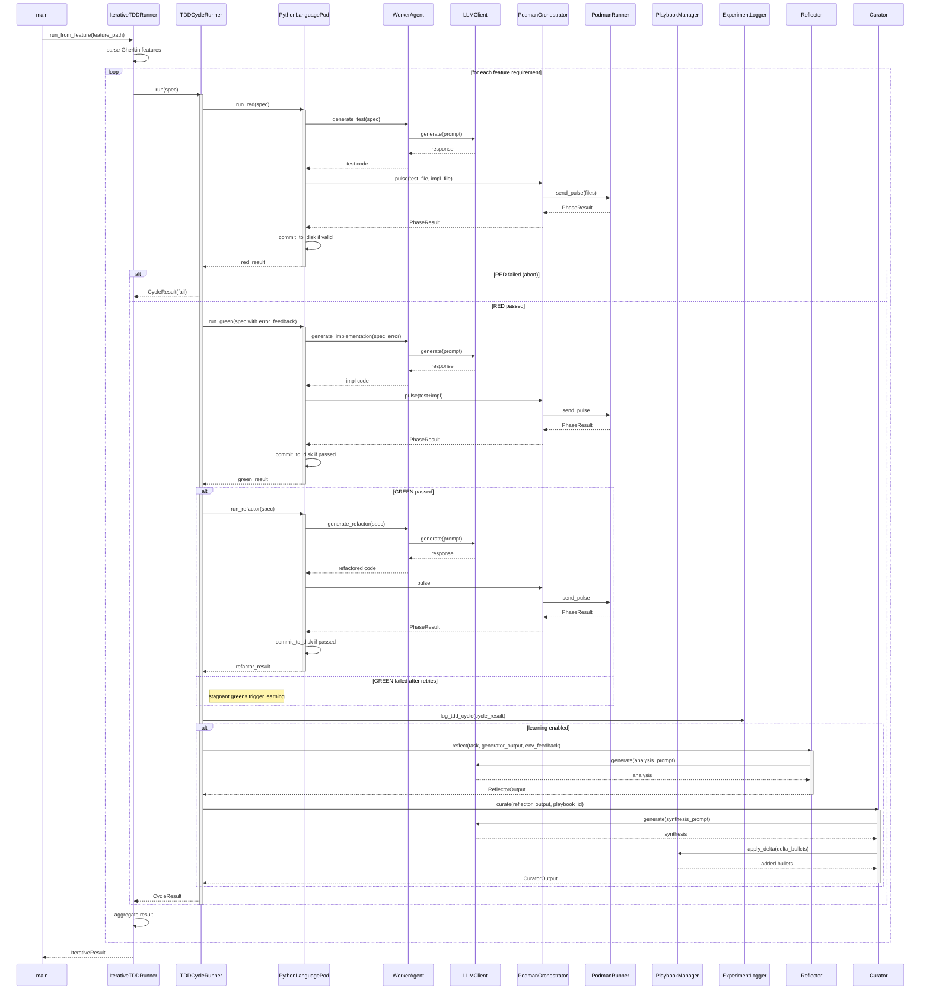

<!-- Generated by generate_live_docs.py on 2026-09-15 21:10 — do not edit by hand -->

# System Architecture

| Component | Module | Role |
|-----------|--------|------|
| IterativeTDDRunner | src/agents/iterative_tdd_runner.py | Orchestrates the iterative RED→GREEN→REFACTOR loop across multiple features |
| TDDCycleRunner | src/agents/tdd_cycle_runner.py | Runs one complete RED→GREEN→REFACTOR cycle with retries and learning |
| PythonLanguagePod | src/agents/python_language_pod.py | Language-specific pod that delegates code generation and test execution |
| WorkerAgent | src/agents/worker_agent.py | Generates code for each TDD phase using LLM prompts |
| IncrementalPlanner | src/agents/incremental_planner.py | Determines the next test increment using LLM |
| PodmanOrchestrator | src/agents/podman_orchestrator.py | Stateless sidecar execution layer ensuring hash-verified code runs |
| PodmanRunner | src/agents/podman_runner.py | Production container runner using rootless Podman |
| LLMClient | src/utils/llm_client.py | Unified LLM client for multiple providers (OpenRouter, etc.) |
| PlaybookManager | src/playbook/manager.py | Manages playbook operations: creation, updates, merging, retrieval |
| ExperimentLogger | src/storage/experiment_logger.py | Logs TDD cycles and ML experiments to PostgreSQL/SQLite |
| Reflector | src/core/reflector/module.py | Analyzes task outcomes and extracts learning insights |
| Curator | src/core/curator/module.py | Synthesizes reflector insights into playbook delta bullets |
| Generator | src/core/generator/module.py | Executes tasks using playbook-guided LLM generation |
| BulletRetriever | src/playbook/retrieval.py | Retrieves relevant bullets using hybrid keyword+semantic search |
| PlaybookRepository | src/storage/repository.py | PostgreSQL repository with pgvector for semantic search |
| ImportFilter | src/agents/import_filter.py | Validates generated code against forbidden imports/builtins |
| ContextMap | src/utils/context_map.py | Builds AST-based context map for code generation |
| AdaptiveBroker | src/broker/adaptive_broker.py | Routes tasks to best agent based on historical performance |
| PerformanceAggregator | src/broker/performance_aggregator.py | Aggregates performance metrics from audit trail |
| EnsembleBuildRunner | src/agents/ensemble_build.py | Drives multi-candidate blind build for a feature |
| PolyglotTDDRunner | src/agents/polyglot_tdd_runner.py | Orchestrates TDD across multiple language pods |
| ProjectArchitect | src/contracts/project_architect.py | Decomposes project spec into module DAG |
| ModuleArchitect | src/contracts/module_architect.py | Generates module-level contracts for stateful systems |
| ModuleTDDBuilder | src/contracts/module_tdd_builder.py | Builds module implementations using TDD methodology |
| ContractValidator | src/contracts/contract_driven.py | Validates implementations against interface contracts |
| BlindEvaluator | src/benchmark/blind_evaluation.py | Evaluates submissions without knowing which agent produced them |
| RedundancyPreChecker | src/agents/redundancy_checker.py | Pre-checks proposed tests for redundancy before RED phase |
| TDDFailureRecorder | src/agents/tdd_failure_recorder.py | Records TDD failures and interventions for self-improvement |
| ContextGraphRetriever | src/retrieval/cgr3_retriever.py | CGR³: Context Graph Retrieve-Rank-Reason retriever |
| InstitutionalKnowledgeService | src/retrieval/service.py | Central knowledge retrieval for all code generation activities |
| DistillationRouter | src/playbook/distillation_router.py | Routes tasks to domain-specific distillation playbooks |
| SuccessRateCalculator | src/analytics/success_rate_calculator.py | Measures experiment success rates across the system |
| TokenEfficiencyReporter | src/analytics/token_efficiency.py | Computes token efficiency scores from LanguagePod run data |

