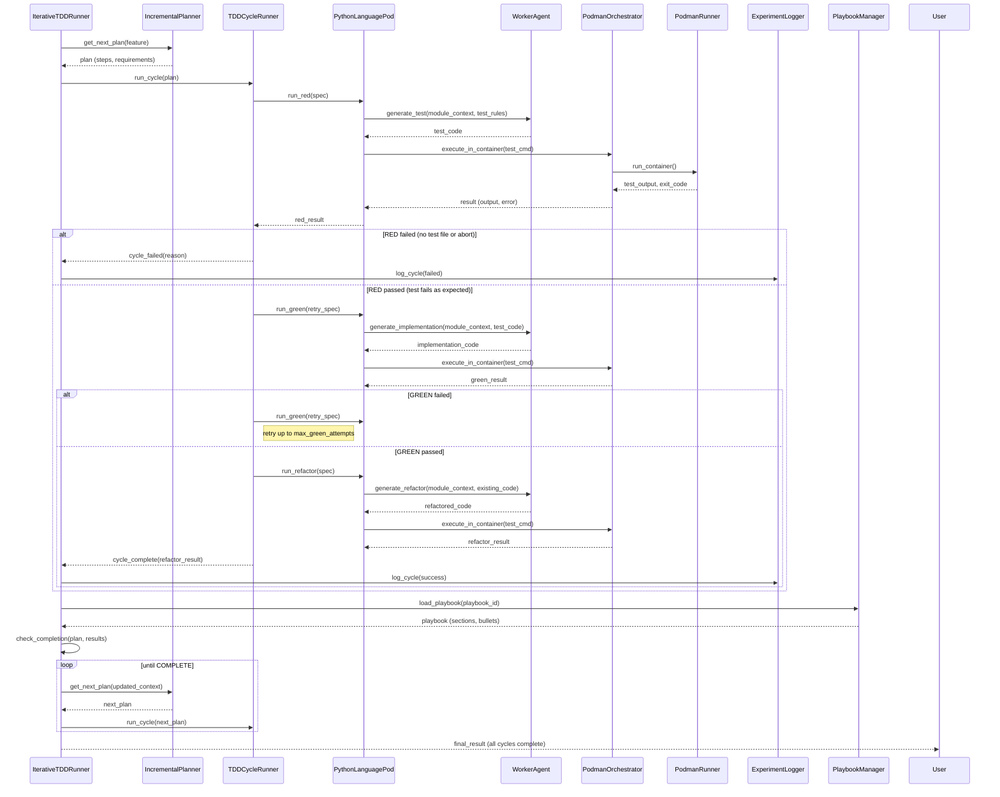

<!-- Generated by generate_live_docs.py on 2026-09-18 17:52 — do not edit by hand -->

# System Architecture

| Component | Module | Role |
|-----------|--------|------|
| IterativeTDDRunner | src/agents/iterative_tdd_runner.py | Orchestrates the Kent Beck-style RED→GREEN→REFACTOR loop, parsing Gherkin features and driving per-language TDD cycles until completion. |
| TDDCycleRunner | src/agents/tdd_cycle_runner.py | Executes one complete RED→GREEN→REFACTOR cycle for a single feature, handling retries and persisting results via ExperimentLogger. |
| IncrementalPlanner | src/agents/incremental_planner.py | Generates step-by-step TDD plans from feature requirements, determining what to implement next in the iterative loop. |
| PodmanOrchestrator | src/agents/podman_orchestrator.py | Manages Podman container lifecycle and enforces security boundaries during test execution. |
| PodmanRunner | src/agents/podman_runner.py | Starts/stops containers and runs test commands inside isolated Podman environments. |
| PythonLanguagePod | src/agents/python_language_pod.py | Implements RED→GREEN→REFACTOR phases for Python, using WorkerAgent for codegen and PodmanOrchestrator for execution. |
| GoLanguagePod | src/agents/go_language_pod.py | Implements RED→GREEN→REFACTOR phases for Go, generating step definitions and test runners from Gherkin. |
| TypeScriptLanguagePod | src/agents/typescript_language_pod.py | Implements RED→GREEN→REFACTOR phases for TypeScript, ensuring test imports and running via sandboxed containers. |
| WorkerAgent | src/agents/worker_agent.py | Generates and edits code via LLM using SEARCH/REPLACE blocks, applying test rules and module context. |
| TypeScriptWorkerAgent | src/agents/typescript_worker_agent.py | TypeScript-specific code generation variant of WorkerAgent with language-aware prompting. |
| PolyglotTDDRunner | src/agents/polyglot_tdd_runner.py | Drives multi-language TDD loops, parsing .feature files and running per-language pods with redundancy checking. |
| SimulationRunner | src/agents/simulation_runner.py | Runs simulation-based TDD cycles with null-action controllers for testing orchestration logic. |
| SimulationPod | src/agents/simulation_pod.py | Simulated pod for testing TDD orchestration without real containers. |
| SimulationPodmanRunner | src/agents/simulation_podman_runner.py | Simulated Podman runner for testing container interactions in-memory. |
| TestReviewAgent | src/agents/test_review_agent.py | Validates test quality before implementation, using LLM deep review for substance-over-style analysis. |
| MermaidRunner | src/agents/mermaid_runner.py | Sends mermaid diagram text as pulse files for diagram validation. |
| PlaybookManager | src/playbook/manager.py | Loads, saves, and manages playbook JSON files with section-based bullet storage. |
| ExperimentLogger | src/storage/experiment_logger.py | Persists TDD cycle results, experiment metadata, and proper-TDD-cycle flags to SQL database. |
| LLMClient | src/utils/llm_client.py | Unified interface for LLM calls, routing to configured providers. |
| EffgenClient | src/utils/effgen_client.py | Adapter exposing effGen local models through the LLMClient interface. |
| Reflector | src/core/reflector/module.py | Reflects on codebase context, parsing markdown sections to extract knowledge. |
| Curator | src/core/curator/module.py | Curates and deduplicates knowledge bullets, managing fenced code blocks during parsing. |
| Generator | src/core/generator/module.py | Generates Gherkin features from codebases and orchestrates sandboxed candidate runners. |
| ModuleTDD | src/core/generator/module.py | Runs module-level TDD with repair and escalation LLM clients. |
| AdaptiveBroker | src/core/generator/module.py | Routes LLM calls to candidate models based on configuration. |
| ContextMap | src/utils/context_map.py | Maps dotted module paths to file paths and renders mermaid flowcharts. |
| MermaidValidator | src/utils/mermaid_validation.py | Extracts and validates mermaid diagram blocks, parsing SEARCH/REPLACE blocks. |
| FileLock | src/utils/file_lock.py | Provides file-based locking for concurrent access control. |
| ImportValidator | src/utils/import_validator.py | Validates import statements and module dependencies. |

