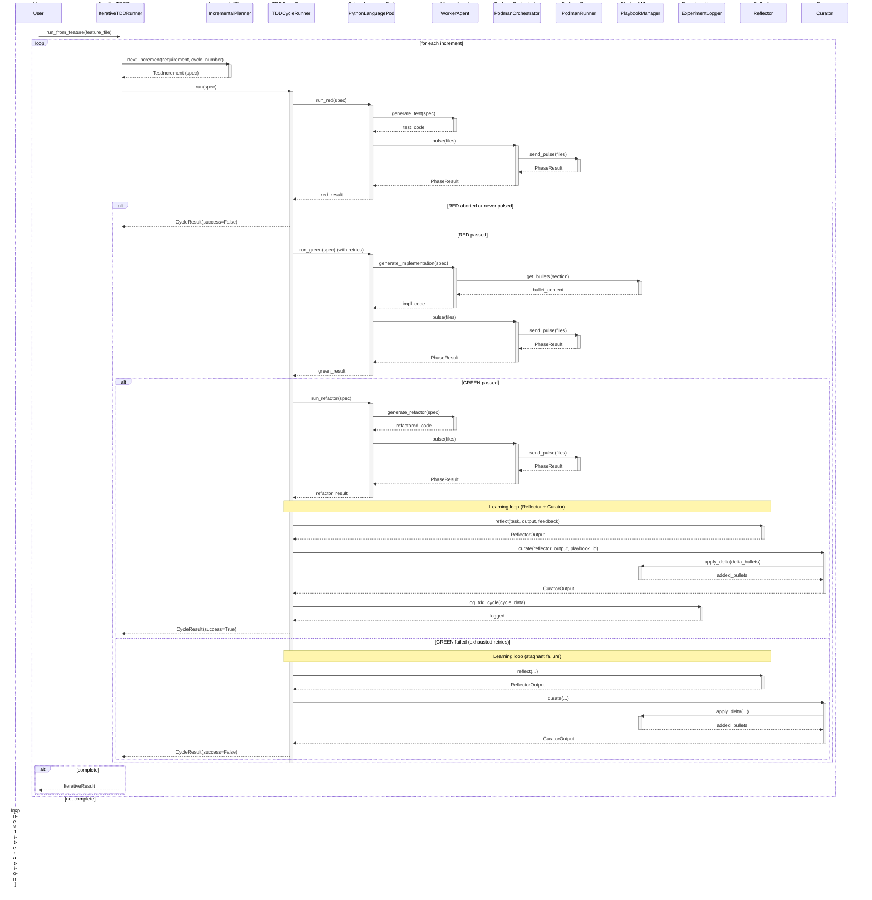

<!-- Generated by generate_live_docs.py on 2026-09-22 08:37 — do not edit by hand -->

# System Architecture

| Component | Module | Role |
|-----------|--------|------|
| IterativeTDDRunner | src/agents/iterative_tdd_runner.py | Orchestrates Kent Beck-style RED→GREEN→REFACTOR loop across iterations |
| TDDCycleRunner | src/agents/tdd_cycle_runner.py | Runs one complete TDD cycle with retry and learning loop |
| IncrementalPlanner | src/agents/incremental_planner.py | Determines the next test increment via LLM |
| PythonLanguagePod | src/agents/python_language_pod.py | LanguagePod implementation for Python TDD cycles |
| WorkerAgent | src/agents/worker_agent.py | Standalone LLM code generation for each TDD phase |
| PodmanOrchestrator | src/agents/podman_orchestrator.py | Stateless sidecar execution layer with security hashing |
| PodmanRunner | src/agents/podman_runner.py | Production container runner backed by rootless Podman |
| PlaybookManager | src/playbook/manager.py | Core playbook operations: creation, updates, merging, retrieval |
| ExperimentLogger | src/storage/experiment_logger.py | Unified experiment logging (PostgreSQL/SQLite) |
| Reflector | src/core/reflector/module.py | Analyses task outcomes and extracts learning insights |
| Curator | src/core/curator/module.py | Synthesises reflector insights into playbook updates |
| Generator | src/core/generator/module.py | Executes tasks using playbook-guided LLM generation |
| PolyglotTDDRunner | src/agents/polyglot_tdd_runner.py | Drives RED→GREEN→REFACTOR across multiple LanguagePods |
| EnsembleBuildRunner | src/agents/ensemble_build.py | Multi-candidate blind build with consensus |
| ProjectBuilder | src/cli/project_builder.py | Builds every module of a ProjectPlan in dependency order |
| ModuleArchitect | src/contracts/module_architect.py | Generates module-level contracts for stateful systems |
| ModuleTDDBuilder | src/contracts/module_tdd_builder.py | Builds module implementations using TDD |
| ContractOrchestrator | src/contracts/contract_driven.py | Orchestrates contract-driven development |
| AdaptiveBroker | src/broker/adaptive_broker.py | Routes tasks based on learned performance |
| PerformanceAggregator | src/broker/performance_aggregator.py | Extracts metrics from audit trail |
| BulletRetriever | src/playbook/retrieval.py | Hybrid retrieval engine for playbook bullets |
| InstitutionalKnowledgeService | src/retrieval/service.py | Central knowledge retrieval for code generation |
| ContextGraphRetriever | src/retrieval/cgr3_retriever.py | CGR³ context graph retrieve-rank-reason |
| AuditStore | src/audit/store.py | Append-only audit store with hash chain integrity |
| LocalAuditClient | src/audit/local_client.py | Write-only local SQLite audit client |
| SimulationOracle | src/agents/simulation_oracle.py | Physics-simulation test oracle for SimulationPod |
| SimulationPod | src/agents/simulation_pod.py | LanguagePod for PyBullet-backed TDD cycles |
| ImportFilter | src/agents/import_filter.py | Static import filter for generated code |
| GherkinFeatureBridge | src/agents/gherkin_feature_bridge.py | Parses Gherkin .feature files into FeatureSpec |
| RedundancyPreChecker | src/agents/redundancy_checker.py | Pre-checks proposed tests for redundancy |
| TDDFailureRecorder | src/agents/tdd_failure_recorder.py | Records failures and interventions for self-improvement |
| TestReviewAgent | src/agents/test_review_agent.py | Validates test quality before implementation |

