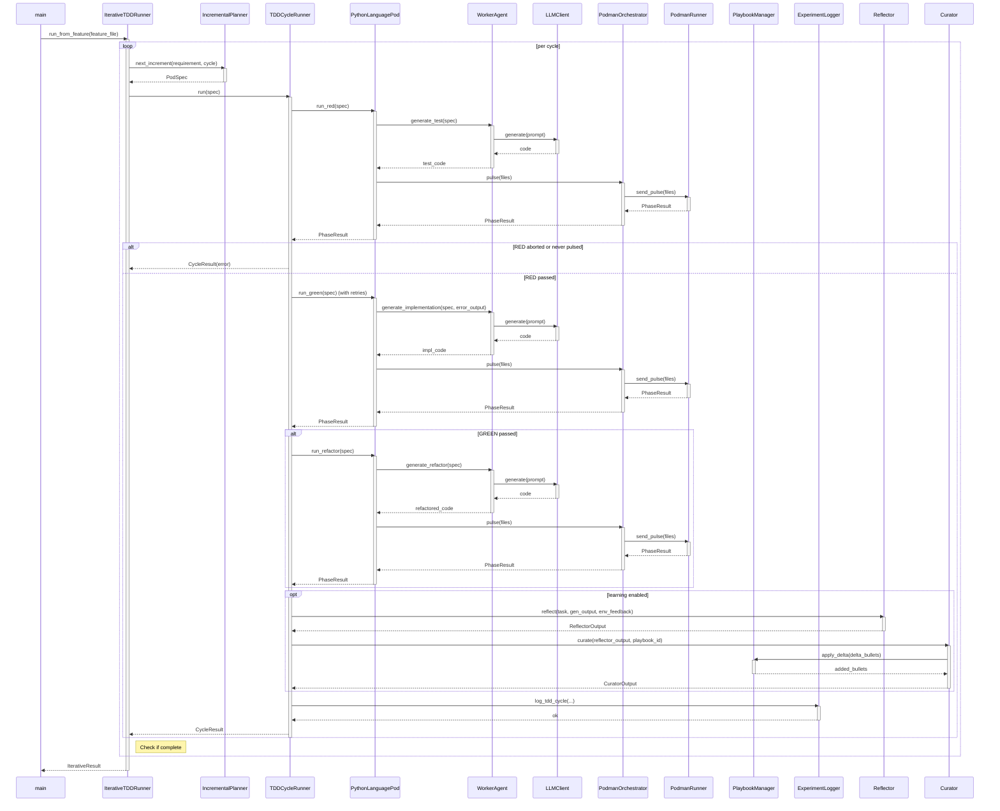

<!-- Generated by generate_live_docs.py on 2026-09-15 20:52 — do not edit by hand -->

# System Architecture

| Component | Module | Role |
|-----------|--------|------|
| IterativeTDDRunner | src/agents/iterative_tdd_runner.py | Orchestrates the iterative RED→GREEN→REFACTOR loop across multiple cycles |
| TDDCycleRunner | src/agents/tdd_cycle_runner.py | Runs one complete TDD cycle with retries and learning |
| PythonLanguagePod | src/agents/python_language_pod.py | LanguagePod for Python: generates code and executes tests in container |
| WorkerAgent | src/agents/worker_agent.py | Generates code for each TDD phase using LLM |
| IncrementalPlanner | src/agents/incremental_planner.py | Determines the next test increment to write |
| PodmanOrchestrator | src/agents/podman_orchestrator.py | Stateless sidecar execution layer for container |
| PodmanRunner | src/agents/podman_runner.py | Container runner backed by rootless Podman |
| PlaybookManager | src/playbook/manager.py | Manages playbook operations: creation, updates, merging, retrieval |
| ExperimentLogger | src/storage/experiment_logger.py | Logs TDD and ML experiments to database |
| Reflector | src/core/reflector/module.py | Analyzes task outcomes and extracts learning insights |
| Curator | src/core/curator/module.py | Synthesizes insights into playbook updates |
| Generator | src/core/generator/module.py | Executes tasks using playbook-guided LLM |
| LLMClient | src/utils/llm_client.py | Unified LLM client supporting multiple providers |
| BulletRetriever | src/playbook/retrieval.py | Hybrid retrieval system for selecting relevant bullets |
| ContextScorer | src/retrieval/context_scorer.py | Scores bullets against request context |
| PerformanceAggregator | src/broker/performance_aggregator.py | Extracts metrics from audit trail |
| AdaptiveBroker | src/broker/adaptive_broker.py | Routes tasks based on learned performance |
| AuditStore | src/audit/store.py | Append-only audit event store with hash chain |
| LocalAuditClient | src/audit/local_client.py | Audit client that writes directly to local SQLite |
| EnsembleLearner | src/ensemble/learner.py | Orchestrates multiple models learning in parallel |
| ConsensusBuilder | src/ensemble/consensus.py | Builds consensus from multiple model proposals |
| DistillationRouter | src/playbook/distillation_router.py | Routes tasks to domain-specific distillation playbooks |
| BulletClusterer | src/playbook/clustering.py | DBSCAN-based clustering for playbook bullets |
| BulletDeduplicator | src/playbook/deduplication.py | Semantic deduplication of bullets |
| ImportFilter | src/agents/import_filter.py | Checks code for forbidden imports and builtins |
| RedundancyPreChecker | src/agents/redundancy_checker.py | Pre-checks proposed tests for redundancy |
| TestReviewAgent | src/agents/test_review_agent.py | Validates test quality before implementation |
| CharacterizationTestGenerator | src/agents/characterization_test_generator.py | Writes empirically-verified pytest tests |
| GherkinFeatureBridge | src/agents/gherkin_feature_bridge.py | Parses Gherkin .feature files |
| ProjectArchitect | src/contracts/project_architect.py | Decomposes project spec into module DAG |
| ModuleArchitect | src/contracts/module_architect.py | Generates module-level contracts |
| ModuleTDDBuilder | src/contracts/module_tdd_builder.py | Builds module implementations using TDD |
| PolyglotTDDRunner | src/agents/polyglot_tdd_runner.py | Orchestrates TDD across multiple LanguagePods |
| SimulationPod | src/agents/simulation_pod.py | LanguagePod for physics simulation TDD |
| SimulationOracle | src/agents/simulation_oracle.py | Physics-simulation test oracle |

