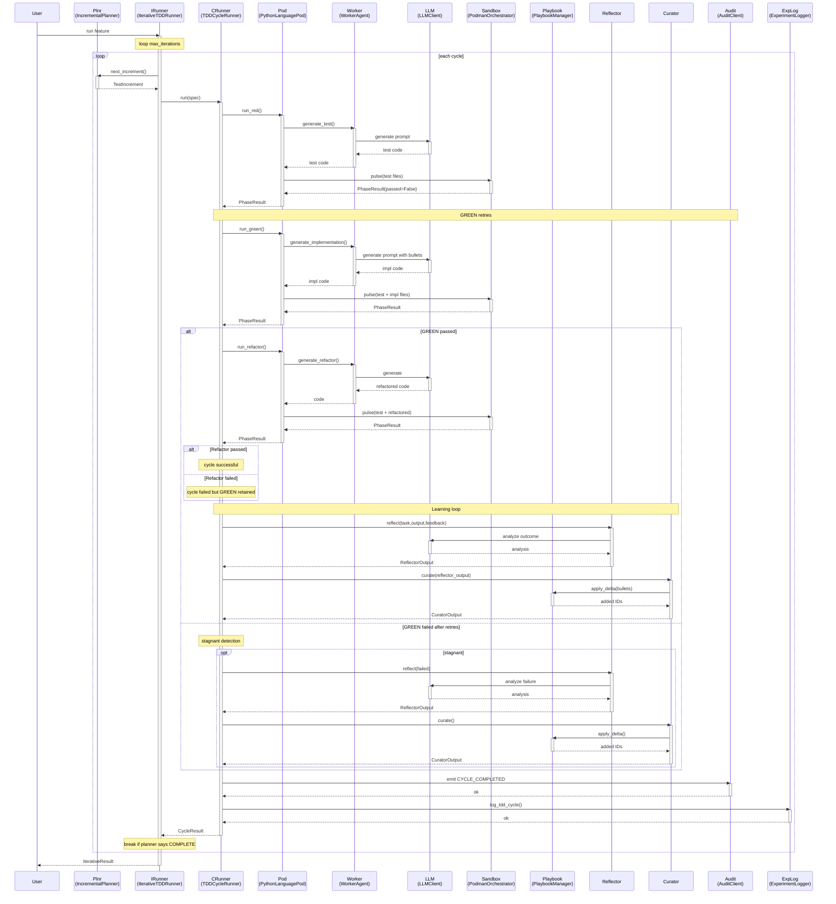

<!-- Generated by generate_live_docs.py on 2026-09-22 09:48 — do not edit by hand -->

# System Architecture

| Component | Module | Role |
|-----------|--------|------|
| `IterativeTDDRunner` | `src.agents.iterative_tdd_runner` | Orchestrates the RED→GREEN→REFACTOR loop across multiple cycles |
| `TDDCycleRunner` | `src.agents.tdd_cycle_runner` | Executes a single TDD cycle with GREEN retries and learning loop |
| `IncrementalPlanner` | `src.agents.incremental_planner` | Determines the next test increment via LLM analysis |
| `PythonLanguagePod` | `src.agents.python_language_pod` | Language-specific implementation of RED/GREEN/REFACTOR phases |
| `WorkerAgent` | `src.agents.worker_agent` | Generates test, implementation, and refactor code via LLM |
| `PodmanOrchestrator` | `src.agents.podman_orchestrator` | Stateless sidecar execution layer with hash verification |
| `PodmanRunner` | `src.agents.podman_runner` | Rootless Podman container lifecycle and file pulse |
| `PlaybookManager` | `src.playbook.manager` | Core playbook CRUD, delta updates, redundancy checking |
| `BulletRetriever` | `src.playbook.retrieval` | Hybrid retrieval of relevant playbook bullets |
| `Reflector` | `src.core.reflector.module` | Analyzes task outcomes and extracts root causes |
| `Curator` | `src.core.curator.module` | Synthesizes insights into playbook delta bullets |
| `Generator` | `src.core.generator.module` | Executes tasks using playbook-guided LLM generation |
| `LLMClient` | `src.utils.llm_client` | Unified interface to multiple LLM providers |
| `ExperimentLogger` | `src.storage.experiment_logger` | Logs TDD cycles and experiments to database |
| `AuditClient` | `src.audit.client` | Write-only audit client for hash-chained event logging |
| `LocalAuditClient` | `src.audit.local_client` | SQLite-backed audit client for development |
| `AuditStore` | `src.audit.store` | Append-only audit event store with hash chain integrity |
| `InstitutionalKnowledgeService` | `src.retrieval.service` | Central knowledge retrieval for code generation |
| `ContextGraphRetriever` | `src.retrieval.cgr3_retriever` | CGR³ context-aware bullet retrieval and ranking |
| `PlaybookReliabilityAnalyzer` | `src.reliability.playbook_analyzer` | Correlates bullet retrieval with first-pass GREEN success |
| `AdaptiveBroker` | `src.broker.adaptive_broker` | Routes tasks to best agent based on historical performance |
| `PerformanceAggregator` | `src.broker.performance_aggregator` | Extracts agent metrics from audit trail |
| `EnsembleLearner` | `src.ensemble.learner` | Orchestrates multi-model learning and voting |
| `CapabilityRegistry` | `src.broker.capability_registry` | Anonymous agent capability tracking |
| `ProjectBuilder` | `src.cli.project_builder` | Drives ModuleArchitect + ModuleTDDBuilder over a project plan |
| `ModuleArchitect` | `src.contracts.module_architect` | Generates module-level contracts for stateful systems |
| `ProjectArchitect` | `src.contracts.project_architect` | Decomposes project spec into module DAG |

