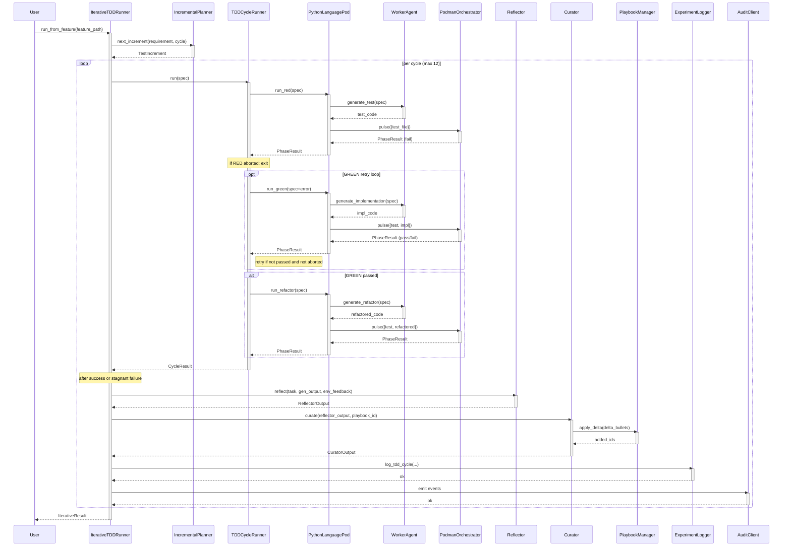

<!-- Generated by generate_live_docs.py on 2026-09-12 08:35 — do not edit by hand -->

# System Architecture

| Component | Module | Role |
|-----------|--------|------|
| IterativeTDDRunner | src/agents/iterative_tdd_runner.py | Orchestrates the RED→GREEN→REFACTOR loop across multiple iterations driven by a planner. |
| IncrementalPlanner | src/agents/incremental_planner.py | Uses LLM to determine the next test increment based on current state. |
| TDDCycleRunner | src/agents/tdd_cycle_runner.py | Runs one complete TDD cycle: RED, GREEN (with retries), REFACTOR. |
| PythonLanguagePod | src/agents/python_language_pod.py | LanguagePod for Python; delegates code generation to WorkerAgent and execution to PodmanOrchestrator. |
| WorkerAgent | src/agents/worker_agent.py | Generates code for each TDD phase (test, implementation, refactor) via LLM prompts. |
| PodmanOrchestrator | src/agents/podman_orchestrator.py | Stateless sidecar execution layer; pulses files into a container and validates execution. |
| PodmanRunner | src/agents/podman_runner.py | Rootless Podman container runner; manages container lifecycle and file pulses. |
| PlaybookManager | src/playbook/manager.py | Core playbook operations: create, add bullets, apply delta, manage versions. |
| Generator | src/core/generator/module.py | Executes tasks using playbook context; retrieves relevant bullets and generates responses. |
| Reflector | src/core/reflector/module.py | Analyzes task outcomes to extract error patterns, root causes, and key insights. |
| Curator | src/core/curator/module.py | Synthesizes reflector insights into actionable playbook delta bullets. |
| LLMClient | src/utils/llm_client.py | Unified LLM client supporting multiple providers (OpenRouter, OpenAI, etc.). |
| ExperimentLogger | src/storage/experiment_logger.py | Logs experiments (TDD cycles, ML runs) to PostgreSQL with SQLite fallback. |
| BulletRetriever | src/playbook/retrieval.py | Hybrid retrieval engine for selecting relevant playbook bullets using embeddings and keywords. |
| AdaptiveBroker | src/broker/adaptive_broker.py | Routes tasks to the best agent based on historical performance and cost awareness. |
| PerformanceAggregator | src/broker/performance_aggregator.py | Aggregates performance metrics from the audit trail. |
| AuditStore | src/audit/store.py | Append-only audit event store with hash chain integrity. |
| LocalAuditClient | src/audit/local_client.py | Writes audit events directly to local SQLite database for development. |
| ConsensusBuilder | src/ensemble/consensus.py | Clusters similar proposals and builds consensus bullets. |
| EnsembleLearner | src/ensemble/learner.py | Orchestrates multiple models learning in parallel with voting and deliberation. |
| ContextGraphRetriever | src/retrieval/cgr3_retriever.py | CGR³: Context Graph Retrieve-Rank-Reason for knowledge retrieval. |
| InstitutionalKnowledgeService | src/retrieval/service.py | Central knowledge retrieval service for code generation activities. |
| ModuleArchitect | src/contracts/module_architect.py | Generates module-level contracts for stateful systems. |
| ProjectArchitect | src/contracts/project_architect.py | Decomposes a project spec into a module DAG. |
| ContractArchitect | src/contracts/contract_architect.py | Generates contracts from natural language requirements. |
| PolyglotTDDRunner | src/agents/polyglot_tdd_runner.py | Drives TDD across multiple LanguagePods (Python, Go, TypeScript) for ensemble comparison. |
| PodFactory | src/agents/polyglot_tdd_runner.py | Creates LanguagePod instances for a given language identifier. |
| SimulationPod | src/agents/simulation_pod.py | LanguagePod for physics simulation TDD using PyBullet. |
| ModelAttributionTracker | src/benchmark/model_attribution.py | Tracks OpenRouter model attribution in performance metrics. |
| ProductionDataAnalyzer | src/benchmark/production_analyzer.py | Analyzes production experiment data for model quality metrics. |
| BlindEvaluator | src/benchmark/blind_evaluation.py | Scores outputs without knowing which agent produced them. |

