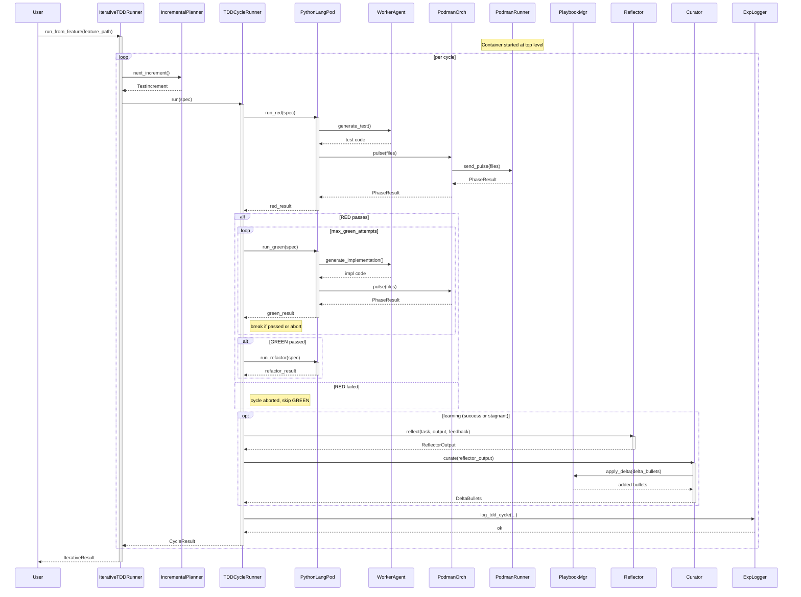

<!-- Generated by generate_live_docs.py on 2026-09-16 06:40 — do not edit by hand -->

# System Architecture

| LLMClient | src/utils/llm_client.py | Unified LLM provider client (OpenAI, Anthropic, Ollama, etc.) |
| PlaybookManager | src/playbook/manager.py | Manage playbook creation, updates, dedup, persistence |
| WorkerAgent | src/agents/worker_agent.py | LLM-prompted code generation for TDD phases |
| PythonLanguagePod | src/agents/python_language_pod.py | Python-specific TDD execution (test, impl, refactor) |
| PodmanOrchestrator | src/agents/podman_orchestrator.py | Stateless sidecar container execution with security hashing |
| PodmanRunner | src/agents/podman_runner.py | Rootless Podman container lifecycle and pulse execution |
| IncrementalPlanner | src/agents/incremental_planner.py | LLM-based next-test planning for iterative TDD |
| IterativeTDDRunner | src/agents/iterative_tdd_runner.py | Kent Beck-style RED→GREEN→REFACTOR loop orchestrator |
| TDDCycleRunner | src/agents/tdd_cycle_runner.py | Single TDD cycle with GREEN retries and optional learning loop |
| Reflector | src/core/reflector/module.py | Analyze task outcome, extract error patterns and insights |
| Curator | src/core/curator/module.py | Synthesize reflector insights into playbook delta bullets |
| Generator | src/core/generator/module.py | Execute tasks using playbook-guided LLM generation |
| ExperimentLogger | src/storage/experiment_logger.py | Unified experiment logging (PostgreSQL fallback to SQLite) |
| BulletRetriever | src/playbook/retrieval.py | Hybrid semantic/keyword retrieval for playbook bullets |
| PolyglotTDDRunner | src/agents/polyglot_tdd_runner.py | Multi-language TDD orchestrator using LanguagePod factory |
| CharacterizationTestGenerator | src/agents/characterization_test_generator.py | Empirical test suite generation with verification |
| EnsembleBuildRunner | src/agents/ensemble_build.py | Multi-candidate blind build with consensus winner selection |
| GoLanguagePod | src/agents/go_language_pod.py | Go-specific TDD implementation via Podman |
| TypeScriptLanguagePod | src/agents/typescript_language_pod.py | TypeScript-specific TDD implementation via Podman |
| SimulationPod | src/agents/simulation_pod.py | Physics-simulation TDD pod using PyBullet |
| SimulationOracle | src/agents/simulation_oracle.py | Simulation test oracle running controller in sandbox |
| AdaptiveBroker | src/broker/adaptive_broker.py | Route tasks to best agent based on learned performance |
| PerformanceAggregator | src/broker/performance_aggregator.py | Aggregate agent metrics from audit trail |
| ModelAttributionTracker | src/benchmark/model_attribution.py | Track OpenRouter model identity and performance metrics |
| ContextGraphRetriever | src/retrieval/cgr3_retriever.py | CGR³: Context Graph Retrieve-Rank-Reason for bullet retrieval |

