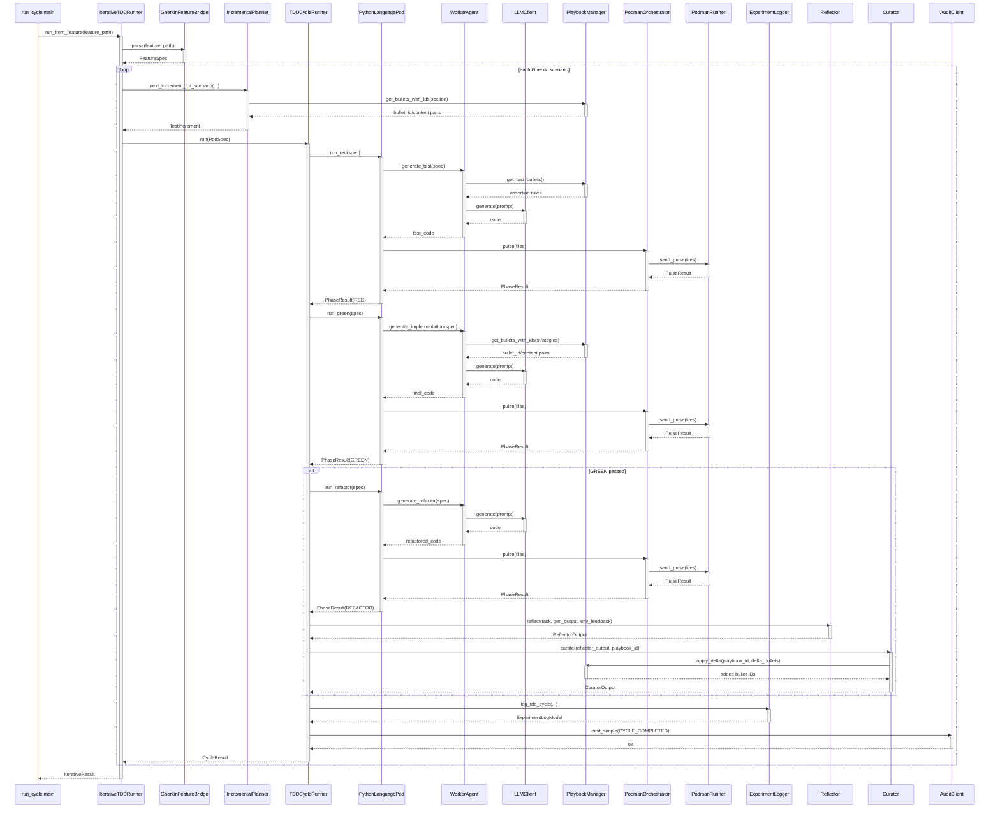

<!-- Generated by generate_live_docs.py on 2026-09-22 13:44 — do not edit by hand -->

# System Architecture

| Component | Module | Role |
|-----------|--------|------|
| IterativeTDDRunner | src/agents/iterative_tdd_runner.py | Orchestrates the iterative RED→GREEN→REFACTOR loop across scenarios, driving the planner and collecting cycle results |
| TDDCycleRunner | src/agents/tdd_cycle_runner.py | Runs one full TDD cycle (RED with retries, GREEN with retries, REFACTOR), aborts on security/policy failures, triggers learning loop |
| IncrementalPlanner | src/agents/incremental_planner.py | Asks the LLM which single test to write next, tracking written tests and implementation context |
| PythonLanguagePod | src/agents/python_language_pod.py | Python LanguagePod: delegates codegen to WorkerAgent, execution to PodmanOrchestrator, atomic file commits, patch-mode GREEN |
| WorkerAgent | src/agents/worker_agent.py | Builds phase-specific prompts (test/impl/refactor/patch) and calls the LLM, extracts code, pulls playbook bullets |
| PodmanOrchestrator | src/agents/podman_orchestrator.py | Stateless sidecar: canonical workspace hashing, H_proposed vs H_executed security check, pulses files into container |
| PodmanRunner | src/agents/podman_runner.py | Rootless-Podman container lifecycle (start/stop/alive) and send_pulse execution with bandit analysis |
| LLMClient | src/utils/llm_client.py | Unified multi-provider LLM client (OpenRouter, OpenAI, Anthropic, DeepSeek, Ollama, vLLM, TogetherAI) |
| PlaybookManager | src/playbook/manager.py | Playbook CRUD, delta updates with semantic dedup, content-safety screening, token budgets, feedback/confidence, JSON persistence |
| ExperimentLogger | src/storage/experiment_logger.py | Persists TDD/ML experiment records to PostgreSQL with local SQLite fallback; lesson and anti-pattern queries |
| Reflector | src/core/reflector/module.py | Analyzes task outcomes, extracts root cause/error/correct approach/key insight/code invariant, scores analysis quality, tags bullets |
| Curator | src/core/curator/module.py | Synthesizes reflector insights into delta bullets (with supersede markers), checks existing bullets for contradictions, applies updates |
| Generator | src/core/generator/module.py | Executes tasks with playbook-guided LLM: cross-model or model-specific bullet retrieval, prompt building, response parsing |
| GherkinFeatureBridge | src/agents/gherkin_feature_bridge.py | Parses Gherkin .feature files into FeatureSpec scenarios for iterative runs |
| BulletRetriever | src/playbook/retrieval.py | Hybrid retrieval (semantic + keyword) scoring bullets by relevance and helpful ratio, cross-model retrieval |
| ImportFilter | src/agents/import_filter.py | Static AST-based rejection of forbidden imports and blocked builtin calls in generated code |
| RedundancyPreChecker | src/agents/redundancy_checker.py | Pre-checks proposed tests for redundancy against existing tests before the RED phase |
| TestReviewAgent | src/agents/test_review_agent.py | Reviews test quality (structure, naming, assertions, edge cases) before implementation, with optional LLM deep review |
| GherkinExtractionAgent | src/agents/gherkin_extraction_agent.py | Reverse-engineers Gherkin scenarios and step definitions from existing code and tests |
| TypeScriptLanguagePod | src/agents/typescript_language_pod.py | TypeScript LanguagePod running vitest in a rootless Podman container |
| GoLanguagePod | src/agents/go_language_pod.py | Go LanguagePod with gosec analysis, gofmt formatting, and multi-file patch GREEN |
| SimulationPod | src/agents/simulation_pod.py | Physics-simulation LanguagePod: oracle-driven RED/GREEN/REFACTOR with archived attempts and invariant checks |
| SimulationOracle | src/agents/simulation_oracle.py | Runs a controller script against a simulation scenario, parses telemetry, enforces invariants |
| PodFactory | src/agents/polyglot_tdd_runner.py | Creates LanguagePod instances for a given language identifier |
| PolyglotTDDRunner | src/agents/polyglot_tdd_runner.py | Drives RED→GREEN→REFACTOR across multiple language pods, reports token efficiency comparison |
| EnsembleBuildRunner | src/agents/ensemble_build.py | Runs multi-candidate "double-blind" feature build: generate, evaluate, consensus analysis, winner selection, commit, learning |
| AdaptiveBroker | src/broker/adaptive_broker.py | Routes tasks to the best agent based on learned performance history (quality, cost, latency, Pareto, budget modes) |
| PerformanceAggregator | src/broker/performance_aggregator.py | Extracts per-agent metrics from audit trail, builds model profiles, regression alerts, Bayesian estimates |
| AuditStore | src/audit/store.py | Append-only audit event store with SHA-256 hash-chain integrity and full-chain verification |
| LocalAuditClient | src/audit/local_client.py | Writes audit events directly to local SQLite for dev/testing |
| ProjectArchitect | src/contracts/project_architect.py | Decomposes a project spec into an ordered module DAG (ProjectPlan) |
| ModuleArchitect | src/contracts/module_architect.py | Generates module-level contracts with shared state and integration tests, validates against codebase context |
| ModuleTDDBuilder | src/contracts/module_tdd_builder.py | Builds module implementations function-by-function via TDD, repairs modules, runs integration tests |
| ContextGraphRetriever | src/retrieval/cgr3_retriever.py | CGR³ Retrieve-Rank-Reason pipeline with context-aware verdicts and lineage-aware filtering |
| InstitutionalKnowledgeService | src/retrieval/service.py | Central knowledge retrieval service feeding context-ranked, verdict-filtered guidance to WorkerAgents |

