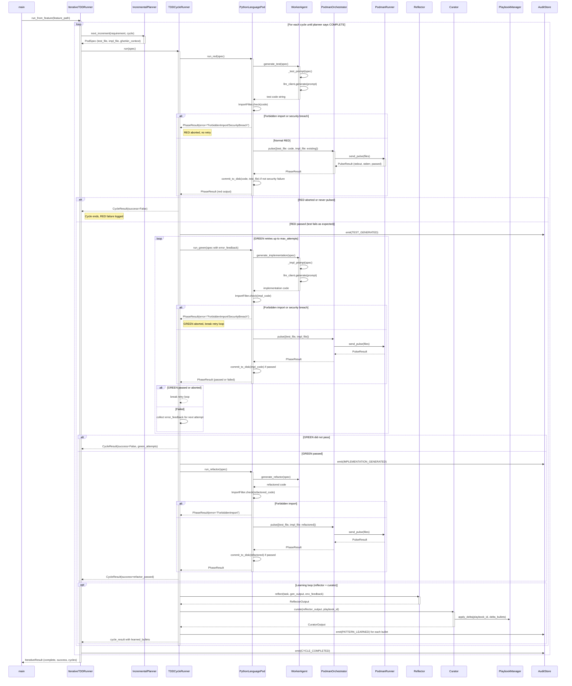

<!-- Generated by generate_live_docs.py on 2026-09-13 12:21 — do not edit by hand -->

# System Architecture

| Component | Module | Role |
|-----------|--------|------|
| LLMClient | utils/llm_client | Unified interface to multiple LLM providers |
| PlaybookManager | playbook/manager | Core playbook CRUD, delta updates, persistence |
| WorkerAgent | agents/worker_agent | Generates RED/GREEN/REFACTOR code via LLM prompts |
| IncrementalPlanner | agents/incremental_planner | LLM-driven next test increment planner |
| IterativeTDDRunner | agents/iterative_tdd_runner | Orchestrates the full RED→GREEN→REFACTOR iteration loop |
| TDDCycleRunner | agents/tdd_cycle_runner | Runs one TDD cycle with GREEN retries and learning |
| PythonLanguagePod | agents/python_language_pod | Python pod: delegates code gen to WorkerAgent, execution to PodmanOrchestrator |
| PodmanOrchestrator | agents/podman_orchestrator | Stateless sidecar execution with security hash verification |
| PodmanRunner | agents/podman_runner | Rootless Podman container lifecycle and pulse |
| Reflector | core/reflector/module | Analyzes task outcomes and extracts learning insights |
| Curator | core/curator/module | Synthesizes insights into playbook delta bullets |
| Generator | core/generator/module | Executes tasks with playbook context and bullet retrieval |
| BulletRetriever | playbook/retrieval | Hybrid (semantic + keyword) bullet retrieval |
| ImportFilter | agents/import_filter | Detects forbidden imports and builtins in generated code |
| ContextMapBuilder | utils/context_map | Builds AST context map for code relevancy |
| ExperimentLogger | storage/experiment_logger | Unified experiment logging (PostgreSQL/SQLite) |
| PlaybookRepository | storage/repository | PostgreSQL + pgvector repository for playbooks |
| BulletDeduplicator | playbook/deduplication | Semantic deduplication of bullets |
| TokenEfficiencyReporter | analytics/token_efficiency | Cross-language token efficiency scoring |
| PerformanceAggregator | broker/performance_aggregator | Aggregates agent performance from audit trail |
| AdaptiveBroker | broker/adaptive_broker | Routes tasks to best agent based on learned metrics |
| RegressionDetector | broker/regression_detector | Detects quality regressions across model versions |
| LanguagePod | agents/language_pod | Protocol for language-specific TDD execution pods |
| ProjectArchitect | contracts/project_architect | Decomposes project spec into module dependency DAG |
| ModuleArchitect | contracts/module_architect | Generates module-level contracts with shared state |
| ModuleTDDBuilder | contracts/module_tdd_builder | TDD-based module implementation builder |
| AuditStore | audit/store | Append-only hash-chained audit event store |

