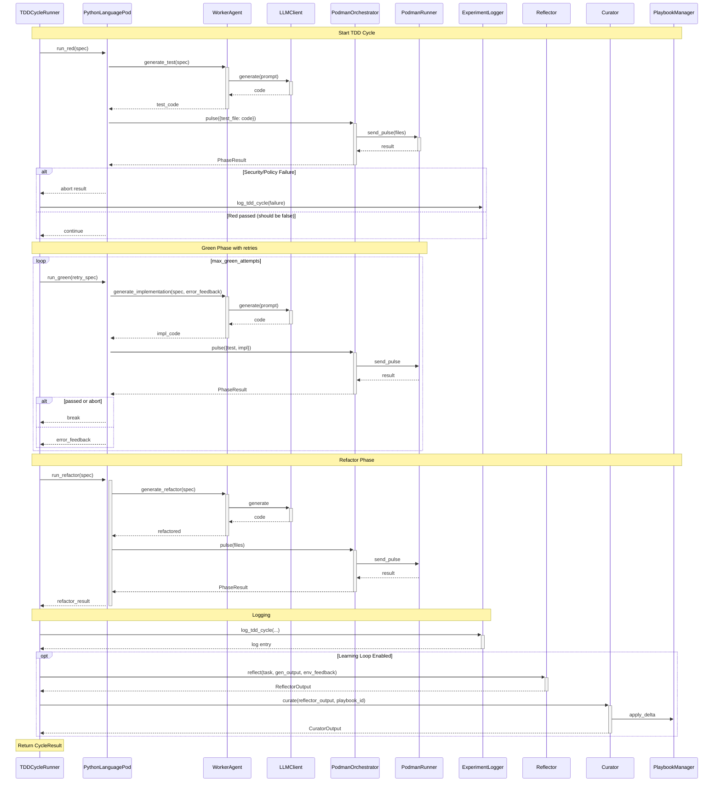

<!-- Generated by generate_live_docs.py on 2026-05-21 21:03 — do not edit by hand -->

# System Architecture

| Component | Module | Role |
|-----------|--------|------|
| TDD Cycle | TDDCycleRunner | Orchestrates RED→GREEN→REFACTOR phases with retry and learning |
| TDD Cycle | PythonLanguagePod | Executes TDD phases for Python via WorkerAgent or AutonomousTDDAgent |
| TDD Cycle | WorkerAgent | Generates test, implementation, refactor code through LLM prompts |
| TDD Cycle | PodmanOrchestrator | Runs code in isolated container, detects security breaches |
| TDD Cycle | PodmanRunner | Manages Podman container lifecycle (start, stop, pulse) |
| TDD Cycle | LLMClient | Unified interface for multiple LLM providers |
| TDD Cycle | ImportFilter | Checks generated code for forbidden imports |
| Learning Loop | Reflector | Analyzes task outcomes, extracts error patterns and insights |
| Learning Loop | Curator | Synthesizes insights into playbook bullets, applies updates |
| Learning Loop | Generator | Executes tasks using playbook-guided LLM, retrieves bullets |
| Learning Loop | BulletRetriever | Hybrid retrieval of relevant bullets from playbook |
| Analytics | SuccessRateCalculator | Measures experiment success rates across types and versions |
| Analytics | CostQualityAnalyzer | Analyzes cost-quality tradeoffs and Pareto frontiers |
| Analytics | TDDCycleAnalyzer | Measures first-pass GREEN rate and trend over time |
| Analytics | PlaybookReliabilityAnalyzer | Correlates bullet retrieval with first-pass GREEN success |
| Analytics | ModelAttributionTracker | Tracks model performance with attribution from OpenRouter |
| Analytics | ProductionDataAnalyzer | Analyzes production experiment logs for quality metrics |
| Infrastructure | PlaybookManager | Creates, retrieves, updates playbooks with delta and persistence |
| Infrastructure | ExperimentLogger | Logs TDD/ML experiments to PostgreSQL or SQLite fallback |
| Infrastructure | AuditClient | Write-only audit event emitter with hash chain |
| Ensemble | ConsensusBuilder | Clusters similar bullet proposals and builds consensus |
| Ensemble | VotingSystem | Applies voting strategies (majority, weighted, etc.) |
| Broker | AdaptiveBroker | Routes tasks to best agent based on historical performance |
| Broker | BrokerAdvisor | Recommends agents by capability fit |
| Broker | PerformanceAggregator | Aggregates performance metrics from audit trail |
| Contracts | ContractArchitect | Generates interface contracts from natural language requirements |
| Contracts | ModuleArchitect | Generates module-level contracts for stateful systems |
| Contracts | ContractValidator | Validates implementations against contracts |
| Retrieval | ContextGraphRetriever | CGR³ retrieve-rank-reason with context-aware scoring |
| Retrieval | DistillationRouter | Routes tasks to domain-specific distillation playbooks |
| Retrieval | BulletDeduplicator | Semantic deduplication of bullets |
| Retrieval | BulletClusterer | DBSCAN clustering of bullets for distillation |
| Failure | TDDFailureRecorder | Records TDD failures and interventions for self-improvement |
| Failure | TDDLessonInjector | Injects TDD lessons into agent prompts |
| QA | PlaybookQA | Answers coding questions using playbook knowledge |
| Security | SemanticCodeAnalyzer | Detects dangerous patterns (eval, exec, secrets) |

