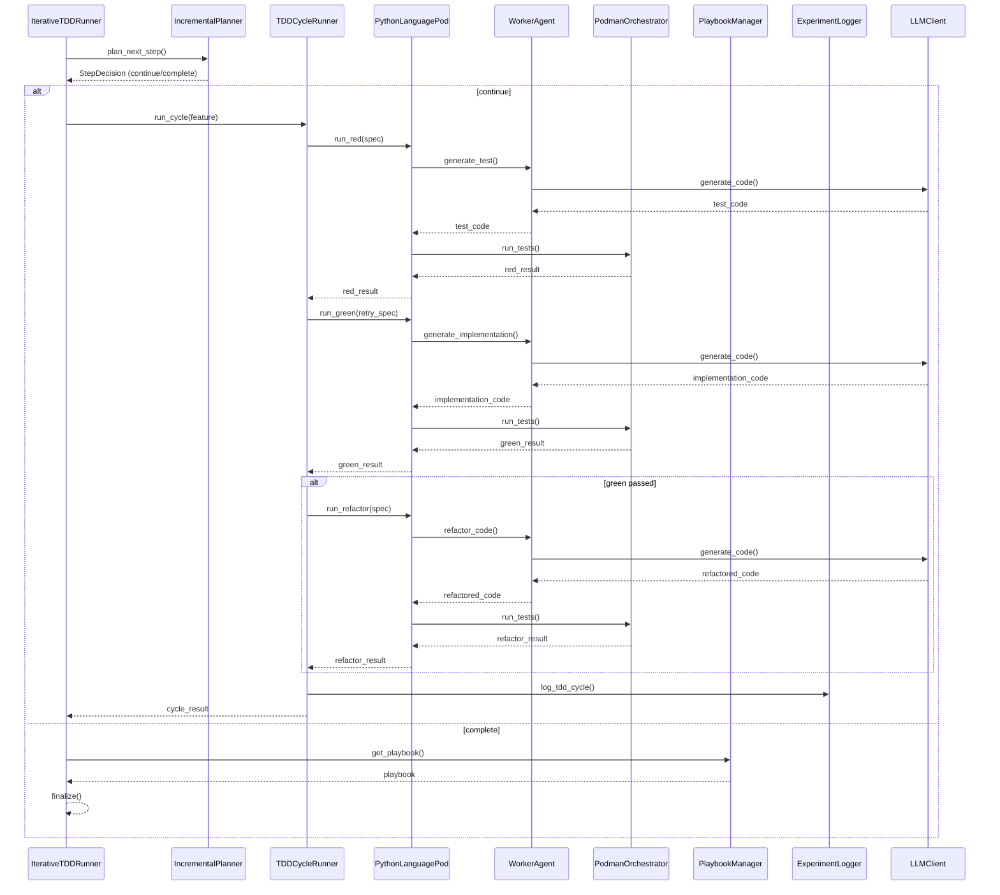

<!-- Generated by generate_live_docs.py on 2026-09-14 22:32 — do not edit by hand -->

# System Architecture

| Component | Module | Role |
|-----------|--------|------|
| IterativeTDDRunner | src/agents/iterative_tdd_runner.py | Orchestrates the Kent Beck-style RED→GREEN→REFACTOR loop, parsing Gherkin features and driving cycles until the planner signals COMPLETE. |
| IncrementalPlanner | src/agents/incremental_planner.py | Plans the next TDD step based on current state, deciding whether to continue or mark the feature as complete. |
| TDDCycleRunner | src/agents/tdd_cycle_runner.py | Executes one full RED→GREEN→REFACTOR cycle for a single feature, managing retries and logging results. |
| PythonLanguagePod | src/agents/python_language_pod.py | Implements the language-specific TDD pod for Python, using WorkerAgent for code generation and PodmanOrchestrator for isolated execution. |
| WorkerAgent | src/agents/worker_agent.py | Generates code and test files via LLM calls, applying test rules and extracting valid Python from model responses. |
| PodmanOrchestrator | src/agents/podman_orchestrator.py | Manages Podman container lifecycle, builds images, and runs commands in isolated sandboxes. |
| PodmanRunner | src/agents/podman_runner.py | Provides a concrete container runner implementation for executing tests and code inside Podman. |
| PlaybookManager | src/playbook/manager.py | Loads, saves, and manages playbook definitions and their associated bullets/sections. |
| ExperimentLogger | src/storage/experiment_logger.py | Persists TDD cycle results and experiment metrics to the database. |
| LLMClient | src/utils/llm_client.py | Provides a unified interface for LLM calls, handling provider routing and response parsing. |
| PolyglotTDDRunner | src/agents/polyglot_tdd_runner.py | Drives RED→GREEN→REFACTOR loops for multiple languages from a single Gherkin feature. |
| LanguageRunResult | src/agents/polyglot_tdd_runner.py | Captures the outcome of a full TDD run for one language. |
| TestReviewAgent | src/agents/test_review_agent.py | Validates test quality before implementation, optionally using LLM deep analysis. |
| TypeScriptLanguagePod | src/agents/typescript_language_pod.py | Implements the language-specific TDD pod for TypeScript. |
| TypeScriptRunner | src/agents/typescript_runner.py | Runs TypeScript tests inside a sandboxed Podman container. |
| TypeScriptWorkerAgent | src/agents/typescript_worker_agent.py | Generates TypeScript code and test files via LLM calls. |
| SimulationPod | src/agents/simulation_pod.py | Simulates TDD cycles without real containers for testing and calibration. |
| SimulationPodmanRunner | src/agents/simulation_podman_runner.py | Simulates Podman container execution for testing purposes. |
| SimulationRunner | src/agents/simulation_runner.py | Orchestrates simulated TDD runs for calibration and cold-start evaluation. |
| MermaidRunner | src/agents/mermaid_runner.py | Sends mermaid diagram text as a pulse for validation. |
| EscalatingVoting | src/core/generator/module.py | Implements escalating thresholds for model selection, starting strict and loosening over time. |
| ModuleTDDRunner | src/core/generator/module.py | Runs module-level TDD with repair and escalation mechanisms. |
| ContextMap | src/utils/context_map.py | Builds codebase context maps and renders mermaid flowcharts. |
| EffgenClient | src/utils/effgen_client.py | Adapter to use effGen local models with the LLMClient interface. |
| MermaidValidation | src/utils/mermaid_validation.py | Extracts and validates mermaid blocks from markdown, including topological ordering. |
| ImportValidator | src/utils/import_validator.py | Validates import statements and detects dynamic import calls. |
| CodeExtraction | src/utils/code_extraction.py | Extracts code blocks from LLM responses, handling fence parsing. |
| FileLock | src/utils/file_lock.py | Provides file-based locking for concurrent access. |
| IDGenerator | src/utils/id_generator.py | Generates unique identifiers for entities. |

