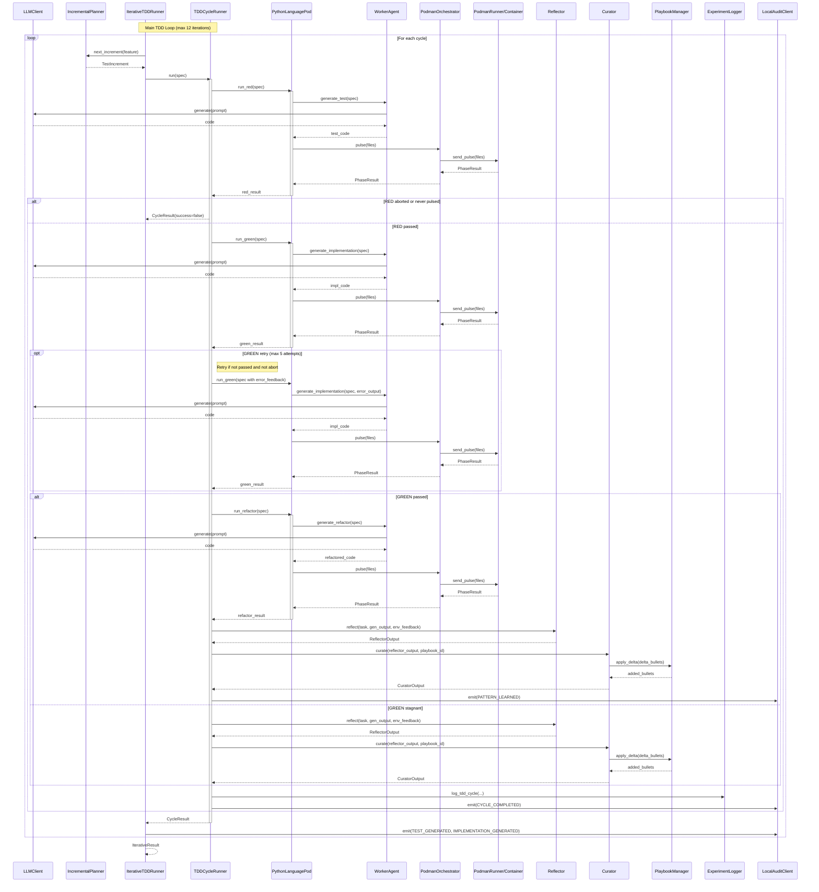

<!-- Generated by generate_live_docs.py on 2026-09-20 11:40 — do not edit by hand -->

# System Architecture

| Component | Module | Role |
|-----------|--------|------|
| IterativeTDDRunner | src/agents/iterative_tdd_runner.py | Orchestrates the full RED→GREEN→REFACTOR loop across multiple cycles |
| TDDCycleRunner | src/agents/tdd_cycle_runner.py | Runs one complete TDD cycle with GREEN retries and learning loop |
| PythonLanguagePod | src/agents/python_language_pod.py | Language-specific pod for Python TDD execution via WorkerAgent and PodmanOrchestrator |
| WorkerAgent | src/agents/worker_agent.py | Generates code for each TDD phase using LLM prompts and playbook context |
| IncrementalPlanner | src/agents/incremental_planner.py | Determines the next test increment to write in the TDD loop |
| PodmanOrchestrator | src/agents/podman_orchestrator.py | Stateless sidecar execution layer with security breach detection |
| PodmanRunner | src/agents/podman_runner.py | Production container runner backed by rootless Podman |
| PlaybookManager | src/playbook/manager.py | Manages playbook creation, updates, merging, and retrieval |
| ExperimentLogger | src/storage/experiment_logger.py | Unified logger for TDD and ML experiments with PostgreSQL/SQLite fallback |
| LLMClient | src/utils/llm_client.py | Unified LLM client supporting multiple providers (OpenRouter, OpenAI, etc.) |
| Reflector | src/core/reflector/module.py | Analyzes task outcomes and extracts learning insights |
| Curator | src/core/curator/module.py | Synthesizes reflector insights into actionable playbook updates |
| Generator | src/core/generator/module.py | Executes tasks using playbook-guided LLM generation |
| BulletRetriever | src/playbook/retrieval.py | Hybrid retrieval system for selecting relevant playbook bullets |
| ContextGraphRetriever | src/retrieval/cgr3_retriever.py | CGR³: Context Graph Retrieve-Rank-Reason pipeline |
| ContextScorer | src/retrieval/context_scorer.py | Scores bullets against request context across multiple dimensions |
| InstitutionalKnowledgeService | src/retrieval/service.py | Central knowledge retrieval service for all code generation activities |
| PerformanceAggregator | src/broker/performance_aggregator.py | Extracts performance metrics from audit trail |
| AdaptiveBroker | src/broker/adaptive_broker.py | Routes tasks to best agent based on historical performance |
| CapabilityRegistry | src/broker/capability_registry.py | Anonymous agent capability tracking |
| BrokerAdvisor | src/broker/advisor.py | Recommends agents by capability fit |
| AuditStore | src/audit/store.py | Append-only audit event store with hash chain integrity |
| LocalAuditClient | src/audit/local_client.py | Write-only audit client for development/testing |
| EnsembleBuildRunner | src/agents/ensemble_build.py | Drives multi-candidate blind build for one feature |
| PolyglotTDDRunner | src/agents/polyglot_tdd_runner.py | Orchestrates RED→GREEN→REFACTOR across multiple LanguagePods |
| ModuleArchitect | src/contracts/module_architect.py | Generates module-level contracts for stateful systems |
| ModuleTDDBuilder | src/contracts/module_tdd_builder.py | Builds module implementations using TDD methodology |
| ProjectArchitect | src/contracts/project_architect.py | Decomposes project spec into a module DAG |
| ProjectBuilder | src/cli/project_builder.py | Builds every module of a ProjectPlan in dependency order |
| CharacterizationTestGenerator | src/agents/characterization_test_generator.py | Writes empirically-verified pytest characterization tests |
| GherkinFeatureBridge | src/agents/gherkin_feature_bridge.py | Parses Gherkin .feature files into FeatureSpec |
| TestReviewAgent | src/agents/test_review_agent.py | Validates test quality before implementation |
| RedundancyPreChecker | src/agents/redundancy_checker.py | Detects redundant tests before writing them |
| TDDFailureRecorder | src/agents/tdd_failure_recorder.py | Records TDD failures and interventions for self-improvement |
| SuccessRateCalculator | src/analytics/success_rate_calculator.py | Measures experiment success rates across the system |
| TokenEfficiencyReporter | src/analytics/token_efficiency.py | Computes token efficiency scores from LanguagePod run data |

