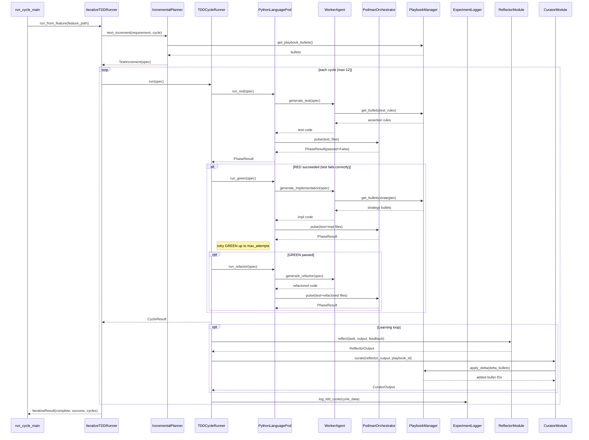

<!-- Generated by generate_live_docs.py on 2026-09-12 12:19 — do not edit by hand -->

# System Architecture

| Component | Module | Role |
|-----------|--------|------|
| IterativeTDDRunner | iterative_tdd_runner.py | Orchestrates the iterative RED→GREEN→REFACTOR loop across cycles |
| TDDCycleRunner | tdd_cycle_runner.py | Runs one complete RED→GREEN→REFACTOR cycle with retries and learning |
| IncrementalPlanner | incremental_planner.py | Determines the next test increment via LLM query |
| PodmanOrchestrator | podman_orchestrator.py | Stateless sidecar execution layer with security hash verification |
| PodmanRunner | podman_runner.py | Production ContainerRunner backed by rootless Podman |
| PythonLanguagePod | python_language_pod.py | LanguagePod implementation for Python TDD cycles |
| WorkerAgent | worker_agent.py | Generates code for RED/GREEN/REFACTOR phases using LLM prompts |
| LLMClient | llm_client.py | Unified LLM client supporting multiple providers (OpenRouter, Ollama, etc.) |
| PlaybookManager | playbook_manager.py | Core playbook CRUD, delta updates, semantic deduplication, persistence |
| ExperimentLogger | experiment_logger.py | Unified logger for TDD/ML experiments with PostgreSQL + SQLite fallback |
| Reflector | reflector/module.py | Analyzes generator performance and extracts learning insights |
| Curator | curator/module.py | Synthesizes insights into playbook bullet updates |
| Generator | generator/module.py | Executes tasks using playbook-guided LLM generation |
| BulletRetriever | retrieval.py | Hybrid retrieval engine for selecting relevant playbook bullets |
| ConsensusBuilder | consensus/consensus.py | Builds consensus from multiple model proposals |
| EnsembleLearner | learner.py | Orchestrates multiple models learning in parallel with voting |
| VotingSystem | voting.py | Applies voting strategies to ensemble bullet proposals |
| ImportFilter | import_filter.py | Static analysis of generated code for forbidden imports |
| GherkinFeatureBridge | gherkin_feature_bridge.py | Parses .feature files into FeatureSpec for Gherkin-driven mode |
| RedundancyPreChecker | redundancy_checker.py | Pre-checks proposed tests for redundancy before RED phase |
| PlaybookQA | qa.py | Answers coding questions using playbook knowledge |
| ContextGraphRetriever | cgr3_retriever.py | CGR³ pipeline: context-aware retrieval, ranking, and reasoning |
| ContextScorer | context_scorer.py | Scores bullets against request context across multiple dimensions |
| AdaptiveBroker | adaptive_broker.py | Routes tasks to best agent based on historical performance |
| PerformanceAggregator | performance_aggregator.py | Extracts performance metrics from audit trail |
| ModelAttributionTracker | model_attribution.py | Tracks OpenRouter model attribution in performance metrics |
| SuccessRateCalculator | success_rate_calculator.py | Measures experiment success rates across the system |
| TokenEfficiencyReporter | token_efficiency.py | Computes token efficiency scores from LanguagePod run data |
| CostQualityAnalyzer | cost_quality_analyzer.py | Analyzes cost-quality tradeoffs for model performance data |
| SimulationOracle | simulation_oracle.py | Physics-simulation test oracle inside a container |
| SimulationPod | simulation_pod.py | LanguagePod for PyBullet-backed TDD cycles |
| AuditStore | audit/store.py | Append-only audit store with hash chain integrity |
| LocalAuditClient | audit/local_client.py | Write-only audit client for local SQLite database |

