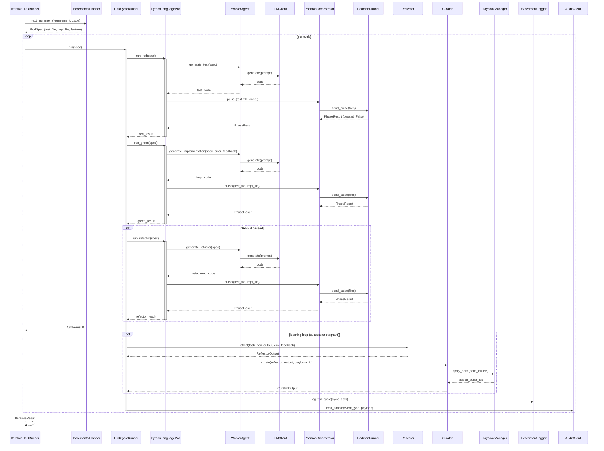

<!-- Generated by generate_live_docs.py on 2026-09-12 10:22 — do not edit by hand -->

# System Architecture

| Component | Module | Role |
|-----------|--------|------|
| src.agents.iterative_tdd_runner | IterativeTDDRunner | Orchestrates the RED→GREEN→REFACTOR loop across multiple cycles |
| src.agents.tdd_cycle_runner | TDDCycleRunner | Executes one complete TDD cycle with GREEN retries and learning |
| src.agents.python_language_pod | PythonLanguagePod | Language-specific pod for Python TDD cycles |
| src.agents.worker_agent | WorkerAgent | Generates code for RED, GREEN, and REFACTOR phases |
| src.utils.llm_client | LLMClient | Unified interface for LLM providers (OpenRouter, OpenAI, etc.) |
| src.agents.podman_orchestrator | PodmanOrchestrator | Stateless sidecar for containerised test execution |
| src.agents.podman_runner | PodmanRunner | Rootless Podman container lifecycle and pulse execution |
| src.agents.incremental_planner | IncrementalPlanner | Determines the next test increment via LLM |
| src.playbook.manager | PlaybookManager | Core playbook CRUD, delta updates, and persistence |
| src.storage.experiment_logger | ExperimentLogger | Logs TDD cycles and ML experiments to PostgreSQL/SQLite |
| src.core.reflector.module | Reflector | Analyzes task outcomes and extracts learning insights |
| src.core.curator.module | Curator | Synthesizes reflector insights into playbook bullets |
| src.core.generator.module | Generator | Executes tasks using playbook-guided LLM generation |
| src.playbook.retrieval | BulletRetriever | Hybrid retrieval (semantic + keyword) for relevant bullets |
| src.retrieval.context_scorer | ContextScorer | Scores bullets against request context (temporal, team, tech stack) |
| src.retrieval.cgr3_retriever | ContextGraphRetriever | CGR³ pipeline: retrieve, rank, reason with context |
| src.retrieval.service | InstitutionalKnowledgeService | Central knowledge retrieval for all code generation |
| src.broker.adaptive_broker | AdaptiveBroker | Routes tasks to best agent based on historical performance |
| src.broker.performance_aggregator | PerformanceAggregator | Aggregates performance metrics from audit trail |
| src.benchmark.model_attribution | ModelAttributionTracker | Tracks OpenRouter model attribution in performance metrics |
| src.analytics.success_rate_calculator | SuccessRateCalculator | Measures experiment success rates across the system |
| src.analytics.token_efficiency | TokenEfficiencyReporter | Computes token efficiency scores from LanguagePod run data |
| src.analytics.cost_quality_analyzer | CostQualityAnalyzer | Analyzes cost-quality tradeoffs for model performance |
| src.benchmark.production_analyzer | ProductionDataAnalyzer | Analyzes quality data from experiment_logs |
| src.broker.regression_detector | RegressionDetector | Detects quality regressions across model versions |
| src.broker.feedback | FeedbackCollector | Stores human ratings and derives blended/drift scores |
| src.broker.human_decision | HumanDecisionInterface | Interface for human decision-making in agent selection |
| src.broker.advisor | BrokerAdvisor | Recommends agents by capability fit |
| src.broker.capability_registry | CapabilityRegistry | Anonymous agent capability tracking |
| src.ensemble.learner | EnsembleLearner | Orchestrates multiple models learning in parallel |
| src.ensemble.consensus | ConsensusBuilder | Builds consensus from multiple model proposals |
| src.ensemble.voting | VotingSystem | Applies voting strategies to ensemble bullets |
| src.playbook.distillation_router | DistillationRouter | Routes tasks to domain-specific distillation playbooks |
| src.reliability.playbook_analyzer | PlaybookReliabilityAnalyzer | Correlates bullet retrieval with first-pass GREEN success |
| src.reliability.tdd_cycle_analyzer | TDDCycleAnalyzer | Measures first-pass GREEN rate and trend over time |
| src.contracts.contract_architect | ContractArchitect | Generates contracts from natural language requirements |
| src.contracts.module_architect | ModuleArchitect | Generates module-level contracts for stateful systems |
| src.contracts.module_tdd_builder | ModuleTDDBuilder | Builds module implementations using TDD methodology |
| src.contracts.project_architect | ProjectArchitect | Decomposes project spec into module DAG |
| src.cli.project_builder | ProjectBuilder | Drives ModuleArchitect + ModuleTDDBuilder over a ProjectPlan |
| src.agents.characterization_test_generator | CharacterizationTestGenerator | Drafts, verifies, and repairs pytest characterization suites |
| src.agents.ensemble_build | EnsembleBuildRunner | Drives multi-candidate blind build for one feature |
| src.agents.gherkin_extraction_agent | GherkinExtractionAgent | Reverse engineers Gherkin scenarios from existing code |
| src.agents.gherkin_feature_bridge | GherkinFeatureBridge | Parses .feature files into FeatureSpec |
| src.agents.test_review_agent | TestReviewAgent | Validates test quality before implementation |
| src.agents.redundancy_checker | RedundancyPreChecker | Detects redundant tests before writing them |
| src.agents.tdd_failure_recorder | TDDFailureRecorder | Records TDD failures and interventions for self-improvement |
| src.agents.tdd_lesson_injector | TDDLessonInjector | Injects TDD lessons into agent prompts |
| src.agents.tdd_lessons | LessonExtractor | Extracts TDD lessons from resolved beads issues |
| src.agents.project_aware_tdd | CodeReuseDetector | Detects opportunities for code reuse in the project |
| src.project.detector | ProjectDetector | Detects and analyzes Python project structure |
| src.playbook.qa | PlaybookQA | Answers coding questions using playbook knowledge |
| src.playbook.markdown_importer | MarkdownImporter | Imports knowledge from markdown files into playbooks |
| src.playbook.postgres_adapter | PostgresPlaybookAdapter | PostgreSQL-backed playbook manager |
| src.playbook.postgres_retriever | PostgresBulletRetriever | PostgreSQL-backed retrieval using pgvector |
| src.playbook.clustering | BulletClusterer | DBSCAN clustering for playbook bullets |
| src.playbook.deduplication | BulletDeduplicator | Semantic deduplication using embedding similarity |
| src.agents.import_filter | ImportFilter | Checks code for forbidden imports and builtins |
| src.utils.import_validator | ImportValidator | Validates and corrects import paths in generated code |
| src.utils.context_map | ContextMapBuilder | Builds AST context map from source files |
| src.utils.embedding | EmbeddingService | Local embedding generation using sentence-transformers |
| src.utils.claude_cli_client | ClaudeCliClient | LLM client backed by local 'claude -p' CLI |
| src.utils.effgen_client | EffGenClient | LLM client adapter for effGen local models |
| src.agents.simulation_oracle | SimulationOracle | Physics-simulation test oracle for SimulationPod |
| src.agents.simulation_pod | SimulationPod | LanguagePod for PyBullet-backed TDD cycles |
| src.agents.simulation_podman_runner | SimulationPodmanRunner | PodmanRunner for simulation harness image |
| src.agents.simulation_scenario | SimulationScenario | Pluggable physical-world contract for simulation |
| src.agents.go_language_pod | GoLanguagePod | LanguagePod for Go TDD cycles |
| src.agents.typescript_language_pod | TypeScriptLanguagePod | LanguagePod for TypeScript TDD cycles |
| src.agents.go_runner | GoRunner | PodmanRunner for Go harness image |
| src.agents.typescript_runner | TypeScriptRunner | PodmanRunner for TypeScript harness image |
| src.agents.go_step_generator | GoStepGenerator | Generates Go step definitions from Gherkin |
| src.agents.polyglot_tdd_runner | PolyglotTDDRunner | Orchestrates TDD across multiple LanguagePods |
| src.agents.polyglot_pod_builder | PodFactory | Creates LanguagePod instances for a given language |
| src.audit.client | AuditClient | Write-only audit client for ACE agents |
| src.audit.local_client | LocalAuditClient | Audit client writing directly to local SQLite |
| src.audit.store | AuditStore | Append-only audit store with hash chain integrity |
| src.audit.dashboard | AuditDashboard | Dashboard for analyzing audit data |
| src.audit.checkpoint | AuditCheckpoint | External anchoring for audit hash chain |
| src.utils.file_lock | DriftDetector | Detects inadvertent drift in locked files |
| src.utils.file_lock | FileLockContext | Context manager for file drift detection |
| src.utils.session_log | SessionLog | Tracks edits and tests in current session |
| src.utils.playbook_enforcer | PlaybookEnforcer | Enforces high-frequency feedback rules |
| src.project.config | ACEConfig | ACE configuration schema for .ace/config.yml |
| src.project.config | ProjectConfig | Manages project configuration loading/saving |
| src.project.decision_record | DecisionRecord | Generates Architectural Decision Records |
| src.ml.experiment_knowledge | MLExperimentKnowledge | Knowledge base for ML experiments |
| src.ml.mlflow_callback | ACEMLflowCallback | Captures ACE knowledge during MLflow experiments |
| src.ml.postgres_mlflow_callback | PostgresACEMLflowCallback | PostgreSQL-backed MLflow callback |
| src.ml.query_interface | MLflowKnowledgeQuery | Unified query interface for MLflow + ACE knowledge |
| src.config.settings | Settings | Application settings loaded from .env |
| src.contracts.contract_driven | ContractValidator | Validates implementations against contracts |
| src.contracts.contract_driven | ContractOrchestrator | Orchestrates contract-driven development |
| src.contracts.contract_decomposer | ContractDecomposer | Breaks user specs into interface contracts |
| src.benchmark.blind_evaluation | BlindEvaluator | Scores outputs without knowing which agent produced them |
| src.benchmark.rubrics.code | CodeGenerationRubric | Evaluates Python code output quality |
| src.benchmark.rubrics.analysis | AnalysisRubric | Evaluates analytical/research output |
| src.benchmark.rubrics.docs | DocumentationRubric | Evaluates Markdown documentation output |
| src.benchmark.rubrics.tests | TestWritingRubric | Evaluates test suite output |
| src.benchmark.semantic_analyzer | SemanticCodeAnalyzer | Analyzes code for security patterns |
| src.broker.model_router | ModelRouter | Live entry point for AdaptiveBroker routing |
| src.broker.calibration | Calibration | Cold-start model calibration for routing |

