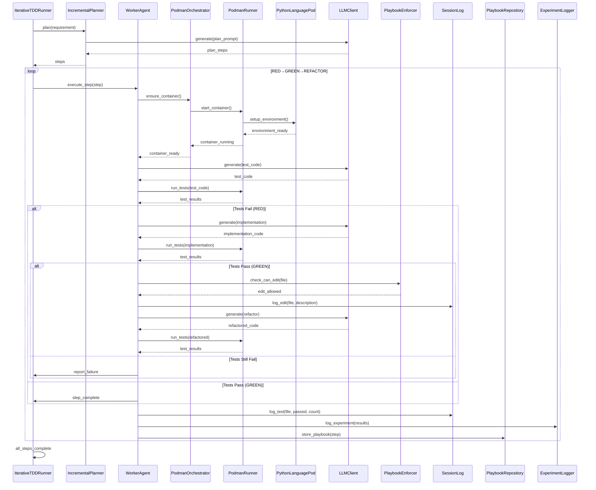

<!-- Generated by generate_live_docs.py on 2026-08-09 10:02 — do not edit by hand -->

# System Architecture

| Component | Module | Role |
|-----------|--------|------|
| IterativeTDDRunner | src.agents.iterative_tdd_runner | Drives the RED→GREEN→REFACTOR loop |
| IncrementalPlanner | src.agents.incremental_planner | Plans incremental steps for TDD |
| PodmanOrchestrator | src.agents.podman_orchestrator | Orchestrates Podman container lifecycle |
| PodmanRunner | src.agents.podman_runner | Runs commands inside Podman containers |
| PythonLanguagePod | src.agents.python_language_pod | Manages Python-specific container setup |
| WorkerAgent | src.agents.worker_agent | Executes test and implementation tasks |
| PlaybookManager | src.playbook.manager | Manages playbook rules and enforcement |
| ExperimentLogger | src.storage.experiment_logger | Logs experiment data and results |
| ModelAttributionTracker | src.storage.model_attribution_tracker | Tracks model attribution in performance metrics |
| ProductionDataAnalyzer | src.storage.production_data_analyzer | Analyzes quality data from experiment logs |
| PlaybookRepository | src.storage.playbook_repository | Persists playbooks and bullets with pgvector |
| EffGenClient | src.utils.effgen_client | Adapter for effGen local LLM models |
| EmbeddingService | src.utils.embedding_service | Generates embeddings using sentence-transformers |
| FileLockContext | src.utils.file_lock_context | Manages file locking for concurrent access |
| DriftDetector | src.utils.drift_detector | Detects drift in project files |
| ImportValidator | src.utils.import_validator | Validates and corrects import paths |
| LLMClient | src.utils.llm_client | Unified LLM client supporting multiple providers |
| PlaybookEnforcer | src.utils.playbook_enforcer | Enforces high-frequency feedback rules |
| SessionLog | src.utils.session_log | Tracks edits and tests in current session |

