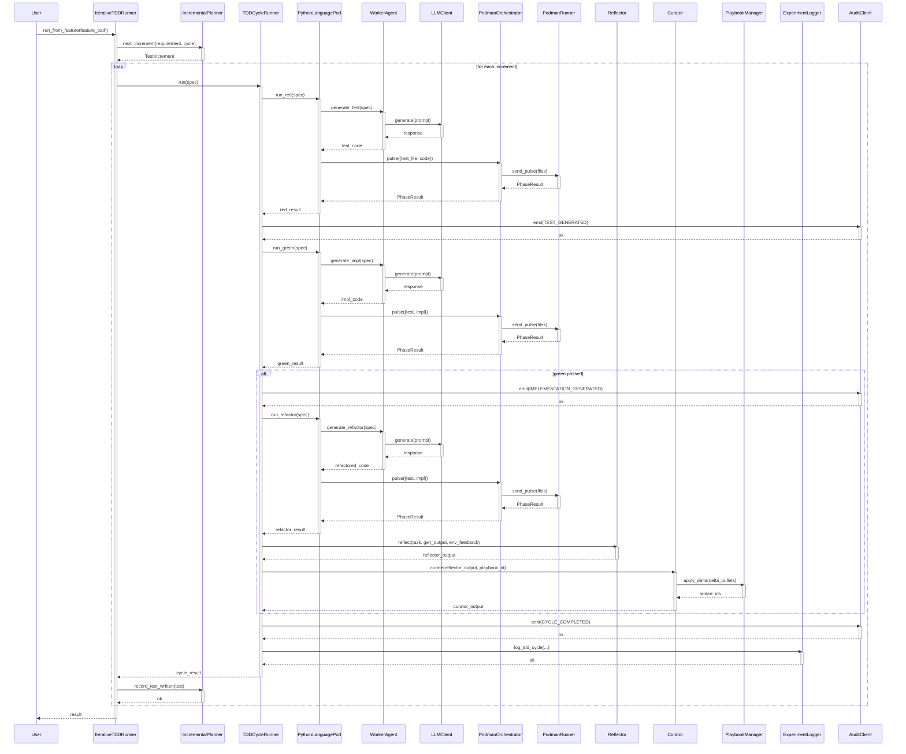

<!-- Generated by generate_live_docs.py on 2026-09-01 21:06 — do not edit by hand -->

# System Architecture

| Component | Module | Role |
|-----------|--------|------|
| IterativeTDDRunner | iterative_tdd_runner | Orchestrates the iterative RED→GREEN→REFACTOR loop across multiple cycles |
| TDDCycleRunner | tdd_cycle_runner | Executes one complete TDD cycle with retry logic, learning loop, and audit trail |
| PythonLanguagePod | python_language_pod | LanguagePod implementation for Python; delegates code generation to WorkerAgent and execution to PodmanOrchestrator |
| WorkerAgent | worker_agent | Generates test, implementation, and refactor code via LLM prompts |
| PlaybookManager | playbook.manager | Manages playbook CRUD, delta updates, deduplication, token budgets, and persistence |
| ExperimentLogger | storage.experiment_logger | Logs TDD cycles and ML experiments to PostgreSQL with SQLite fallback |
| Reflector | core.reflector.module | Analyzes task execution outcomes and extracts error patterns, root causes, and insights |
| Curator | core.curator.module | Synthesizes reflector insights into playbook bullets and applies them |
| Generator | core.generator.module | Executes tasks using playbook-guided LLM with bullet retrieval and context |
| IncrementalPlanner | agents.incremental_planner | Determines the next test increment by consulting the LLM and existing test context |
| PodmanOrchestrator | agents.podman_orchestrator | Stateless sidecar execution layer; validates code integrity via canonical hashing |
| PodmanRunner | agents.podman_runner | Rootless Podman container runner for isolated test execution |
| LLMClient | utils.llm_client | Unified LLM client supporting multiple providers (OpenRouter, Ollama, OpenAI, etc.) |
| ImportFilter | agents.import_filter | Validates generated code against forbidden imports and builtins |
| RedundancyPreChecker | agents.redundancy_checker | Pre-checks proposed tests for redundancy before the RED phase |
| GherkinFeatureBridge | agents.gherkin_feature_bridge | Parses Gherkin .feature files into structured FeatureSpec objects |
| EnsembleBuildRunner | agents.ensemble_build | Drives multi-candidate blind build across models with consensus analysis |
| ConsensusBuilder | ensemble.consensus | Clusters similar bullet proposals and builds consensus from multiple models |
| BulletRetriever | playbook.retrieval | Hybrid retrieval engine (keyword + embedding) for selecting relevant bullets |
| BulletDeduplicator | playbook.deduplication | Semantic deduplication of bullets using embedding similarity |
| BulletClusterer | playbook.clustering | DBSCAN clustering of playbook bullets for knowledge distillation |
| DistillationRouter | playbook.distillation_router | Routes tasks to domain-specific distillation playbooks with provenance filtering |
| InstitutionalKnowledgeService | retrieval.service | Central knowledge retrieval service for code generation guidance |
| ContextScorer | retrieval.context_scorer | Scores bullets against request context across temporal, team, tech, and domain dimensions |
| PerformanceAggregator | broker.performance_aggregator | Extracts agent performance metrics from audit trail for routing decisions |
| AdaptiveBroker | broker.adaptive_broker | Routes tasks to the best agent based on historical performance and cost-awareness |
| BrokerAdvisor | broker.advisor | Recommends agents by capability fit analysis |
| CapabilityRegistry | broker.capability_registry | Tracks anonymous agent capabilities and proficiency ratings |
| AuditStore | audit.store | Append-only audit event store with hash chain integrity verification |
| LocalAuditClient | audit.local_client | Audit client writing directly to local SQLite database |
| TDDFailureRecorder | agents.tdd_failure_recorder | Records TDD failures and interventions for self-improvement |
| TestReviewAgent | agents.test_review_agent | Reviews test quality before implementation using static analysis and optional LLM |
| GherkinExtractionAgent | agents.gherkin_extraction_agent | Reverse-engineers Gherkin scenarios from existing code and tests |
| CodeAnalyzer | agents.gherkin_extraction_agent | Analyzes Python code structure for Gherkin extraction |
| TestAnalyzer | agents.gherkin_extraction_agent | Analyzes test code to extract scenarios and assertions |

