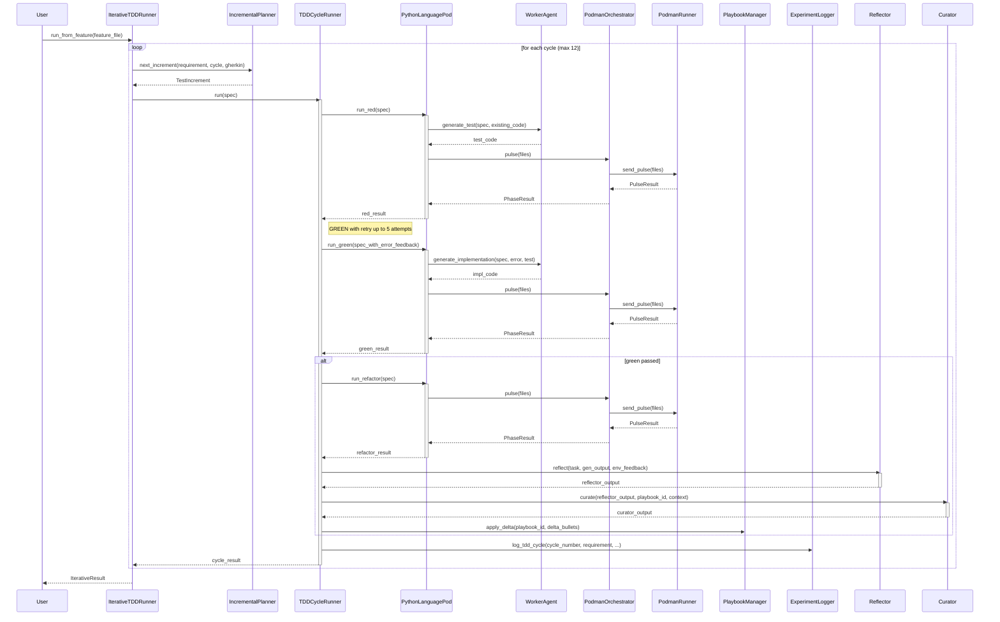

<!-- Generated by generate_live_docs.py on 2026-08-09 11:07 — do not edit by hand -->

# System Architecture

| Component | Module | Role |
|-----------|--------|------|
| IncrementalPlanner | src.agents.incremental_planner | Decides next test to write in TDD loop |
| IterativeTDDRunner | src.agents.iterative_tdd_runner | Orchestrates planner-driven RED→GREEN→REFACTOR loop |
| TDDCycleRunner | src.agents.tdd_cycle_runner | Runs one full TDD cycle with GREEN retries |
| PythonLanguagePod | src.agents.python_language_pod | Language-specific TDD pod for Python code |
| WorkerAgent | src.agents.worker_agent | Generates code using LLM with playbook context |
| LLMClient | src.utils.llm_client | Unified client for multiple LLM providers |
| PodmanOrchestrator | src.agents.podman_orchestrator | Stateless container execution layer |
| PodmanRunner | src.agents.podman_runner | Manages Podman container lifecycle |
| PlaybookManager | src.playbook.manager | Core playbook CRUD with dedup and token budget |
| ExperimentLogger | src.storage.experiment_logger | Persists experiment results to DB (PostgreSQL/SQLite) |
| Reflector | src.core.reflector.module | Analyzes execution and extracts insights |
| Curator | src.core.curator.module | Synthesizes insights into playbook bullets |
| Generator | src.core.generator.module | Executes tasks using retrieved playbook context |
| GherkinFeatureBridge | src.agents.gherkin_feature_bridge | Parses .feature files into structured specs |
| AutonomousTDDAgent | src.agents.autonomous_tdd_agent | Full-featured incremental TDD agent |
| TestReviewAgent | src.agents.test_review_agent | Validates test quality before implementation |
| RedundancyPreChecker | src.agents.redundancy_checker | Detects redundant tests before writing |
| TDDFailureRecorder | src.agents.tdd_failure_recorder | Records failures and creates self-healing entries |
| EnsembleLearner | src.ensemble.learner | Orchestrates multi-model parallel learning |
| ConsensusBuilder | src.ensemble.consensus | Clusters and merges bullet proposals |
| VotingSystem | src.ensemble.voting | Applies voting strategies to approve bullets |
| BulletRetriever | src.playbook.retrieval | Hybrid retrieval (embedding + keyword) for bullets |
| ContextGraphRetriever | src.retrieval.cgr3_retriever | Context-aware retrieve-rank-reason pipeline |
| InstitutionalKnowledgeService | src.retrieval.service | Central guidance service for code generation |
| DistillationRouter | src.playbook.distillation_router | Routes tasks to domain-specific distillation playbooks |
| BulletClusterer | src.playbook.clustering | DBSCAN clustering of playbook bullets |
| BulletDeduplicator | src.playbook.deduplication | Semantic deduplication using embedding similarity |
| AdaptiveBroker | src.broker.adaptive_broker | Routes tasks to best-performing agents |
| PerformanceAggregator | src.broker.performance_aggregator | Aggregates agent metrics from audit trail |
| CapabilityRegistry | src.broker.capability_registry | Tracks anonymous agent capabilities |
| SuccessRateCalculator | src.analytics.success_rate_calculator | Measures experiment success rates |
| TokenEfficiencyReporter | src.analytics.token_efficiency | Computes token efficiency across language pods |
| ProductionDataAnalyzer | src.benchmark.production_analyzer | Extracts model performance from logs |
| AuditStore | src.audit.store | Append-only audit store with hash chain |

