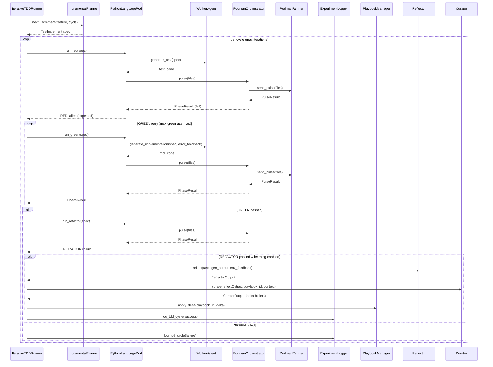

<!-- Generated by generate_live_docs.py on 2026-06-20 20:07 — do not edit by hand -->

# System Architecture

| Component | Module | Role |
|-----------|--------|------|
| Orchestration | IterativeTDDRunner | Drives RED→GREEN→REFACTOR loop until planner signals completion |
| Orchestration | TDDCycleRunner | Executes one complete TDD cycle with GREEN retries and optional reflection |
| Orchestration | IncrementalPlanner | Determines next test increment via LLM, tracks written tests |
| Orchestration | GherkinFeatureBridge | Parses `.feature` files into structured FeatureSpec |
| Orchestration | AutonomousTDDAgent | Full autonomous agent that builds features incrementally with TDD |
| Orchestration | PolyglotTDDRunner | Drives TDD loops across multiple language pods and compares results |
| Execution | PythonLanguagePod | LanguagePod for Python: delegates code generation to WorkerAgent, execution to PodmanOrchestrator |
| Execution | WorkerAgent | Generates test/implementation/refactor code from PodSpec and playbook context |
| Execution | PodmanOrchestrator | Stateless sidecar that sends workspace pulses to container and checks security |
| Execution | PodmanRunner | Rootless Podman container lifecycle and `send_pulse` execution |
| Execution | TypeScriptLanguagePod | LanguagePod for TypeScript TDD via vitest in Podman |
| Execution | TypeScriptWorkerAgent | TypeScript code generation for RED/GREEN/REFACTOR |
| Execution | GoLanguagePod | LanguagePod for Go TDD cycles |
| Execution | ImportFilter | Checks generated code for forbidden imports and builtin calls |
| Playbook | PlaybookManager | CRUD for playbook bullets, delta updates, redundancy checks, persistence |
| Playbook | BulletRetriever | Hybrid (embedding + keyword) retrieval of relevant bullets |
| Playbook | DistillationRouter | Routes tasks to domain-specific playbook contexts for prompt-level distillation |
| Learning | Reflector | Analyzes execution outcomes, extracts error patterns and insights |
| Learning | Curator | Synthesizes reflector insights into delta bullets and applies to playbook |
| Learning | Generator | Executes tasks using retrieved playbook bullets as context |
| Learning | EnsembleLearner | Orchestrates multi-model parallel learning with voting and deliberation |
| Storage | ExperimentLogger | Logs TDD/ML experiments to PostgreSQL with SQLite fallback |
| Storage | AuditClient | Write-only client for emitting audit events |
| Storage | AuditStore | Append-only log with hash-chain integrity |
| Infrastructure | LLMClient | Unified interface to multiple LLM providers (OpenRouter, OpenAI, etc.) |
| Infrastructure | ContextMapBuilder | Builds AST context maps from source files for test relevance |
| Analytics | SuccessRateCalculator | Measures experiment success rates by type, version, and time |
| Analytics | TokenEfficiencyReporter | Aggregates token usage across language pods and computes efficiency scores |
| Analytics | PlaybookReliabilityAnalyzer | Correlates bullet retrieval with first-pass GREEN success |
| Reliability | TDDCycleAnalyzer | Measures first-pass GREEN trend over time |
| Broker | AdaptiveBroker | Routes tasks to best agent based on learned performance metrics |

