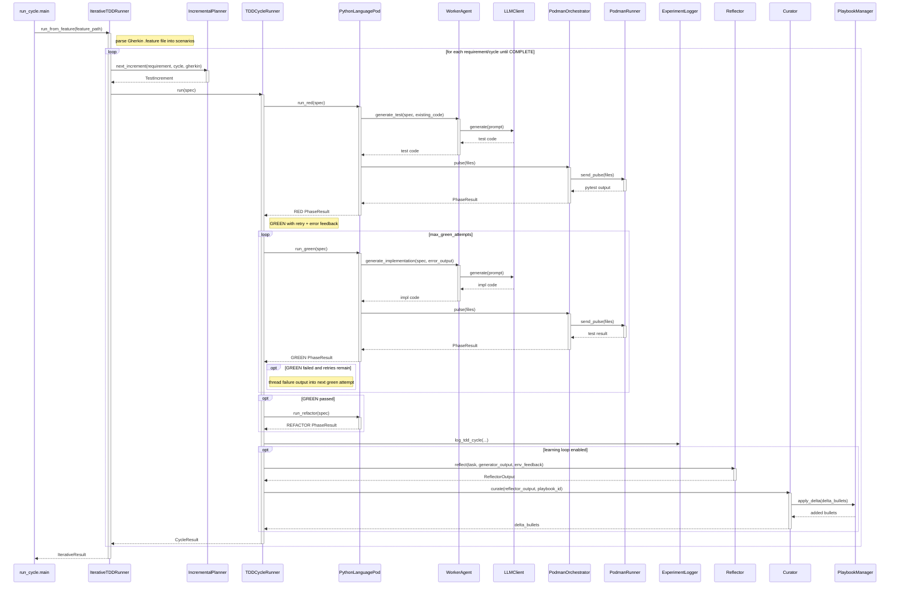

<!-- Generated by generate_live_docs.py on 2026-09-22 11:15 — do not edit by hand -->

# System Architecture

| Component | Module | Role |
|-----------|--------|------|
| run_cycle.main | run_cycle.py | Entry-point orchestrator wiring LLM, playbook, pod, and container for an end-to-end TDD run |
| IterativeTDDRunner | src/agents/iterative_tdd_runner.py | Kent Beck-style plan→RED→GREEN→REFACTOR loop; drives cycles until planner says COMPLETE |
| IncrementalPlanner | src/agents/incremental_planner.py | Asks the LLM for the next single test increment given current test/impl context |
| TDDCycleRunner | src/agents/tdd_cycle_runner.py | Orchestrates one RED→GREEN(→retry)→REFACTOR cycle; aborts on security/policy failures; runs learning loop |
| PythonLanguagePod | src/agents/python_language_pod.py | LanguagePod for Python: atomic file writes, sibling-file pulses, patch-mode GREEN with escalation fallback |
| WorkerAgent | src/agents/worker_agent.py | LLM code generation for each phase; builds prompts, extracts code, retrieves playbook bullets |
| PodmanOrchestrator | src/agents/podman_orchestrator.py | Stateless sidecar execution layer; canonical-hash pulse verification and SecurityBreach detection |
| PodmanRunner | src/agents/podman_runner.py | Rootless Podman container runner; executes pytest pulses, parses bandit output, hashes workspace |
| PlaybookManager | src/playbook/manager.py | Playbook CRUD, delta application, dedup, token budget, content-safety screening, JSON persistence |
| Curator | src/core/curator/module.py | Synthesizes reflector insights into delta bullets and applies updates to the playbook |
| Reflector | src/core/reflector/module.py | Analyzes task outcomes, extracts root causes/insights; iterative refinement and quality scoring |
| Generator | src/core/generator/module.py | Task execution using playbook-guided LLM with bullet retrieval and feedback tracking |
| ExperimentLogger | src/storage/experiment_logger.py | Persists TDD/ML experiments to PostgreSQL (SQLite fallback) |
| LLMClient | src/utils/llm_client.py | Unified LLM interface across providers (OpenRouter, Anthropic, DeepSeek, TogetherAI, etc.) |
| PodFactory | src/agents/polyglot_tdd_runner.py | Creates LanguagePod instances for a given language identifier |
| PolyglotTDDRunner | src/agents/polyglot_tdd_runner.py | Drives RED→GREEN→REFACTOR across multiple LanguagePods and reports token efficiency |
| GherkinFeatureBridge | src/agents/gherkin_feature_bridge.py | Parses .feature files into FeatureSpec/ScenarioSpec for Gherkin-driven runs |
| ImportFilter | src/agents/import_filter.py | Static blocking of forbidden imports/builtins before code reaches the sandbox |
| TokenEfficiencyReporter | src/analytics/token_efficiency.py | Aggregates LanguagePod run data into per-language/cross-language token efficiency scores |
| SuccessRateCalculator | src/analytics/success_rate_calculator.py | Measures system success rates across experiment types, versions, and time windows |
| AdaptiveBroker | src/broker/adaptive_broker.py | Routes tasks to best agent based on historical performance and budget/pareto modes |
| PerformanceAggregator | src/broker/performance_aggregator.py | Extracts and aggregates per-agent performance metrics from the audit trail |
| BulletRetriever | src/playbook/retrieval.py | Hybrid keyword+embedding retrieval of relevant playbook bullets |
| InstitutionalKnowledgeService | src/retrieval/service.py | Central CGR³ knowledge retrieval service for code generation guidance |
| TestReviewAgent | src/agents/test_review_agent.py | Validates test quality (structure, naming, assertions, edge cases) before implementation |
| ModuleArchitect | src/contracts/module_architect.py | Generates module-level contracts for stateful systems with integration tests |
| ModuleTDDBuilder | src/contracts/module_tdd_builder.py | Builds module implementations function-by-function via TDD with repair loop |
| ProjectArchitect | src/contracts/project_architect.py | Decomposes a project spec into an ordered module dependency DAG |
| ProjectBuilder | src/cli/project_builder.py | Drives ModuleArchitect + ModuleTDDBuilder over a ProjectPlan in dependency order |
| EnsembleBuildRunner | src/agents/ensemble_build.py | Multi-candidate blind build, consensus analysis, winner selection, and commit |
| EnsembleLearner | src/ensemble/learner.py | Parallel multi-model learning with voting/deliberation and playbook updates |
| AuditStore | src/audit/store.py | Append-only audit event store with SHA-256 hash-chain integrity |
| AuditDashboard | src/audit/dashboard.py | Analyzes audit events into agent performance, cost rankings, and team suggestions |
| PlaybookReliabilityAnalyzer | src/reliability/playbook_analyzer.py | Correlates bullet retrieval with first-pass GREEN outcomes (causal uplift) |

