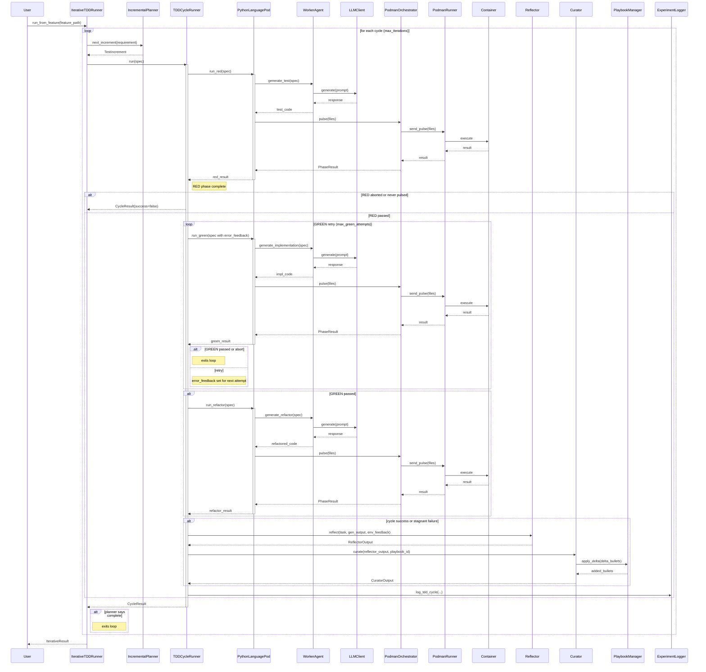

<!-- Generated by generate_live_docs.py on 2026-09-18 17:07 — do not edit by hand -->

# System Architecture

| Component | Module | Role |
|-----------|--------|------|
| IterativeTDDRunner | src/agents/iterative_tdd_runner.py | Orchestrates the RED→GREEN→REFACTOR loop across multiple cycles |
| TDDCycleRunner | src/agents/tdd_cycle_runner.py | Runs one complete TDD cycle with GREEN retries and learning |
| PythonLanguagePod | src/agents/python_language_pod.py | LanguagePod implementation for Python TDD cycles |
| WorkerAgent | src/agents/worker_agent.py | Generates code for each TDD phase (test, implementation, refactor) |
| IncrementalPlanner | src/agents/incremental_planner.py | Determines the next test increment to write |
| PodmanOrchestrator | src/agents/podman_orchestrator.py | Stateless sidecar execution layer for containerised harness |
| PodmanRunner | src/agents/podman_runner.py | ContainerRunner backed by rootless Podman |
| PlaybookManager | src/playbook/manager.py | Manages playbook creation, updates, merging, and retrieval |
| ExperimentLogger | src/storage/experiment_logger.py | Logs TDD and ML experiments to PostgreSQL or SQLite |
| LLMClient | src/utils/llm_client.py | Unified LLM client supporting multiple providers |
| Reflector | src/core/reflector/module.py | Analyzes task outcomes and extracts learning insights |
| Curator | src/core/curator/module.py | Synthesizes insights into playbook updates |
| Generator | src/core/generator/module.py | Executes tasks using playbook-guided LLM |
| BulletRetriever | src/playbook/retrieval.py | Hybrid retrieval system for selecting relevant bullets |
| BulletDeduplicator | src/playbook/deduplication.py | Handles semantic deduplication of bullets |
| BulletClusterer | src/playbook/clustering.py | DBSCAN-based clustering for playbook bullets |
| ContextGraphRetriever | src/retrieval/cgr3_retriever.py | CGR³: Context Graph Retrieve-Rank-Reason |
| ContextScorer | src/retrieval/context_scorer.py | Scores bullets against request context across multiple dimensions |
| InstitutionalKnowledgeService | src/retrieval/service.py | Central knowledge retrieval service for code generation |
| DistillationRouter | src/playbook/distillation_router.py | Routes tasks to domain-specific distillation playbooks |
| DomainRegistry | src/playbook/distillation_router.py | Registry of available domains and their playbook signatures |
| PerformanceAggregator | src/broker/performance_aggregator.py | Extracts metrics from audit trail |
| AdaptiveBroker | src/broker/adaptive_broker.py | Routes tasks based on learned performance |
| BrokerAdvisor | src/broker/advisor.py | Recommends agents by capability fit |
| CapabilityRegistry | src/broker/capability_registry.py | Anonymous agent capability tracking |
| ModelAttributionTracker | src/benchmark/model_attribution.py | Tracks OpenRouter model attribution in performance metrics |
| ProductionDataAnalyzer | src/benchmark/production_analyzer.py | Analyzes quality data from experiment logs |
| SuccessRateCalculator | src/analytics/success_rate_calculator.py | Measures experiment success rates across the system |
| TokenEfficiencyReporter | src/analytics/token_efficiency.py | Computes token efficiency scores from LanguagePod run data |
| CostQualityAnalyzer | src/analytics/cost_quality_analyzer.py | Analyzes cost-quality tradeoffs for model performance data |
| BlindEvaluator | src/benchmark/blind_evaluation.py | Scores outputs without knowing which agent produced them |
| EnsembleBuildRunner | src/agents/ensemble_build.py | Drives multi-candidate blind build for one feature |
| EnsembleLearner | src/ensemble/learner.py | Orchestrates multiple models learning in parallel |
| VotingSystem | src/ensemble/voting.py | Applies voting strategies to ensemble bullets |
| ConsensusBuilder | src/ensemble/consensus.py | Builds consensus from multiple model proposals |

