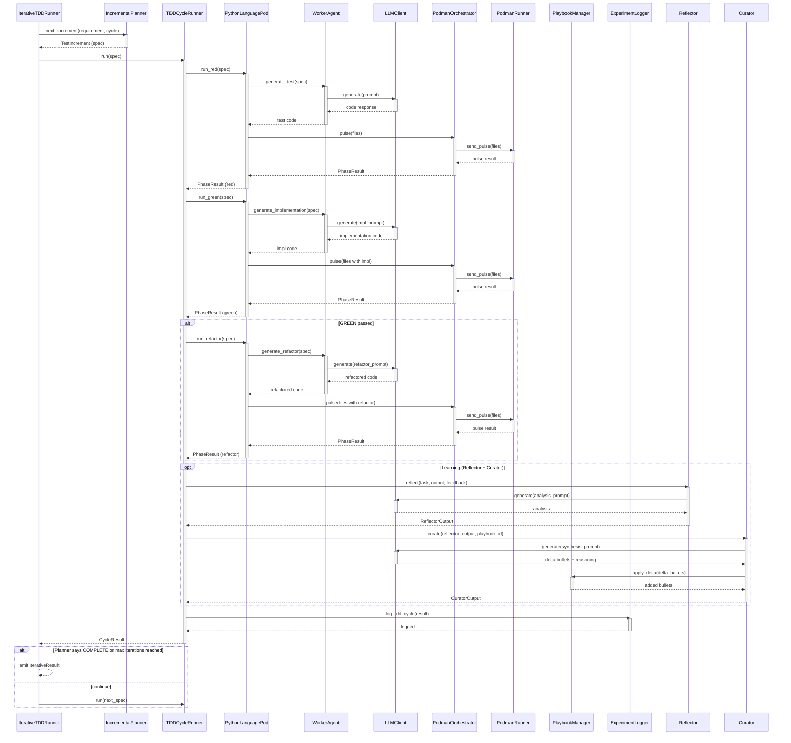

<!-- Generated by generate_live_docs.py on 2026-09-21 07:29 — do not edit by hand -->

# System Architecture

| Component | Module | Role |
|-----------|--------|------|
| IterativeTDDRunner | src/agents/iterative_tdd_runner.py | Orchestrates the top-level RED→GREEN→REFACTOR loop across features |
| TDDCycleRunner | src/agents/tdd_cycle_runner.py | Orchestrates one RED→GREEN→REFACTOR cycle with retries and learning |
| PythonLanguagePod | src/agents/python_language_pod.py | Language pod implementation for Python TDD cycles |
| WorkerAgent | src/agents/worker_agent.py | LLM code-generation for test/implementation/refactor prompts |
| PodmanOrchestrator | src/agents/podman_orchestrator.py | Stateless sandbox execution layer with security verification |
| PodmanRunner | src/agents/podman_runner.py | Rootless Podman container lifecycle and file pulse execution |
| IncrementalPlanner | src/agents/incremental_planner.py | LLM-guided test increment planning |
| GoLanguagePod | src/agents/go_language_pod.py | Language pod implementation for Go TDD cycles |
| TypeScriptLanguagePod | src/agents/typescript_language_pod.py | Language pod implementation for TypeScript TDD cycles |
| SimulationPod | src/agents/simulation_pod.py | Language pod for physics-simulation TDD cycles |
| SimulationOracle | src/agents/simulation_oracle.py | Physics-simulation test oracle running controller code |
| SimulationPodmanRunner | src/agents/simulation_podman_runner.py | PodmanRunner variant for simulation harness |
| MermaidRunner | src/agents/mermaid_runner.py | PodmanRunner for mermaid diagram validation |
| GoRunner | src/agents/go_runner.py | PodmanRunner for Go TDD harness |
| TypeScriptRunner | src/agents/typescript_runner.py | PodmanRunner for TypeScript TDD harness |
| PlaybookManager | src/playbook/manager.py | Core playbook CRUD, delta application, persistence |
| BulletRetriever | src/playbook/retrieval.py | Hybrid semantic/keyword retrieval engine |
| ExperimentLogger | src/storage/experiment_logger.py | Unified experiment persistence with PostgreSQL/SQLite fallback |
| Generator | src/core/generator/module.py | Playbook-guided task execution with bullet retrieval |
| Reflector | src/core/reflector/module.py | Task execution analysis and insight extraction |
| Curator | src/core/curator/module.py | Synthesis of insights into playbook delta bullets |
| EnsembleBuildRunner | src/agents/ensemble_build.py | Multi-candidate blind build orchestrator |
| GherkinFeatureBridge | src/agents/gherkin_feature_bridge.py | Gherkin .feature file parser into FeatureSpec |
| LLMClient | src/utils/llm_client.py | Unified LLM provider interface with fallback |
| ImportFilter | src/agents/import_filter.py | Static import/builtin security filter |
| ClaudeCliClient | src/utils/claude_cli_client.py | Local claude CLI LLM client adapter |
| CharacterizationTestGenerator | src/agents/characterization_test_generator.py | Empirical characterization test suite generator |
| ContextGraphRetriever | src/retrieval/cgr3_retriever.py | CGR³ context-aware retrieval pipeline |
| ContextScorer | src/retrieval/context_scorer.py | Multi-dimension bullet scoring (temporal/team/tech) |
| InstitutionalKnowledgeService | src/retrieval/service.py | Central knowledge retrieval service |
| PerformanceAggregator | src/broker/performance_aggregator.py | Audit-trail metric extraction for agent routing |
| AdaptiveBroker | src/broker/adaptive_broker.py | Performance-based task routing |
| ModelAttributionTracker | src/benchmark/model_attribution.py | OpenRouter model attribution tracking |
| PlaybookReliabilityAnalyzer | src/reliability/playbook_analyzer.py | Bullet-GREEN correlation and causal uplift analysis |
| TDDCycleAnalyzer | src/reliability/tdd_cycle_analyzer.py | First-pass rate and reliability trend analysis |
| ProjectArchitect | src/contracts/project_architect.py | Project specification to module DAG decomposition |
| ModuleArchitect | src/contracts/module_architect.py | Module-level contract generation from requirements |
| ModuleTDDBuilder | src/contracts/module_tdd_builder.py | TDD-based module implementation builder |
| ProjectBuilder | src/cli/project_builder.py | Drives ModuleArchitect + ModuleTDDBuilder over a ProjectPlan |

